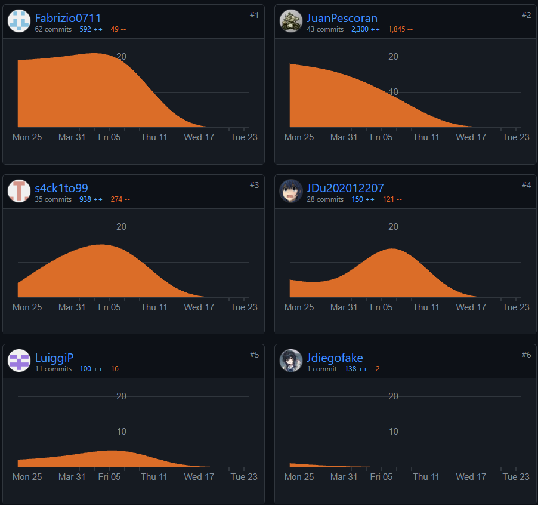
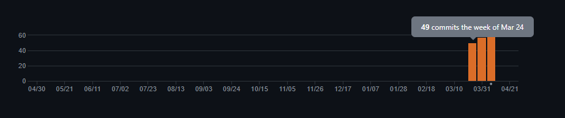
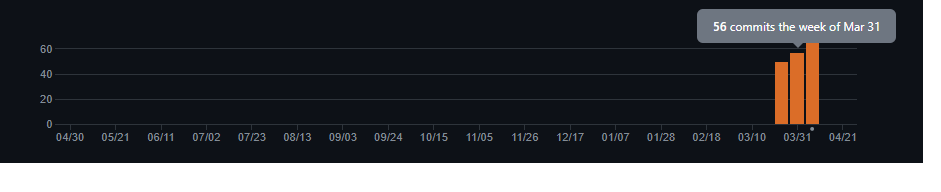
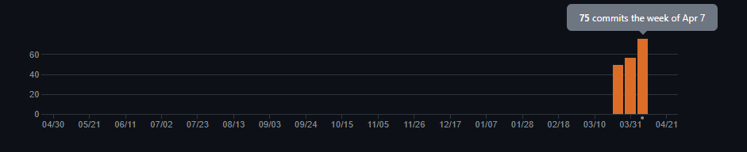
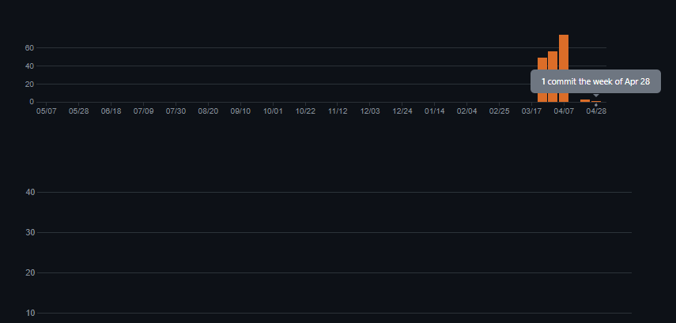

## Universidad Peruana de Ciencia Aplicadas 

##### Nombre del curso: Aplicaciones Web
##### Carrera: Ingeniería de Software
##### Nombre del profesor: Angel Augusto Velasquez Nuñez
##### Sección: SV51

#### " Informe de Trabajo Final "
##### Nombre de la Startup: Los Seniors
##### Nombre del Producto: Flexpal

#### Integrantes
* Miguel Angel Jesus Carpio Cornejo
* Juan Diego Cueto Dominguez -  u202012207
* Luiggi Gianfranco Paredes Zapata - u202218996
* Juan Fabritzzio Pescorán Angulo -   u20221c936
* Fabrizio Alessandro Sanchez Zamora- u202213652
* Ruben Velasquez Chambi - u202117342

Fecha: **Julio de 2024**.

# Registro de Versiones del Informe

| Versión | Fecha      | Autores            | Descripción de Modificación                                                                                                                                                                                                                                                                                             |
|---------|------------|--------------------|-------------------------------------------------------------------------------------------------------------------------------------------------------------------------------------------------------------------------------------------------------------------------------------------------------------------------|
| 1       | 10/04/2024 | - Juan Pescoran    | - Añadió contenido a todos los capítulos   - Aportó ideas para la creación de User Stories   - Realizó código para el despliegue de la Landing Page   - Adicionó las secciones que pertenecen al capítulo 1 hasta el 2.                                                                                        |
| 1       | 10/04/2024 | - Fabrizio Sanchez | - Realizó diseño de entrevistas   - Realizó análisis de entrevistas   - Realizó User Persona   - Realizó empathy mapping   - Realizó as is scenario mapping       - Realizó source code management   - Realizó source code style guide & conventions   - Realizó software deployment configuration |
| 1       | 10/04/2024 | - Juan Cueto       | - Implementó segmentos objetivos para el proyecto   - Implementó Landing Page UI Design, Mockups.   - Implementó Web Applications UX/UI Design, Web Applications Prototyping, Domain-Driven Software Architecture.   - Implementó las bases para el desarrollo de la lading page                               |
| 1       | 10/04/2024 | - Luiggi Paredes   | - Realizó diagramas de clase   - Realizó diagramas de base de datos   - Realizó entrevista para un segmento   - Aplicó el uso de conventional commits.   - Aportó con conocimiento sobre el nicho de membresías en el ámbito del gimnasio.                                                                  |
| 1       | 10/04/2024 | - Miguel Carpio    | - Culminó con el capítulo 3 agregando el impact map y product backlog   - Realizó entrevistas para un segmento objetivo   -Lideró impact map, user stories, product backlog.                                                                                                                                      |
| 2       | 29/04/2024 | - Juan Pescoran    | - Corrigió, mediante commits dirigidos al "refactor", el nombre de los archivos en assets   - Agregó el seguimiento que faltaba en la sección "Project Report Collaboration Insights"   - Investigó y se realizó de forma correcta los "Lean UX Assumptions"   - . . .                                         |
| 2       | 29/04/2024 | - Fabrizio Sanchez | - Corrigió user task matrix   - Corrigío style guidelines   - Agregó descripciones faltantes en todos los capítulos   - Realizó componentes haciendo uso de primevue en conjunto con html, css y javascript                                                                                                    |
| 2       | 29/04/2024 | - Juan Cueto       | - Implementó los componenetes para las vistas de la aplicación web.   - Actualizó Web Applications UX/UI Design, Web Applications Prototyping, Domain-Driven Software Architecture.                                                                                                                                  |
| 2       | 29/04/2024 | - Luiggi Paredes   | - Realizó código en html, css y javascript para el desarrollo de componentes en vue.   - Implementó APIS en json server                                                                                                                                                                                              |
| 2       | 29/04/2024 | - Miguel Carpio    | - Realizo feats utilizando vue como framework   Actualizó user stories                                                                                                                                                                                                                                               |
| 3       | 29/04/2024 | - Juan Pescoran    | - Ayudó en la contribución al bounded context de counseling, en la parte de routines.   - Se encargó del despliegue de la web application.                                                                                                                                                                           |
| 3       | 29/04/2024 | - Fabrizio Sanchez | - Apoyó en el desarrollo de los bounded countext profiles                                                                                                                                                                                                                                                               |
| 3       | 29/04/2024 | - Juan Cueto       | - Implementó nuvas funcionas en la web application y apoyó en el desarrollo de profiles del web service                                                                                                                                                                                                                 |
| 3       | 29/04/2024 | - Luiggi Paredes   | - Implementó el bounded context counseling                                                                                                                                                                                                                                                                              |
| 3       | 29/04/2024 | - Miguel Carpio    | - Encargado del bounded context subscription en la parte de BackEnd, siguió estructura DDD.                                                                                                                                                                                                                             |
| 3       | 29/04/2024 | - Ruben Velasquez  | - Encargado de desarrollar  los bounded context de iam y profiles                                                                                                                                                                                                                                                       |
| 4       | 25/06/2024 | - Ruben Velasquez  | - Encargado de implementar el register, login y logout de la aplicacion.                                                                                                                                                                                                                                                |
| 4       | 25/06/2024 | - Luiggi Paredes   | - Encargado de implementar el bounded context de counseling.                                                                                                                                                                                                                                                            |
| 4       | 25/06/2024 | - Juan Pescoran    | - Encargado de aplicar DDD para el bounded context de counseling, el arreglo de algunos errores en el backend y la mejora del reporte para la adición del sprint #4                                                                                                                                                     |

- - -
# Project Report Collaboration Insights

El siguiente enlace lleva al URL del repositorio que se encuentra en nuestra
organización pública: https://github.com/Los-seniors/Informe
A continuación, se explicará todo a cerca del desarrollo de activades para la
elaboración del informe junto con capturas de los analíticos de colaboración y commits en Github.

Para la entrega de la TB1, este es el análisis de colaboración, que presenta el número de contribuciones
hechas en el repositorio del informe.

En la primera semana del reporte, estos eran los commits totales realizados durante la semana 3:

los commits totales realizados durante la semana 4:

los commits totales realizados durante la semana 5:

los commits totales realizados durante la semana 6:

los commits totales realizados durante la semana 7:

los commits totales realizados durante la semana 8:

los commits totales realizados durante la semana 9:

los commits totales realizados durante la semana 10:

los commits totales realizados durante la semana 11:

los commits totales realizados durante la semana 12:

los commits totales realizados durante la semana 13:

los commits totales realizados durante la semana 14:

los commits totales realizados durante la semana 15:

# Contenido
## Tabla de contenidos
#### [Capítulo I: Introducción](/chapter01.md)
[1.1. Startup Profile](/chapter01.md#11-startup-profile)

[1.2,1 Antecedentes y problemática](/chapter01.md#121-antecedentes-y-problemática)

[1.2.2 Lean UX Process](/chapter01.md#122-lean-ux-process)

[1.2.2.1. Lean UX Problem Statements](/chapter01.md#1221-lean-ux-problem-statements)

[1.2.2.1. Lean UX Problem Statements](/chapter01.md#1221-lean-ux-problem-statements)

#### [Capítulo III: Requirements Specification](/chapter03.md#capítulo-iii-requirements-specification)

[3.1. To-Be Scenario Mapping](/chapter03.md#31-to-be-scenario-mapping)

[3.2. User Stories](/chapter03.md#32-user-stories)

[3.3. Impact Mapping](/chapter03.md#33-impact-mapping)

[3.4. Product Backlog](/chapter03.md#33-impact-mapping)

##### [Capítulo IV: Product Design](/chapter04.md#capítulo-iv-product-design)

[4.1. Style Guidelines](/chapter04.md#41-style-guidelines)

[4.1.1. General Style Guidelines](/chapter04.md#42-information-architecture)

[4.1.2. Web Style Guidelines](/chapter04.md#412-web-style-guidelines)

[4.2. Information Architecture](/chapter04.md#42-information-architecture)

[4.2.1. Organization Systems](/chapter04.md#421-organization-systems)

[4.2.2. Labeling Systems](/chapter04.md#422-labeling-systems)

[4.2.3. SEO Tags and Meta Tags](/chapter04.md#423-seo-tags-and-meta-tags)

[4.2.4. Searching Systems](/chapter04.md#424-searching-systems)

[4.2.5. Navigation Systems](/chapter04.md#425-navigation-systems)

[4.3. Landing Page UI Design](/chapter04.md#43-landing-page-ui-design)

[4.3.1. Landing Page Wireframe](/chapter04.md#431-landing-page-wireframe)

[4.3.2. Landing Page Mock-up](/chapter04.md#432-landing-page-mock-up)

[4.4. Web Applications UX/UI Design](/chapter04.md#44-web-applications-uxui-design)

[4.4.1. Web Applications Wireframes](/chapter04.md#441-web-applications-wireframes)

[4.4.2. Web Applications Wireflow Diagrams](/chapter04.md#442-web-applications-wireflow-diagrams)

[4.4.3. Web Applications Mock-ups](/chapter04.md#443-web-applications-mock-ups)

[4.4.4. Web Applications User Flow Diagrams](/chapter04.md#444-web-applications-user-flow-diagrams)

[4.5. Web Applications Prototyping](/chapter04.md#45-web-applications-prototyping)

[4.6. Domain-Driven Software Architecture](/chapter04.md#46-domain-driven-software-architecture)

[4.6.1. Software Architecture Context Diagram](/chapter04.md#461-software-architecture-context-diagram)

[4.6.2. Software Architecture Container Diagrams](/chapter04.md#462-software-architecture-container-diagrams)

[4.6.3. Software Architecture Components Diagrams](/chapter04.md#463-software-architecture-components-diagrams)

[4.7. Software Object-Oriented Design](/chapter04.md#47-software-object-oriented-design)

[4.7.1. Class Diagrams](/chapter04.md#471-class-diagrams)

[4.7.2. Class Dictionary](/chapter04.md#472-class-dictionary)

[4.8. Database Design](/chapter04.md#48-database-design)

[4.8.1. Database Diagram](/chapter04.md#481-database-diagram)

#### [Capítulo V: Product Implementation, Validation & Deployment](/chapter05.md#capítulo-v-product-implementation-validation--deployment)

[5.1. Software Configuration Management](/chapter05.md#51-software-configuration-management)

[5.1.1. Software Development Environment Configuration](/chapter05.md#512-source-code-management)

[5.1.2. Source Code Management](/chapter05.md#513-source-code-style-guide--conventions)

[5.1.3. Source Code Style Guide & Conventions](/chapter05.md#513-source-code-style-guide--conventions)

[5.1.4. Software Deployment Configuration](/chapter05.md#514-software-deployment-configuration)

[5.2. Landing Page, Services & Applications Implementation](/chapter05.md#52-landing-page-services--applications-implementation)

[5.2.1. Sprint 1](/chapter05.md#521-sprint-1)

[5.2.1.1. Sprint Planning 1](/chapter05.md#5211-sprint-planning-1)

[5.2.1.2. Sprint Backlog 1](/chapter05.md#5212-sprint-backlog-1)

[5.2.1.3. Development Evidence for Sprint Review](/chapter05.md#5213-development-evidence-for-sprint-review)

[5.2.1.4. Testing Suite Evidence for Sprint Review](/chapter05.md#5214-testing-suite-evidence-for-sprint-review)

[5.2.1.5. Execution Evidence for Sprint Review](/chapter05.md#5215-execution-evidence-for-sprint-review)

[5.2.1.6. Services Documentation Evidence for Sprint Review](/chapter05.md#5216-services-documentation-evidence-for-sprint-review)

[5.2.1.7. Software Deployment Evidence for Sprint Review](/chapter05.md#5217-software-deployment-evidence-for-sprint-review)

[5.2.1.8. Team Collaboration Insights during Sprint](/chapter05.md#5218-team-collaboration-insights-during-sprint)

[5.2.2. Sprint]()

[5.2.2.1.Sprint Planning 2]()

[5.2.2.2.Sprint Backlog 2]()

[5.2.2.3.Development Evidence for Sprint Review]()

[5.2.2.4.Testing Suite Evidence for Sprint Review]()

[5.2.2.5.Execution Evidence for Sprint Review]()

[5.2.2.6.Services Documentation Evidence for Sprint Review]()

[5.3.2. Sprint 3]()

[5.3.2.1.Sprint Planning 2]()

[5.3.2.2.Sprint Backlog 3]()

[5.3.2.3.Development Evidence for Sprint Review]()

[5.3.2.4.Testing Suite Evidence for Sprint Review]()

[5.3.2.5.Execution Evidence for Sprint Review]()

[5.3.2.6.Services Documentation Evidence for Sprint Review]()

[5.3.2.7.Software Deployment Evidence for Sprint Review]()

[5.3.2.8.Team Collaboration Insights during Sprint]()

[5.3.2.9.Development Evidence for Sprint Review]()

[5.3.2.10.Testing Suite Evidence for Sprint Review]()

[5.3.2.11.Execution Evidence for Sprint Review]()

[5.3.2.12.Services Documentation Evidence for Sprint Review]()

[5.3.2.13.Software Deployment Evidence for Sprint Review]()

[5.3.2.14.Team Collaboration Insights during Sprint]()

[5.4.2. Sprint 4]()

[5.4.2.1.Sprint Planning 4]()

[5.4.2.2.Sprint Backlog 4]()

[5.4.2.3.Development Evidence for Sprint Review]()

[5.4.2.4.Testing Suite Evidence for Sprint Review]()

[5.4.2.5.Execution Evidence for Sprint Review]()

[5.4.2.6.Services Documentation Evidence for Sprint Review]()

[5.4.2.7.Software Deployment Evidence for Sprint Review]()

[5.4.2.8.Team Collaboration Insights during Sprint]()

[5.4.2.9.Development Evidence for Sprint Review]()

[5.4.2.10.Testing Suite Evidence for Sprint Review]()

[5.4.2.11.Execution Evidence for Sprint Review]()

[5.4.2.12.Services Documentation Evidence for Sprint Review]()

[5.4.2.13.Software Deployment Evidence for Sprint Review]()

[5.4.2.14.Team Collaboration Insights during Sprint]()

[Conclusiones](/chapter05.md#conclusiones)

# Student Outcome

| Criterio Específico                                                                                                                                  | Acciones Ralizadas                                                                                                                                                                                                                                                                                                                                                                                                                                                                                                                                                                                                                                                                                                                                                                                                                                                                                                                                                                                                                                                                                                                                                                                                                                                                                                                                                                                                                                                                                                                                                                                                                                                                                                                                                                                                                                                                                                                                                                                                                                                                                                                                                                                                                                                                                                                                                                                                                                                                                                                                                                                                                                                                                                                                                                                                                                                                                                                                                                                                                                                                                                                                                                                                                                                                                                                                                                                                                                                                                                                                                                                                                                                                                                                                                                                                                                                                                                                                                                                                                                                                                                                                                                                                                                                                                                                                                                                                                                                                                                                                                                                                                                                                                                                                                                                                                                                                                                                                                                                                                                                                                                                                                                                                                             | Conclusiones                                                                                                                                                                                                                                                                                                                                                                                                                                                                                                                                                                                                                                                                                                                                                                                                                                                                                                                                                                                                                                                                                                                                                                                                                                                                                                                                                                                                                                                                                                                                                                                                                                                                                                                                                                                                                                                                                                                                                                                                                                                                                                                                                                                                                                                                                                                                                                                                                                                                                                                         |
|------------------------------------------------------------------------------------------------------------------------------------------------------|------------------------------------------------------------------------------------------------------------------------------------------------------------------------------------------------------------------------------------------------------------------------------------------------------------------------------------------------------------------------------------------------------------------------------------------------------------------------------------------------------------------------------------------------------------------------------------------------------------------------------------------------------------------------------------------------------------------------------------------------------------------------------------------------------------------------------------------------------------------------------------------------------------------------------------------------------------------------------------------------------------------------------------------------------------------------------------------------------------------------------------------------------------------------------------------------------------------------------------------------------------------------------------------------------------------------------------------------------------------------------------------------------------------------------------------------------------------------------------------------------------------------------------------------------------------------------------------------------------------------------------------------------------------------------------------------------------------------------------------------------------------------------------------------------------------------------------------------------------------------------------------------------------------------------------------------------------------------------------------------------------------------------------------------------------------------------------------------------------------------------------------------------------------------------------------------------------------------------------------------------------------------------------------------------------------------------------------------------------------------------------------------------------------------------------------------------------------------------------------------------------------------------------------------------------------------------------------------------------------------------------------------------------------------------------------------------------------------------------------------------------------------------------------------------------------------------------------------------------------------------------------------------------------------------------------------------------------------------------------------------------------------------------------------------------------------------------------------------------------------------------------------------------------------------------------------------------------------------------------------------------------------------------------------------------------------------------------------------------------------------------------------------------------------------------------------------------------------------------------------------------------------------------------------------------------------------------------------------------------------------------------------------------------------------------------------------------------------------------------------------------------------------------------------------------------------------------------------------------------------------------------------------------------------------------------------------------------------------------------------------------------------------------------------------------------------------------------------------------------------------------------------------------------------------------------------------------------------------------------------------------------------------------------------------------------------------------------------------------------------------------------------------------------------------------------------------------------------------------------------------------------------------------------------------------------------------------------------------------------------------------------------------------------------------------------------------------------------------------------------------------------------------------------------------------------------------------------------------------------------------------------------------------------------------------------------------------------------------------------------------------------------------------------------------------------------------------------------------------------------------------------------------------------------------------------------------------------------------------------------|--------------------------------------------------------------------------------------------------------------------------------------------------------------------------------------------------------------------------------------------------------------------------------------------------------------------------------------------------------------------------------------------------------------------------------------------------------------------------------------------------------------------------------------------------------------------------------------------------------------------------------------------------------------------------------------------------------------------------------------------------------------------------------------------------------------------------------------------------------------------------------------------------------------------------------------------------------------------------------------------------------------------------------------------------------------------------------------------------------------------------------------------------------------------------------------------------------------------------------------------------------------------------------------------------------------------------------------------------------------------------------------------------------------------------------------------------------------------------------------------------------------------------------------------------------------------------------------------------------------------------------------------------------------------------------------------------------------------------------------------------------------------------------------------------------------------------------------------------------------------------------------------------------------------------------------------------------------------------------------------------------------------------------------------------------------------------------------------------------------------------------------------------------------------------------------------------------------------------------------------------------------------------------------------------------------------------------------------------------------------------------------------------------------------------------------------------------------------------------------------------------------------------------------|
| Participa en equipos multidisciplinarios con eficacia, eficiencia y objetividad, en el marco de un proyecto en soluciones de ingeniería de software. | **-----------TB1-----------**   **Juan Pescorán**   Realizó trabajos durante sesiones virtuales hechas en Microsoft Team, usando eficientemente las herramientas para las soluciones de Software.   **Juan Cueto** - Cordinó con el equipo para la creación de los repositorios, reuniones para el entendimiento de gitflow, y la creación de las respectivas ramas de cada repositorio a trabajar. De manera que, se obtuvo un desarrollo organizado en la forma de realizar las tareas asignadas al grupo, teniendo así un mejor control y registro en el contenido del proyecto.    **Luiggi Paredes** - Coordinó con el equipo las fechas para la entrega de avances, las reuniones, las partes que cada uno tenía que realizar. De manera que, se tuvo un desarrollo óptimo de la TB1    **Fabrizio Sanchez**: Avanzó los elementos asignados a través de las reuniones grupales que fueron realizadas de manera diaria y semanal, por lo que pudo avanzar de la manera esperada.    **Miguel Carpio**: Colaboró activamente en la resolución de problemas técnicos durante las sesiones virtuales, proporcionando soluciones efectivas y contribuyendo al avance del proyecto.     **-----------TP1-----------**  **Fabrizio Sanchez**:  Colaboró y planficó eficazmente las actividades a realizar para la entrega parcial a traves de la herramienta Trello, la cual permitió al equipo avanzar de manera mas ordenada   **Luiggi Paredes**:  Se concluyó de manera satisfactoria el avance y la coordinación con los cumplimientos para esta entrega asiganando a cada uno de los integrantes para el avance del entregable para el sprints.   **-----------TB2-----------**  **Juan Pescorán**:  Hasta el momento, el Backend fue la parte más compleja dentro de todo nuestro software, y al dividir las tareas de forma ordenada, nos permitió como equipo avanzar de manera efectiva. Separando nuestras tareas según los Technical Stories, y cada rama siendo partes de o los mismos bounded context.    **Luiggi Paredes**:  El BackEnd de nuestro proyecto es grande, mas hemos tratado de enfocarnos principalmente en aquellos puntos que sumen valor a nuestro modelo de negocio. Como equipo, hemos tratado de entender correctamente la elaboración del BackEnd, las buenas prácticas, y seguir el diseño DDD; no tener idea sobre lo que estamos haciendo, abruma la creación de preguntas o avances sobre nuestro proyecto.    **Fabrizio Sanchez**     A través de reuniones semanales, pudo lograr una correcta comunicación con los demás integrantes del equipo, asimismo hizo uso de la herramienta de colaboración Trello para una mayor comprensión de los puntos pendientes en el proyecto.     **Miguel Carpio**   Realizó en equipo parte del BackEnd del proyecto, se enfocó en la parte de subscription y payments utilizando el DDD, avanzó con dicho bounded context, quedando pendiente pulir métodos para la la última entrega.     **Juan Cueto**   Mantuvo comunicación con el equipo, participando en las reuniones para definir y aplicar las buenas practicas usando DDD en la aplicación web y servicio web. **Ruben Velasquez**  Mantuvo comunicacion con otros integrantes para poder implementar el backend con datos relevantes del negocio **-----------TF-------------** **Ruben Velasquez**  Mantuvo comunicacion para avisas al resto de integrantes las funcionalidades que ya fueron implementadas  **Luiggi Paredes**  El desarrollo del backend se ha concretado al nivel que esperabamos, incluyendo la adición de documentacion en codigo y la implementación de counseling para la gestión de planes. El backend ha sido desplegado, permitiendo su conexión con el frontend y asegurando un funcionamiento coordinado y optimizado del sistema.     **Fabrizio Sanchez**   Para esta entrega final, me enfoqué en mejorar los elementos pendientes en la TB2, abarcando tanto el frontend como algunos puntos backend, así como la elaboración del reporte. Durante el sprint 4, colaboré de manera eficiente con los otros miembros del equipo, lo que permitió abordar desafíos sin mayores problemas y completar todas las tareas asignadas a tiempo y con alta calidad.   **Juan Pescoran**  Como lider del grupo, estuve haciendo propuestas para mejorar la distribución de trabajos (mediante reuniones virtuales, uso de aplicaciones como trello para manejar las tareas, entre otros.) para, puesto que nuestro proyecto a inicios de su ciclo de vida parecía exigir un backend complejo, pero con ayuda de todos los miembros del equipo y sus conocimientos en ASP .Net, manejo de IDEs, documentación de código, entre otros, pudimos realizar la entrega cumpliendo con lo requerido.    **Juan Cueto**: Mantuve conversacion con todo el equipo para mantener el control y la estructura del proyecto en este ultimo sprint. Indiqué y supervisé las nuevas implementaciones de mis compañeros para manejar y mantener la estructura y codigo del proyecto  sin errores tanto para la aplicación web como el servicio.   **Miguel Carpio** Durante esta entrega final, me centré en asegurar la calidad y la integración de los distintos componentes del proyecto. Esto incluyó pruebas exhaustivas del frontend y backend, asegurando que todas las funcionalidades implementadas funcionaran de manera correcta y sin errores. Adicionalmente, colaboré en la mejora de la interfaz de usuario, optimizando la experiencia para los usuarios finales. Mi participación en las reuniones diarias permitió mantener una comunicación fluida con todo el equipo, facilitando la resolución rápida de cualquier inconveniente que surgiera. Gracias al esfuerzo colectivo, logramos completar el proyecto cumpliendo con los estándares de calidad y los plazos establecidos.  | **-----------TB1-----------**  El equipo demostró una sólida capacidad para trabajar de manera colaborativa y efectiva, utilizando herramientas virtuales de manera eficiente para coordinar, planificar y ejecutar las tareas del proyecto. La comunicación fluida, la organización adecuada y el compromiso con los objetivos del equipo permitieron un avance significativo y un desarrollo ordenado del proyecto. La participación activa de cada miembro, su capacidad para resolver problemas de manera eficiente durante las sesiones virtuales, así como su compromiso con los plazos y objetivos del proyecto, fueron fundamentales para el éxito del equipo.  **-----------TP-----------**  Elaboramos el front end, para este caso nos hemos organizado en distintas reuniones para la correcta ejecución del front end.   **-----------TB2-----------**   Para esta entrega nos organizamos en distintas reuniones en las que nos repartimos y ayudamos entre nosotros para la elaboración de back end.  **-----------TF-----------**  Se han identificado bastantes puntos de mejora durante la entrega, sin embargo se han satisfecho todos los objetivos propuestos para la realización de esta. Todo el equipo ha considerado las múltiples opciones de servicios web, frameworks a usar e implementaciones de lógica para el desarrollo de nuestro backend conectado a nuestra frontend.                                                                                                                                                                                                                                                                                                                                                                                                                                                                                                                                                                                                                                                                                                                                                                                                                                                                                                                                                                                                                                                                                                        |
| Conoce al menos un sector empresarial o dominio de aplicación de soluciones de software                                                              | **-----------TB1-----------**   **Juan Pescorán**   Utilizó frameworks como vue que crearán dominios locales: "localhost:1800" por ejemplo. También usaremos la herramienta GitHun Pages para que, al subir nuestra landing page a un repositorio, GitHub cree un dominio en internet donde se alojará nuestro index.   **Juan Cueto** - Investigó los posibles y actuales competidores de nuestro negocio. Con el fin de tener una retroalimentación y destacar los puntos que pueden impulsar y destacar entre los demas competidores. Obteniendo un resultado del entedimiento del dominio del problema que abarca este modelo de negocio.     **Luiggi Paredes** - Investigó el dominio y aplicación del software a implementar, es por ello que todo el equipo participó de forma activa en el proceso de investigación de la problemática y la segmentación de nuestro público objetivo.     **Fabrizio Sanchez**: Utilizó diferentes técnicas y herramientas para poder recaudar mas información de manera que ampliemos nuestro conocimiento de nuestros segmentos.     **Miguel Carpio**: Realizó un análisis de la competencia para identificar fortalezas y oportunidades de mejora en el proyecto, contribuyendo así a la definición de estrategias competitivas.    **-----------TP1-----------**  **Fabrizio Sanchez**:  Investigó la correcta implementación del user task matrix, el cual permitió saber como priorizar las actividades hechas por lo usuarios, así como tambien al realizar el user style guideline pudo entender las guias que debe tener nuestra aplicación.   **Luiggi Paredes**:  Todos tuvimos que conocer y dominar las herramientas necesarias para enriquecer el valor de nuestro negocio. Al final de esta entrega, aprendimos cómo usar las distintas herramientas tecnológicas como frameworks, bibliotecas, etc., las cuales ayudan a nuestro propósito sobre cómo mejorar y hacer de nuestro proyecto un negocio sostenible.   **-----------TB2-----------**   **Juan Pescorán**:  En este sprint, los conocimientos en C# y .NET core deben ser muy sólidos para el trabajo con el backend de nuestra web application.    **Luiggi Paredes**:  Para esta entrega, tuvimos que dominar el framework de ASP.net. Adicionalmente, era necesario investigar más por nuestra cuenta para poder añadir una capa adicional de seguridad y características a nuestro BackEnd, como tambien asesorias y entender correctamente el DDD.    **Fabrizio Sanchez**  En esta entrega se trabajó mas en detalle el DDD por lo que se tuvo que repasar los temas mas en profundidad, haciendo uso de recursos brindades por el profesor y recursos en internet.     **Miguel Carpio**   Codificó el BackEnd siguiendo estructura DDD, empleó lenguaje C# y framework .NET. Siguió las buenas prácticas explicadas por el docente a la hora de realizar el bounded context Subscription en el BackEnd.   **Ruben Velasquez** Al Implementar el back-end siguiendo la estructura DDD, pude aumentar mo dominio del negocio ya que pude detallar los datos necesarios por diferentes contextos **--------TF---------**   **Ruben Velasquez** Al Desarrollar el Front-end con el back-end pude refinar los conocimientos previos de la logica del negocio, ya que se tenia que detallar el flujo en como interacturia el usuario con nuestra aplicacion   **Luiggi Paredes**  Para este último avance del trabajo, se termino de completar el backend y se procedió con el despliegue de este y de la base de datos. Asimismo, se realizó una refactorización del código para poder aplicarle la arquitectura DDD y el patrón CQRS, los cuales fueron de gran ayuda para una mejora y mantenibilidad del código. Al final de todo este proceso pude adquirir conocimiento sobre la lógica del negocio y la complejidad que lleva por detrás la elaboración de los procesos en el ámbito fitness.   **Fabrizio Sanchez**  Al desarrollar el entregable final incluyendo tanto el lado fronted y backend de nuestra aplicacion web, pude comprender las funcionalidades y requisitos que una apliacion relacionada al mundo  fitess debe  cumplir, por lo que para futuros proyectos este trabajo me ha ayudado de gran manera a comprender el funcionamiento de una aplicación web.   **Juan Pescoran**  Para el desarollo de esta entrega, he mejorado mis conocimientos para la implementación de la lógica de negocio. Esto se ve plasmado en mi aporte al backend en el bounded context counseling, al mejorar la implementación  NutritionalMeal y RoutineItem dentro de Fitness Plan, me he guiado del servicio que otras web applications muestran e investigué a cerca de que información se proporciona.   **Miguel Carpio**   Durante la fase final del proyecto, mi objetivo principal fue garantizar la calidad y cohesión de todos los componentes. Esto incluyó la realización de pruebas exhaustivas tanto en el frontend como en el backend para asegurar que todas las funcionalidades funcionaran sin problemas. También colaboré en la optimización de la interfaz de usuario para mejorar la experiencia del usuario.                                                                                                                                                                                                                                                                                                                                                      | **-----------TB1-----------**  El equipo demostró un profundo conocimiento del dominio de aplicación del proyecto, mediante la investigación exhaustiva de la problemática a abordar y la identificación de los competidores relevantes. Esta comprensión sólida del sector empresarial permitió identificar oportunidades y establecer estrategias competitivas adecuadas para el éxito del proyecto. La investigación detallada sobre competidores proporcionó información valiosa para diferenciar el proyecto y destacar entre la competencia, mientras que la comprensión clara del público objetivo garantizó un enfoque preciso y efectivo en el desarrollo de soluciones de software adaptadas a las necesidades del mercado. En resumen, el profundo conocimiento del dominio de aplicación del proyecto fue clave para la definición de estrategias efectivas y el éxito global del equipo en la implementación de soluciones de ingeniería de software.   **-----------TP-----------**  Elaboramos el front end, para este caso nos hemos organizado en distintas reuniones para la correcta ejecución del front end.     **-----------TB2-----------**  Para esta entrega nos organizamos en distintas reuniones en las que nos repartimos y ayudamos entre nosotros para la elaboración de back end.  **-----------TF-----------**  El equipo ha demostrado un buen manejo de conocimientos con respecto a las implementaciones de DDD en todas las capas de nuestros bounded context por parte del backend, la correcta realización de commits hechos en nuestro repositorios, la unión funcional de nuestros servicios de axios para el funcionamiento de los CRUDS por parte de nuestro backend y también las buenas prácticas con el marco de desarrollo web ASP .NetCore que usa C#.    **Juan Cueto**: El desarrollo de este ultimo sprint me permitio conocer los aspectos más importantes del sector de fitness, me ayudó a establecer las prioridades y entender que necesitan nuestros usuarios principalmente para engancharlas a la aplicación. Conocer un sector, mantener un diseño amigable, responsive y aplicar i18n me ayudo a entender mejor estos conceptos.    **Juan Cueto**: El termino de este ultimo sprint me ayudo a entender como funciona el sector de fitness, cuales son los aspectos principales que llama la atención del usuario y que funciones son las más llamativas para los usuarios. Aplicar un diseño intereactivo, responsive y aplicar i18n |
