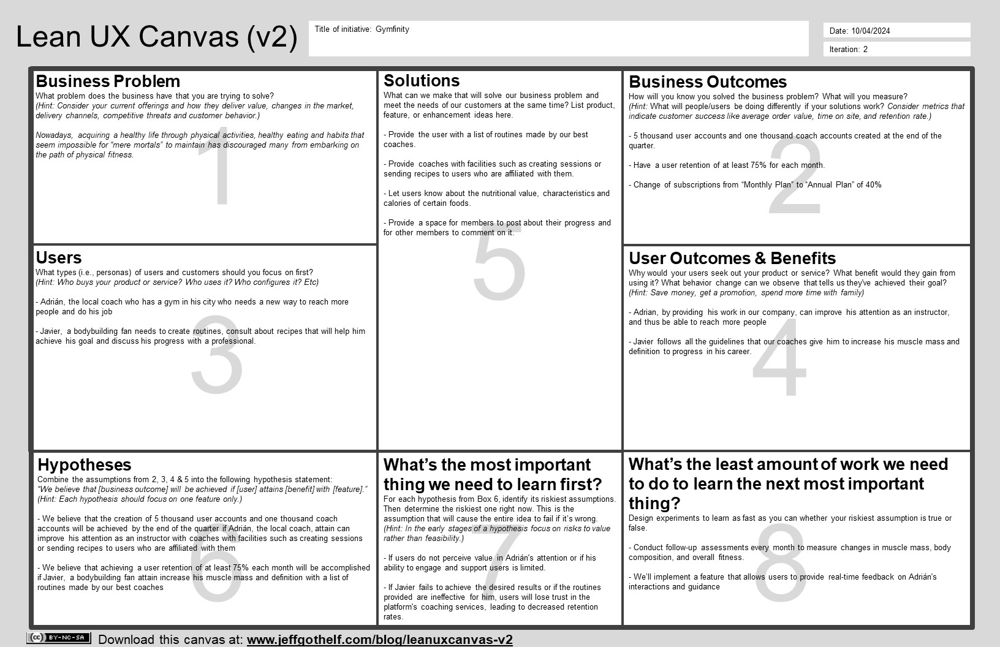

# **Capítulo I: Introducción**
## 1.1. Startup Profile

### 1.1.1. Descripción de la Startup

Somos una compañía recién creada llamada "Gymfinity" que tiene una misión en mente: <b>mejorar la salud de todos nuestros miembros mediante ayuda personalizada</b>.
 Por esta razón, nos reunimos y trabajamos con cooperación, eficiencia y responsabilidad para crear "FlexPal". Los integrantes que conforman este equipo son:

### 1.1.2. Perfiles de integrantes del equipo

|                                               |                                                                                                                                                                                                                                                                                                                                                                                                                                                                                                                                                  |
|-----------------------------------------------|--------------------------------------------------------------------------------------------------------------------------------------------------------------------------------------------------------------------------------------------------------------------------------------------------------------------------------------------------------------------------------------------------------------------------------------------------------------------------------------------------------------------------------------------------|
|  | Mi nombre es Juan Fabritzzio Pescorán Angulo con el código de estudiante u20221c936, estoy estudiando la carrera de Ingeniería de Software. Tengo conocimientos que pueden aportar al proyecto, tales como: códificar en C#, SQL y aplicar la metodología Scrum. Las habilidades que puedo aportar a mi equipo son responsabilidad y puntualidad con la entrega de trabajos, esfuerzo con las tareas que debo realizar para el avance del proyecto y liderazgo para guiar a todos mis compañeros de equipo para presentar un producto impecable. |
|  | Mi nombre es Luiggi Gianfranco Paredes Zapata, mi codigo es u202218996, estoy cursando el quinto ciclo en la carrera de Ingeniería de Software. Cuento con conocimientos que serían de gran ayuda para el proyecto, como: manejo de base de datos, codificacion en c++, c#, java y python. Sé trabajar en equipo, escucho y participo activamente.                                                                                                                                                                                               |
|  | Mi nombre es Fabrizio Alessandro Sanchez Zamora con código de estudiante u202213652, soy estudiante de Ingeniería de Software. Entre mis conocimientos se encuentran el manejo de lenguajes de programacion como C++, JavaScript y Python, asi como también se manejar SQL, Html y CSS. Como miembro del equipo, me comprometo a colaborar con mis compañeros para poder presentar un buen proyecto grupal.                                                                                                                                      |
|    | Mi nombre es Juan Diego Cueto Dominguez, mi codigo de estudiante es u202012207, actualmente soy estudiante de la carrera de Ingeniería de Software. Cuento con conocimiento y experiencia en el uso de Git y GitHub, con el cual estaré apoyando a mis compañeros. Además poseo mucha práctica con los lenguajes de programación C++, JavaScript, Python , HTML5 y CSS3. Estoy dispuesto a apoyar y trabajar en el tiempo y momento que se requiera.                                                                                             |
|  | Soy estudiante de 5to ciclo en la Universidad Peruana de Ciencias Aplicadas, tengo conocimientos en lenguajes de programación como C++, C#, Python, HTML, Java, MySQL. Lo cual podré beneficiar en el progreso de nuestro trabajo de curso.                                                                                                                                                                                                                                                                    

## 1.2. Solution Profile
FlexPal es una completa aplicación web desarrollada por Gymfinity, diseñada para atender tanto a entusiastas del fitness como a profesionales. Ofrece un modelo de suscripción que brinda a los miembros acceso a planes de nutrición personalizados, entrenadores expertos y rutinas de ejercicio adaptadas. FitHub tiene como objetivo revolucionar la industria del fitness integrando tecnología con soluciones de fitness personalizadas de manera fluida.

**Características Principales:**

- **Planes de Nutrición Personalizados:** FitHub utiliza algoritmos avanzados para generar planes de nutrición personalizados según las preferencias del miembro, restricciones dietéticas y objetivos de fitness. Los miembros pueden acceder a una amplia gama de opciones de comidas adaptadas a sus necesidades específicas, asegurando una dieta equilibrada y saludable.

- **Entrenadores Expertos:** FitHub conecta a los miembros con entrenadores de fitness certificados que se especializan en áreas como entrenamiento de fuerza, cardio, yoga, etc. Los miembros pueden programar sesiones de entrenamiento virtuales, recibir comentarios personalizados y realizar un seguimiento de su progreso con el tiempo.

- **Rutinas de Ejercicio Adaptadas:** FitHub ofrece una amplia biblioteca de rutinas de ejercicio adaptadas para miembros de todos los niveles de fitness y preferencias. Ya sea que los miembros prefieran entrenamientos de alta intensidad, levantamiento de pesas o yoga, pueden encontrar rutinas adecuadas diseñadas para lograr los resultados deseados.

- **Seguimiento del Progreso:** FitHub permite a los miembros realizar un seguimiento de su progreso fitness con informes detallados, incluyendo métricas como pérdida de peso, ganancia muscular y mejora del rendimiento general. Esta función permite a los miembros mantenerse motivados y monitorear su éxito con el tiempo.

### 1.2.1 Antecedentes y problemática
#### Uso de la técnica  The 5'W's w Y 2'H's
Presentación del modelo de las preguntas 5Ws y 2 hs con la que se analizaron los antecedentes y la problemática que abarca nuestro proyecto.

| LAS 5W y 2H | Pregunta                                                | Descripción                                                                                                                                                                                                                                                                                                                                                                                                                                                                                                                                                                                                                                                                                                                                                                                      |
|-------------|---------------------------------------------------------|--------------------------------------------------------------------------------------------------------------------------------------------------------------------------------------------------------------------------------------------------------------------------------------------------------------------------------------------------------------------------------------------------------------------------------------------------------------------------------------------------------------------------------------------------------------------------------------------------------------------------------------------------------------------------------------------------------------------------------------------------------------------------------------------------|
| Who?        | ¿Quién es afectado?                                     | Personas interesadas en mejorar su salud y condición física, así como profesionales del coaching en áreas como el ejercicio y la nutrición.                                                                                                                                                                                                                                                                                                                                                                                                                                                                                                                                                                                                                                                      |
| What?       | ¿Cuál es el problema?                                   | La desmotivación o dificultades que tienen las personas a la hora de trazar y empezar una rutina de entrenamiento, ya sea por salud o actividad propia. De acuerdo al Ministerio de Salud (MINSA, 2024), el 62% de peruanos mayores a 15 años sufre de obesidad, esto demuestra la carente disciplina, compromisos o mal hábito de alimentación que tiene la población.                                                                                                                                                                                                                                                                                                                                                                                                                          |
| When?       | ¿Cuándo sucede el problema?                             | Es un problema que usualmente a estado presente en varias personas desde que intentaron iniciar una rutina de entrenamiento, con el objetivo de abordar sus necesidades y mejorar su estilo de vida. Añadiendo además aquellos profesionales del coaching que han deseado expandir su base de clientes.                                                                                                                                                                                                                                                                                                                                                                                                                                                                                          |
| Where?      | ¿Dónde surge el problema?                               | El problema surge de las necesidades y ubicación de la persona, siendo los principales factores la distancia del gimnasio mas cercano y sus tiempos disponibles, por consiguiente, la aplicación estará disponible en línea, lo que permitirá el acceso desde cualquier lugar con conexión a internet.                                                                                                                                                                                                                                                                                                                                                                                                                                                                                           |
| Why?        | ¿Cuál es la causa del problema?                         | La creación de la aplicación se debe a la falta de orientación personalizada para las personas que desean mejorar su salud y condición física, así como la necesidad de los profesionales del coaching de llegar a nuevos clientes y ofrecerles un servicio efectivo y personalizado.                                                                                                                                                                                                                                                                                                                                                                                                                                                                                                            |
| How?        | ¿Qué llevó a la persona a esta situación?               | Según un estudio realizado por Ipsos, un 44% de personas hace actividad física con frecuencia y percepción que el 88% considera que tener una buena alimentación es la clave para tener una vida saludable (Ipsos Perú, 2019), por consiguiente, nuestra aplicación facilitara la comunicación directa entre miembros y coaches a través de reuniones virtuales además de proporcionar acceso a planes alimentarios personalizados. Los miembros podrán suscribirse mensualmente para acceder a estos servicios y recibir el seguimiento y apoyo continuo que necesitan para alcanzar sus objetivos de salud.                                                                                                                                                                                    |
| How Much?   | ¿Cuál es la cantidad, duración o intensidad del evento? | Según un estudio realizado por Fitness Pass (2019), se descubrió que un porcentaje alarmantemente alto del 80% de las personas optan por cancelar su membresía en el gimnasio después de tres meses de haberla adquirido. Este hallazgo preocupa a la industria del fitness, donde seguir un régimen de ejercicio a largo plazo parece ser desafiante para la mayoría de los individuos. Entre los motivos principales que impulsan esta decisión se encuentran la desmotivación y la falta de tiempo. La desmotivación puede surgir de diversas fuentes, incluida la falta de resultados rápidos o visibles. Además, en el mundo moderno, las demandas de tiempo suelen ser un factor determinante, ya que las personas luchan por equilibrar el trabajo, la familia y otras responsabilidades. |
### 1.2.2 Lean UX Process
- #### 1.2.2.1. Lean UX Problem Statements
"En un contexto de creciente interés por el bienestar personal, se hace evidente la necesidad de una aplicación web de coaching que facilite la conexión entre miembros y profesionales del ejercicio y nutrición. Dicha aplicación web debe proporcionar una experiencia personalizada y efectiva para cada individuo, adaptándose a sus necesidades y objetivos específicos."   
Como grupo, nos comprometeremos a resolver este desafío mediante una colaboración estrecha entre los miembros que deseen empezar una rutina de ejercicio, así como también con profesiones tanto en coaching y nutrición. Nos enfocaremos en comprender profundamente las necesidades y expectativas de nuestros miembros, utilizando esta información para diseñar y desarrollar una solución innovadora que satisfaga sus requerimientos de manera integral.
- #### 1.2.2.2. Lean UX Assumptions
  ### **Business Assumptions**

    * **I believe my customers need** personalized guidance and continuous support to achieve their health and fitness goals.
    * **These demands can be met by** an online platform that connects members with professional coaches in exercise and nutrition, offering direct communication and personalized plans.
    * **The initial customers will be** those who are actively seeking to improve their lifestyle and are willing to invest in professional coaching services to achieve it.
    * **The primary need that customers have for my service is** to receive expert guidance and personalized follow-up to optimize their progress and effectively and sustainably achieve their health goals.
    * **I will acquire most of my customers through** digital marketing strategies targeted at individuals interested in health and wellness, as well as collaborations with influencers and industry professionals.
    * **I will generate revenue through** a monthly subscription model, where members will pay for access to coaching services and personalized meal plans offered.
    * **The main problem that could affect my product is** competition in the health and wellness app market, which could hinder customer acquisition and retention in a saturated market.
    * **We will address this situation by** clearly differentiating our service, highlighting the quality of personalized attention and the effectiveness of our exercise and nutrition plans, as well as implementing customer retention strategies to ensure long-term satisfaction.

  ### **Business Outcomes Assumptions**
    * Improving the user experience of our web app will lead to an increase in membership sign-ups and revenue for gyms.
    * Providing personalized coaching services will result in higher member engagement and retention rates.
    * Offering adaptable and convenient meal plans will enhance member satisfaction and loyalty to the platform.
    * Ensuring the security and confidentiality of member data will build trust and credibility in the online community.
    * Developing an intuitive and user-friendly interface will lead to higher user engagement and usage frequency.
    * Implementing effective marketing strategies will drive customer acquisition and growth for the business.
    * Differentiating our service from competitors will establish a unique value proposition and attract a broader audience.
    * Building a strong online community will foster member engagement, support, and loyalty to the platform.
  
  ### **User Assumptions**
    * Target Member Segment:
      * Members are seeking a comprehensive solution that not only provides guidance in exercise but also in nutrition, recognizing the importance of both aspects in achieving their health goals.
      * Members highly value convenience and accessibility in an online coaching platform, preferring the flexibility of being able to access services from anywhere and at any time.
      * Members are willing to invest in a professional coaching service that offers direct and personalized communication with a coach, feeling more motivated and committed to their progress when they receive individualized support.
      * Members expect the meal plans provided by the platform to be adaptable to their dietary preferences and restrictions, as well as easy to follow and integrate into their daily lives.
      * Members value transparency and reliability in an online coaching platform, seeking assurances that their personal and health data will be treated securely and confidentially.
    * Target Coach Segment:
      * Coaches seek a platform that allows them to reach a broader and more diverse audience, offering their services efficiently and effectively through an online environment.
      * Coaches value the opportunity to establish direct and personalized communication with their clients, enabling them to tailor their services and plans to the specific needs and goals of each individual.
      * Coaches are interested in a platform that provides them with tools and resources to optimize their work, including the ability to schedule sessions, track member progress, and access detailed reports and analysis.
      * Coaches seek a platform that offers an intuitive and user-friendly experience, allowing them to navigate smoothly and quickly access the information and features they need to provide high-quality service to their clients.
      * Coaches value security and confidentiality in an online coaching platform, expecting their data and their clients' information to be protected and for the platform to comply with industry-established privacy and security standards.

  ### **User Outcomes Assumptions**
  * Target Member Segment:
      * Members will experience increased motivation and commitment to their health and fitness progress by receiving personalized guidance and continuous support from a professional coach.
      * Members will feel satisfied and content with the personalized and adaptable meal plans provided by the platform, finding options that fit their dietary preferences and restrictions.
      * Members will trust in the security and confidentiality of their personal and health data on the platform, feeling comfortable and protected when sharing sensitive information with their coaches and the online community.
      * Members will enjoy an intuitive and user-friendly experience on the online coaching platform, allowing them to navigate smoothly and quickly access the resources and services they need to optimize their progress and achieve their health goals.   * Segmento objetivo Coach:
  * Target coach Segment:
      * Coaches will find the platform easy to use and efficient in delivering personalized guidance and support to their clients.
      * Coaches will appreciate the ability to customize meal plans and fitness routines for individual clients, enhancing their coaching effectiveness.
      * Coaches will trust in the platform's security measures to safeguard client data and maintain confidentiality, ensuring a professional and ethical coaching environment.
      * Coaches will benefit from a streamlined interface and tools that facilitate communication and collaboration with clients, enabling them to focus more on providing value and less on administrative tasks.

- #### 1.2.2.3. Lean UX Hypothesis Statements

  * If we offer members convenient and flexible access to online coaching services, enabling direct communication with coaches and personalized plans, then the probability of members committing long-term to the platform will increase, resulting in higher customer retention.
  * If we provide personalized and adaptable meal plans that cater to members' dietary preferences and restrictions, then member satisfaction will increase, along with the likelihood of them staying on the platform, contributing to business growth through referrals and positive recommendations.
  * If we guarantee the security and confidentiality of members' personal and health data, and provide a transparent and reliable member experience, then trust and loyalty towards the platform will increase, resulting in higher retention and a positive reputation in the market.
  * If we develop an intuitive and easy-to-use member interface on the online coaching platform, allowing members to navigate seamlessly and access resources and services quickly, then participation and frequency of use will increase, leading to higher customer retention and business growth.

- #### 1.2.2.4. Lean UX Canvas

## 1.3. Segmentos objetivo.
Los segmentos objetivos identificados se definirán en la siguiente tabla:

| Segmento Objetivo                                                                                                                                    |                                                              Características Demográficas                                                              |                                                                                                                                                                                                                                                                                                                                    Información estadística de sustento |
|:-----------------------------------------------------------------------------------------------------------------------------------------------------|:------------------------------------------------------------------------------------------------------------------------------------------------------:|-----------------------------------------------------------------------------------------------------------------------------------------------------------------------------------------------------------------------------------------------------------------------------------------------------------------------------------------------------------------------:|
| Miembro: Personas que buscan bienestar físico mediante comida saludable y rutinas de ejercicio que cuentan con una subscripción.                     | Edad: 18 años a más.   Género: Varía (Hombre y Mujer).  Sistemas operativos: Windows y MACos   Ubicación Geográfica: Urbanos y suburbanos. | Según Calderón Gamarra (2021; ___Hábitos alimentarios, estado nutricional y obesidad central en pacientes adultos mayores hipertensos y diabéticos de un centro de salud___, Junín, Perú 2020) “el Instituto Nacional de Salud (INS) a través del Centro Nacional de Nutrición (CENAN) 10 señaló que tanto la obesidad y sobrepeso alcanzaron un 70% en la población.” |
| Coach: Entrenadores personales certificados o coaches con experiencia en la industria del fitness que ejercen su trabajo dentro de nuestra compañía. | Edad: 25 años a más.  Género: Varía (Hombre y Mujer).  Sistemas operativos: Windows y MACos   Ubicación Geográfica: Urbanos y suburbanos.  |      Como menciona Mario Morante (___Últimas Tendencias en la Industria de Entrenamiento Personal___; ) “Desarrollos recientes han hecho que los programas de certificación sean más asequibles y accesibles, lo que ha llevado a un crecimiento en el número de entusiastas del fitness que cumplen su sueño de convertirse en entrenadores personales certificados.” |
