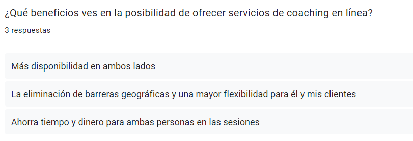
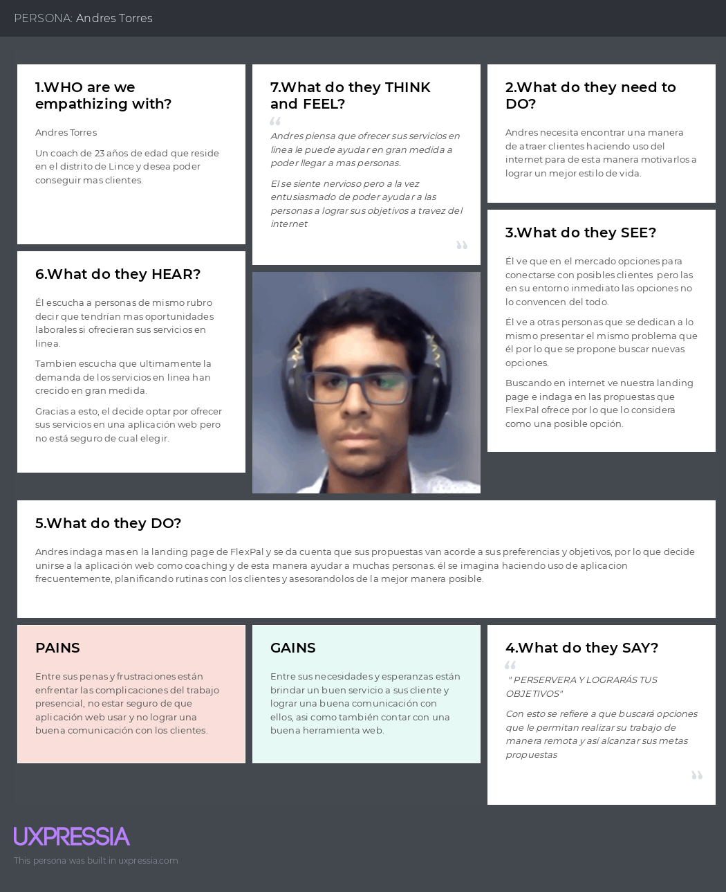

# **Capítulo II:  Requirements Elicitation & Analysis**
La recolección y análisis de requisitos es una etapa fundamental en el desarrollo de cualquier proyecto. Este proceso implica identificar, comprender y documentar las necesidades y expectativas de los stakeholders, así como los objetivos y restricciones del proyecto. Mediante diversas técnicas como entrevistas, encuestas y talleres de trabajo colaborativo, se busca obtener una comprensión clara y detallada de lo que se espera lograr con el proyecto. El análisis de estos requisitos permite establecer una base sólida para el diseño y desarrollo posterior, asegurando que el producto final satisfaga las necesidades del usuario y cumpla con los objetivos del negocio.
## 2.1. Competidores.
En la siguiente sección se presentarán los competidores, un análisis de las fortalezas de nuestro servicio frente a estas.
  
   

***MyFitnessPal:*** Es una de las aplicaciones líderes en el seguimiento de alimentos y ejercicio físico. Ofrece una amplia base de datos de alimentos y permite a los usuarios realizar un seguimiento de su ingesta calórica y actividad física para ayudarles a alcanzar sus objetivos de salud y fitness. Además del seguimiento básico, MyFitnessPal también proporciona herramientas para establecer metas personalizadas, crear planes de alimentación y recibir apoyo de una comunidad activa de usuarios.

   

***Noom:*** Es una aplicación de coaching en salud y bienestar que se centra en la pérdida de peso y el cambio de hábitos. Utiliza un enfoque basado en la psicología y la tecnología para ayudar a los usuarios a desarrollar hábitos saludables a largo plazo. Noom ofrece programas personalizados de pérdida de peso, seguimiento del progreso, educación sobre nutrición y ejercicio, así como apoyo de coaches certificados.

   

***NikeTrainingClub:*** Es una aplicación de entrenamiento de Nike que ofrece una amplia variedad de programas de ejercicio, desde entrenamientos de fuerza hasta yoga y cardio. La aplicación incluye entrenamientos guiados por expertos, seguimiento del progreso y una comunidad activa de usuarios que comparten sus logros y motivan a otros. Además, Nike Training Club está integrado con dispositivos Nike y ofrece acceso exclusivo a contenido de entrenamiento de atletas y celebridades patrocinados por Nike.
### 2.1.1. Análisis competitivo.
El análisis competitivo nos brinda una visión clara de cómo nos comparamos con nuestros competidores en el mercado. Nos ayuda a identificar áreas en las que podemos mejorar, así como oportunidades para diferenciarnos y destacar. Esta comprensión nos permite desarrollar estrategias más efectivas como grupo, lo que nos ayuda a alcanzar nuestros objetivos y mantenernos competitivos en el mercado. 

<table border="1" style="text-align: center;">
	<tbody>
		<tr>
			<td colspan="6">Competitive Analysis Landscape</td>
		</tr>
		<tr>
			<td colspan="2">¿Por que llevar a cabo este análisis?</td>
			<td colspan="4">Llevar a cabo este análisis nos brindará información crítica que nos permitirá tomar decisiones más informadas y estratégicas para el desarrollo, comercialización y crecimiento de nuestra aplicación</td>
		</tr>
		<tr>
			<td colspan="2"></td>
			<td>Nuestro nombre</td>
			<td>MyFitnessPal</td>
			<td>Noom</td>
			<td>Nike Training Club</td>
		</tr>
		<tr>
			<td rowspan="2">Perfil</td>
			<td>Overview</td>
			<td>Una aplicación móvil y web que ofrece coaching personalizado, seguimiento de progreso y planes de ejercicio y alimentación adaptados a las necesidades individuales de los usuarios.</td>
			<td>Una aplicación líder en seguimiento de alimentos y ejercicio, con una amplia base de usuarios y herramientas para ayudar a mejorar la salud y el estado físico.</td>
			<td>Una aplicación de coaching en salud y bienestar que combina seguimiento de alimentos, planificación de comidas, apoyo de coaching y educación sobre hábitos saludables.</td>
			<td>Una aplicación de entrenamiento de Nike que ofrece una amplia variedad de programas de ejercicio, entrenamientos guiados por expertos y seguimiento del progreso.</td>
		</tr>
		<tr>
			<td>Ventaja competitiva ¿Que valor ofrece a los clientes?</td>
			<td>Ofrece coaching personalizado y seguimiento de progreso integral para una experiencia de usuario altamente adaptada.</td>
			<td>Amplia base de usuarios, base de datos extensa de alimentos, integración con dispositivos de fitness y una comunidad activa.</td>
			<td>Enfoque holístico en la salud y el bienestar, coaching personalizado, educación sobre hábitos saludables y seguimiento del progreso.</td>
			<td>Variedad de entrenamientos y programas, consejos y guía de entrenadores expertos, seguimiento del progreso detallado y amplia integración con dispositivos Nike. </td>
		</tr>
		<tr>
			<td rowspan="2">Perfil de Marketing</td>
			<td>Mercado objetivo</td>
			<td>Individuos interesados en mejorar su salud y condición física, así como profesionales del coaching en áreas como el ejercicio y la nutrición.</td>
			<td>Personas que buscan mejorar su dieta y actividad física, así como profesionales de la salud y el fitness.</td>
			<td>Usuarios interesados en una experiencia de coaching en línea centrada en la salud y el bienestar, con un enfoque en la educación y el apoyo personalizado.</td>
			<td>Individuos que buscan variedad en sus entrenamientos, guía de expertos y seguimiento del progreso para mejorar su estado físico.</td>
		</tr>
		<tr>
			<td>Estrategias de marketing</td>
			<td>Marketing digital dirigido a individuos interesados en la salud y el bienestar, así como colaboraciones con profesionales del sector.</td>
			<td>Marketing de contenido, integración con dispositivos de fitness y una sólida presencia en línea.</td>
			<td>Enfoque en la educación sobre hábitos saludables, coaching personalizado y testimonios de éxito.</td>
			<td>Promoción de la marca Nike, colaboraciones con atletas y celebridades, y marketing digital dirigido a entusiastas del fitness.</td>
		</tr>
		<tr>
			<td rowspan="3">Perfil de Producto</td>
			<td>Productos &amp; Servicios</td>
			<td>Aplicación móvil y web con coaching personalizado, seguimiento de progreso y planes de ejercicio y alimentación adaptados.</td>
			<td>Aplicación móvil y web con seguimiento de alimentos, registro de ejercicio, objetivos personalizables y comunidad en línea.</td>
			<td>Aplicación móvil y web que combina seguimiento de alimentos, planificación de comidas, apoyo de coaching y educación sobre hábitos saludables.</td>
			<td>Aplicación móvil con una amplia variedad de programas de ejercicio, entrenamientos guiados por expertos y seguimiento del progreso.</td>
		</tr>
		<tr>
			<td>Precios &amp; Costos</td>
			<td>Modelo de suscripción mensual para acceder a los servicios de coaching y planes alimentarios personalizados.</td>
			<td>Modelo gratuito con opciones premium de suscripción mensual o anual.</td>
			<td>Modelo de suscripción con opciones de pago mensual o anual.</td>
			<td>Modelo gratuito con opciones de suscripción premium disponibles.</td>
		</tr>
		<tr>
			<td>Canales de distribución (Web y/o Móvil)</td>
			<td>Disponible en línea a través de la aplicación móvil y la plataforma web.</td>
			<td>Disponible en línea a través de la aplicación móvil y la plataforma web.</td>
			<td>Disponible en línea a través de la aplicación móvil y la plataforma web.</td>
			<td>Disponible en línea a través de la aplicación móvil y la plataforma web.</td>
		</tr>
		<tr>
			<td rowspan="4">Análisis SWOT</td>
			<td>Fortalezas</td>
			<td>
                <ul>
                    <li>Coaching personalizado</li>
                    <li>Seguimiento de progreso integral</li>
                    <li>Planes de ejercicio y alimentación adaptados</li>
                </ul>
            </td>
			<td>
                <ul>
                    <li>Amplia base de usuarios</li>
                    <li>Base de datos extensa de alimentos</li>
                    <li>Comunidad activa</li>
                </ul>
            </td>
			<td>
                <ul>
                    <li>Enfoque holístico en la salud y el bienestar</li>
                    <li>Coaching personalizado</li>
                    <li>Educación sobre hábitos saludables</li>
                </ul>
            </td>
			<td>
                <ul>
                    <li>Variedad de entrenamientos y programas</li>
                    <li>Consejos y guía de entrenadores expertos</li>
                    <li>Seguimiento del progreso detallado</li>
                </ul>
            </td>
		</tr>
		<tr>
			<td>Debilidades</td>
			<td>
                <ul>
                    <li>Novedad en el mercado</li>
                    <li>Confianza en las empresas educativas</li>
                </ul>
            </td>
			<td>
                <ul>
                    <li>Precio prohibitivo (facturado anualmente)</li>
                    <li>Solo disponible en inglés</li>
                </ul>
            </td>
			<td>
                <ul>
                    <li>Precio variable (en función de la inscripción de niños)</li>
                    <li>Material muy general</li>
                </ul>
            </td>
			<td>
                <ul>
                    <li>Precio alto (facturado anualmente)</li>
                    <li>Enfoque en niños de entre 3 a 10 años</li>
                </ul>
            </td>
		</tr>
		<tr>
			<td>Oportunidades</td>
			<td>
                <ul>
                    <li>Expansión a nivel internacional</li>
                    <li>Establecer asociaciones con empresas educativas</li>
                </ul>
            </td>
			<td>
                <ul>
                    <li>Precios basados en el nivel socioeconómico</li>
                    <li>Posibilidad de cambio de idioma</li>
                </ul>
            </td>
			<td>
                <ul>
                    <li>Precios fijos basados en usuario</li>
                    <li>Actualización continua del material</li>
                </ul>
            </td>
			<td>
                <ul>
                    <li>Precios basados en el nivel socioeconómico</li>
                    <li>Optimización del rendimiento de la aplicación web</li>
                </ul>
            </td>
		</tr>
		<tr>
			<td>Amenazas</td>
			<td>
                <ul>
                    <li>Competidores establecidos</li>
                    <li>Aceptación por parte de empresas educativas</li>
                </ul>
            </td>
			<td>
                <ul>
                    <li>Competencia de aplicaciones similares</li>
                    <li>Precio alto (facturado anualmente)</li>
                </ul>
            </td>
			<td>
                <ul>
                    <li>Competencia de aplicaciones similares</li>
                    <li>Precio variable</li>
                </ul>
            </td>
			<td>
                <ul>
                    <li>Competencia de aplicaciones similares</li>
                    <li>Precio alto (facturado anualmente)</li>
                </ul>
            </td>
		</tr>
	</tbody>
</table>

### 2.1.2. Estrategias y tácticas frente a competidores.
Para destacar frente a la competencia, es crucial desarrollar estrategias y tácticas efectivas que permitan diferenciar nuestro producto o servicio y captar la atención del mercado. Algunas estrategias y tácticas que podríamos considerar incluyen:
 
1.  **Desarrollar una Propuesta de Valor Únic :**
    * Estrategia: Destacar los aspectos únicos y diferenciadores de nuestro producto que lo hacen sobresalir frente a la competencia.
    * Táctica: Identificar las fortalezas clave de nuestro producto, como el enfoque holístico en la salud y el bienestar, y comunica claramente cómo benefician a los usuarios.
2.  **Enfoque en la Experiencia del Usuario:**
    * Estrategia: Priorizar la satisfacción y la experiencia del usuario para generar lealtad a la marca.
    * Táctica: Mejorar continuamente la interfaz de usuario de nuestro aplicación, simplificando la navegación y agregando funciones que faciliten el uso y la comprensión.
3.  **Ampliar la Base de Usuarios:**
    * Estrategia: Atraer a más usuarios a nuestra plataforma para aumentar su visibilidad y relevancia en el mercado.
    * Táctica: Implementar programas de referidos y promociones para incentivar a los usuarios actuales a invitar a amigos y familiares a unirse a nuestra aplicación.
4.  **Marketing Digital Dirigido:**
    * Estrategia: Dirigir nuestros esfuerzos de marketing digital hacia los segmentos de mercado más relevantes y receptivos.
    * Táctica: Utilizar estrategias de segmentación de audiencia en plataformas como redes sociales y motores de búsqueda para llegar a usuarios interesados en mejorar su salud y condición física.
5.  **Colaboraciones Estratégicas:**
    * Estrategia: Establecer asociaciones con otras empresas o profesionales del sector para expandir nuestro alcance y credibilidad.
    * Táctica: Colaborar con nutricionistas, entrenadores personales o influencers en el ámbito del fitness para promocionar unestro producto y llegar a nuevas audiencias.

## 2.2. Entrevistas.
El propósito de las entrevistas es adquirir una comprensión profunda de las experiencias, perspectivas y opiniones de los segmentos de mercado seleccionados. Nuestro objetivo es obtener información valiosa que nos ayude a entender mejor a nuestro público objetivo y así mejorar nuestro conocimiento sobre los usuarios. Estas conversaciones nos permitirán obtener una visión más clara de las necesidades y deseos de nuestros usuarios, lo que nos ayudará a adaptar nuestros productos o servicios de manera más efectiva a sus requerimientos.
### 2.2.1. Diseño de entrevistas.
El diseño de entrevistas nos permitirá recopilar información valiosa sobre las experiencias, perspectivas y necesidades de nuestro grupo objetivo. Esto nos ayudará a comprender mejor sus preocupaciones y expectativas, lo que a su vez nos permitirá desarrollar soluciones más efectivas y adaptadas a sus requerimientos. Además, nos brindará la oportunidad de establecer una conexión significativa con nuestros usuarios, fortaleciendo así nuestra relación con ellos y mejorando la calidad de nuestro producto o servicio.
 
* **Individuos interesados en mejorar su salud y condición física:**
1. ¿Qué te ha motivado a buscar maneras de mejorar tu salud y condición física en este momento?
2. ¿Cuál ha sido tu experiencia previa al intentar adoptar un estilo de vida más saludable? ¿Qué obstáculos has enfrentado?
3. ¿Qué tipo de apoyo o orientación te resultaría más útil para alcanzar tus objetivos de salud y condición física?
4. ¿Cómo crees que una Aplicación web de coaching en línea podría ayudarte a mantenerte motivado y comprometido con tus metas de bienestar?
5. ¿Qué características considerarías más importantes al elegir un servicio de coaching en línea para ayudarte a alcanzar tus objetivos de salud y condición física?
6. ¿Qué esperas obtener de un coach profesional en términos de apoyo y seguimiento en tu viaje hacia un estilo de vida más saludable?

* **Profesionales del coaching en ejercicio y alimentación:**
1. ¿Qué te llevó a convertirte en un profesional del coaching en ejercicio o alimentación?
2. ¿Cuáles son los mayores desafíos que enfrentas al trabajar con clientes de manera presencial?
3. ¿Qué beneficios ves en la posibilidad de ofrecer servicios de coaching en línea?
4. ¿Qué herramientas o características crees que serían más útiles para ti al proporcionar servicios de coaching en línea a tus clientes?
5. ¿Qué aspectos considerarías críticos al seleccionar una plataforma de coaching en línea para ofrecer tus servicios profesionales?
6. ¿Cómo crees que una aplicación web de coaching  podría mejorar la eficacia de tu trabajo como coach y la experiencia de tus clientes?
### 2.2.2. Registro de entrevistas.
El registro de entrevistas es una herramienta fundamental que nos ayuda a recopilar y organizar la información obtenida durante las entrevistas con nuestros usuarios o clientes. Nos permite documentar de manera estructurada las respuestas, comentarios y observaciones relevantes, lo que facilita su análisis posterior y la identificación de patrones o tendencias. Además, nos proporciona un registro histórico de las interacciones con los usuarios, lo que nos ayuda a mantenernos alineados con sus necesidades y expectativas a lo largo del tiempo. 
# **Personas que frecuentan actividades físicas:**

### **Entrevista #1**
#### Características:
Nombre y apellidos: Javier Cornejo  
Edad: 30 años  
Sistema Operativo: Windows  
Dispositivo más usado: Celular  
Distrito:  

#### Imagen de referencia:

Inicio De Entrevista: 0:00  
Fin de la entrevista: 2:10  

#### Transcripción:

**¿Qué te ha motivado a buscar maneras de mejorar tu salud y condición física en este momento?**  
- Mejorar mi rendimiento físico y mental para cumplir satisfactoriamente todas las actividades que me planteo en el día.

**¿Cuál ha sido tu experiencia previa al intentar adoptar un estilo de vida más saludable? ¿Qué obstáculos has enfrentado?**  
- Experiencia desfavorable y los obstáculos fueron no poder variar las actividades saludables durante un periodo largo, haciendo esto repetitivo y cansado.

**¿Qué tipo de apoyo o orientación te resultaría más útil para alcanzar tus objetivos de salud y condición física?**  
- Un guía para entrenar y un nutricionista que mejore mi alimentación

**¿Cómo crees que una Aplicación web de coaching en línea podría ayudarte a mantenerte motivado y comprometido con tus metas de bienestar?**  
- Creo que un coaching en línea podría ayudarme en incluir correctamente la rutina dentro de mis actividaes diarias. Además un seguimiento por parte de él evitaría caer en la rutina y desmotivación.

**¿Qué características considerarías más importantes al elegir un servicio de coaching en línea para ayudarte a alcanzar tus objetivos de salud y condición física?**  
- Considero que debe tener una atención rápida, un plan de actividades semanales y profesionales con capacitaciones constantes.

**¿Qué esperas obtener de un coach profesional en términos de apoyo y seguimiento en tu viaje hacia un estilo de vida más saludable?**  
- Espero obtener profesionalismo, motivación, responsabilidad y compromiso.  

- - -

### **Entrevista #2** 

#### Características:
Nombre y apellidos: Renzo Enciso  
Edad: 20 años  
Distrito: Chorrillos 

#### Imagen de referencia:
  
Inicio De Entrevista: 2:10  
Fin de la entrevista: 6:32  

#### Transcripción:
Resumen De Entrevista: El entrevistado muestra una motivación actual para mejorar su salud y condición física, destacando su conciencia sobre la importancia del bienestar a largo plazo. Su experiencia previa revela obstáculos como la falta de motivación constante y la carencia de apoyo adecuado en sus intentos previos por adoptar un estilo de vida más saludable. Busca un apoyo útil para alcanzar sus objetivos, priorizando el acceso a un coach profesional que brinde consejos personalizados y motivación constante. Considera que una Aplicación web de coaching en línea sería beneficiosa por su fácil acceso a recursos útiles y seguimiento del progreso. Al elegir un servicio de coaching, valora la experiencia del coach, la personalización de los planes y el apoyo constante. Espera recibir un apoyo personalizado de un coach profesional, que incluya orientación experta, seguimiento regular del progreso y motivación para superar obstáculos.

- - -

### **Entrevista #3**  

#### Características:
Nombre y apellidos: Diego Paulino  
Edad: 21 años  
Distrito: Santiago de Surco  

#### Imagen de referencia:
  
Inicio De Entrevista: 6:32  
Fin de la entrevista: 9:45  

#### Transcripción:
Resumen De Entrevista: El entrevistado revela una motivación actual para mejorar su salud y condición física, destacando su interés en adoptar un estilo de vida más activa y organizada. Su experiencia previa incluye intentos anteriores de seguir una dieta equilibrada y hacer ejercicio regularmente, pero ha enfrentado desafíos como la falta de organización y la dificultad para mantener la consistencia. Busca un apoyo y orientación útiles para alcanzar sus objetivos, priorizando la educación sobre nutrición y la planificación de comidas saludables. Considera que una Aplicación web de coaching en línea sería beneficiosa por su accesibilidad y seguimiento del progreso. Al elegir un servicio de coaching, valora la personalización de los planes, el apoyo constante y la motivación para mantenerse comprometido con sus objetivos. Espera recibir un apoyo profesional y personalizado de un coach en su viaje hacia un estilo de vida más saludable.

- - -

# **Coaches certificados:**

### **Entrevista #1**

#### Características:
Nombre y apellidos: Andres Torres  
Edad: 23 años  
Distrito: Lince 

#### Imagen de referencia:
  
Inicio De Entrevista: 9:45 
Fin de la entrevista: 14:46  

#### Transcripción:
Resumen De Entrevista: El entrevistado revela una fuerte motivación en el campo del coaching en ejercicio y alimentación, destacando su deseo de ayudar a otros a lograr sus metas de salud y bienestar de manera efectiva y sostenible. Además, reconoce los desafíos asociados con el trabajo presencial, como las limitaciones geográficas y la dificultad para mantener la consistencia en las sesiones. Expresa un claro entusiasmo por los beneficios potenciales de ofrecer servicios de coaching en línea, señalando la eliminación de barreras geográficas y una mayor flexibilidad para él y sus clientes. En cuanto a las herramientas y características esenciales, resalta la importancia de la comunicación en tiempo real, el seguimiento de progreso y los recursos educativos en una plataforma en línea. Finalmente, destaca cómo una aplicación web de coaching podría mejorar significativamente su eficacia laboral y la experiencia del cliente al proporcionar una plataforma centralizada y accesible para la comunicación y el soporte en cualquier momento y lugar.
  
- - -

### **Entrevista #2**  
#### Características:
Nombre y apellidos: Cristopher Paredes  
  Edad: 23 años  
  Distrito: Santiago de Surco 

#### Imagen de referencia:
    
  Inicio De Entrevista: 14:46  
  Fin de la entrevista: 21:14  

#### Transcripción:
  Resumen De Entrevista: El entrevistado muestra     el porqué inició en el mundo del coaching y nutrición, destacando su deseo de ayudar a otras personas a obtener su cuerpo deseado. Ya que como él dice, entrenar y comer saludable es distinto a solamente comer saludable. Reconoce los desafios de de trabajar de manera presencial, como la dificultad de tener mas asesorados. Expresa entusiasmo por los beneficios que obtendría ofreciendo servicios de coaching en linea. En cuanto a las herramientas y caracteristicas esenciales, resalta la facilidad de hablar con mas asesorados en el transcurso del dia, asi como el seguimiento de progreso que los obtendria consultando una base de datos. Finalmente, destaca cómo una aplicación web de coaching podría mejorar significativamente su eficacia laboral y la experiencia del cliente.  

- - -

### **Entrevista #3**  
#### Características:
Nombre y apellidos: Adrián Valerio  
Edad: 22 años  
Dispositivo más usado: Móvil  
Sistema Operativo: Android  
Distrito: Chorrillos 

#### Imagen de referencia:
  
Inicio De Entrevista: 21:14  
Fin de la entrevista: 27:06  

#### Transcripción:
  Resumen De Entrevista: El entrevistado nos comenta a cerca de su gran interés a cerca de la actividad física cuando niño, por ello esstudió y en estos momentos está sacando una certificación de coaching profesional mientras ejerce su carrera a sus 22 años. Para él, la comunicación usuario-coach es de lo más importante, y más si es virtual, pues, Adrián nos indica que hay una gran ventaja a comparación de la virtualidad, ya que feedbacks, consejos y regulaciones que brinda a sus usuarios puede ser más consistente, ya que la disponibilidad es más grande. 

## [Link de la entrevista upc-pre-202401-si730-SV51-Gymfinity-sprint-2](https://upcedupe-my.sharepoint.com/:v:/g/personal/u20221c936_upc_edu_pe/EdthUfWGQcdNjafKk4Iss98Blmmlg1Ej3pICf9SBl_3Hkw?nav=eyJyZWZlcnJhbEluZm8iOnsicmVmZXJyYWxBcHAiOiJTdHJlYW1XZWJBcHAiLCJyZWZlcnJhbFZpZXciOiJTaGFyZURpYWxvZy1MaW5rIiwicmVmZXJyYWxBcHBQbGF0Zm9ybSI6IldlYiIsInJlZmVycmFsTW9kZSI6InZpZXcifX0%3D&e=ctQ6T7)

### 2.2.3. Análisis de entrevistas.
El análisis de entrevistas nos permite profundizar en la comprensión de las necesidades, deseos y comportamientos de nuestros usuarios, lo que a su vez informa la toma de decisiones en el diseño y desarrollo de productos o servicios orientados al usuario.
  
- #### Analisis Primer Segmento:

Este análisis sugiere que ambos entrevistados comparten similitudes en términos de motivación, desafíos enfrentados y expectativas del servicio de coaching en línea. Identificar estas características comunes nos permitirá ayudar a orientar el diseño y desarrollo de la aplicación web para satisfacer las necesidades y expectativas de este grupo objetivo.

- #### Analisis Segundo Segmento:

Características comunes:

- **Motivación y pasión**: Todos los entrevistados muestran una fuerte motivación y pasión por el campo del coaching en ejercicio y alimentación, destacando su deseo de ayudar a otros a mejorar su salud y bienestar.
- **Reconocimiento de desafíos**: Los entrevistados reconocen los desafíos asociados con el trabajo presencial, como las limitaciones geográficas y la dificultad para mantener la consistencia en las sesiones.
- **Interés en la virtualidad**: Todos expresan un claro entusiasmo por los beneficios potenciales de ofrecer servicios de coaching en línea, como la eliminación de barreras geográficas y una mayor flexibilidad para ellos y sus clientes.
- **Importancia de herramientas y características esenciales**: Resaltan la importancia de herramientas como la comunicación en tiempo real, el seguimiento del progreso y los recursos educativos en una plataforma en línea para brindar un servicio efectivo.
- **Mejora de la eficacia laboral**: Todos destacan cómo una aplicación web de coaching podría mejorar

## 2.3. Needfinding.
El proceso de needfinding nos permite identificar problemas reales que enfrentan los usuarios y descubrir oportunidades de diseño que pueden llevar a soluciones innovadoras y centradas en el usuario.
### 2.3.1. User Personas.
En esta sección, presentaremos el perfil de nuestros User Persona, que surge de un análisis de las entrevistas realizadas anteriormente y de una evaluación de la competencia en el mercado. Los artefactos que vamos a presentar están estrechamente relacionados con las principales características identificadas durante este proceso de análisis. Desde las entrevistas, hemos extraído valiosa información sobre las necesidades, deseos y frustraciones de nuestros potenciales usuarios, lo que nos ha permitido perfilar a nuestro User Persona de manera precisa y realista.
- **User Persona Primer Segmento Objetivo(Usuarios interesados en mejorar su salud y condición física)**
  
- **User Persona Segundo Segmento Objetivo(Profesionales del coaching en ejercicio y alimentación)**
  
### 2.3.2. User Task Matrix.
La User Task Matrix es una herramienta que nos permite identificar las tareas clave que nuestros usuarios necesitan realizar en nuestra aplicación web. Al mapear estas tareas, podemos comprender mejor las necesidades y expectativas de nuestros usuarios, lo que nos ayuda a diseñar una experiencia de usuario más efectiva y centrada en sus requerimientos.
  
- User Task Matrix Primer Segmento Objetivo(Usuarios interesados en mejorar su salud y condición física)

<table  style="text-align: center">
    <tbody>
     <tr>
            <td colspan="3"> Javier Cornejo</td>
    </tr>  
    <tr>
        <td>Tareas</td>
        <td>Frecuencia</td>
        <td>Importancia</td>
    </tr>
    <tr>
        <td>Asistir a clases de gimnasio o grupos de entrenamiento </td>
        <td>Never</td>
        <td>High</td>
    </tr>
    <tr>
        <td>Hacer ejercicio en casa </td>
        <td>Rarely</td>
        <td>High</td>
    </tr>
    <tr>
        <td>Planificar comidas semanalmente</td>
        <td>Sometimes</td>
        <td>Medium</td>
    </tr>
    <tr>
        <td>Consultar blogs y videos sobre nutrición y fitness</td>
        <td>Often</td>
        <td>High</td>
    </tr>
    <tr>
        <td>Hablar con amigos o familiares sobre sus experiencias con planes de ejercicio y alimentación</td>
        <td>Sometimes</td>
        <td>Low</td>
    </tr>
    <tr>
        <td>Investigar diferentes tipos de dietas y programas de ejercicio</td>
        <td>Low</td>
        <td>Medium</td>
    </tr>
    <tr>
        <td>Buscar aplicaciones de seguimiento de alimentos y ejercicios</td>
        <td>Always</td>
        <td>High</td>
    </tr>
    </tbody>

</table>

- User Task Matrix Segundo Segmento Objetivo(Profesionales del coaching en ejercicio y alimentación)

<table  style="text-align: center">
    <tbody>
     <tr>
            <td colspan="3"> Andrés Torres</td>
    </tr>  
    <tr>
        <td>Tareas</td>
        <td>Frecuencia</td>
        <td>Importancia</td>
    </tr>
    <tr>
        <td>Crear planes de ejercicio personalizados para sus clientes presencialmente</td>
        <td>Always</td>
        <td>High</td>
    </tr>
    <tr>
        <td>Seguir el progreso de los clientes </td>
        <td>High</td>
        <td>High</td>
    </tr>
    <tr>
        <td>Comunicarse con los clientes</td>
        <td>Often</td>
        <td>Medium</td>
    </tr>
    <tr>
        <td>Hacer uso de redes sociales y plataformas digitales para atraer clientes</td>
        <td>Low</td>
        <td>High</td>
    </tr>
    <tr>
        <td>Buscar oportuniades para mejorar su forma de trabajo</td>
        <td>Sometimes</td>
        <td>Medium</td>
    </tr>
    <tr>
        <td>Mantenerse al día con las últimas investigaciones en salud y fitness</td>
        <td>Low</td>
        <td>Medium</td>
    </tr>
    </tbody>
</table>                                    

### 2.3.3. User Journey Mapping
El User Journey Mapping es una herramienta  para comprender la experiencia del usuario de manera holística, lo que permite a los equipos de diseño crear productos y servicios que se alineen mejor con las necesidades y expectativas de los usuarios.
  

- **Segmento Objetivo: Usuarios interesados en mejorar su salud y condición física**  

### 2.3.4. Empathy Mapping.
Se ha elaborado el Empathy Mapping utilizando los datos obtenidos de las etapas preliminares del proyecto. A través de este proceso, hemos diseñado mapas específicos para cada uno de nuestros dos User Persona, con el fin de profundizar en la comprensión de sus necesidades y experiencias. Esta comprensión es esencial para guiar las próximas fases de nuestro desarrollo.
 

- **Empathy Map Primer Segmento Objetivo(Usuarios interesados en mejorar su salud y condición física)**
  
- **Empathy Map Segundo Segmento Objetivo(Profesionales del coaching en ejercicio y alimentación)**
  
### 2.3.5. As-is Scenario Mapping.
El "As-is Scenario Mapping" será una parte fundamental de nuestro enfoque de trabajo, ya que nos permitirá comprender el estado actual de nuestros procesos, identificar áreas de mejora y visualizar los pasos necesarios para alcanzar nuestros objetivos.
- As-Is del segmento objetivo usuario:

- As-Is del segmento objetivo coach:

## 2.4. Ubiquitous Language
El "Ubiquitous Language" será una herramienta esencial en nuestro trabajo, ya que nos permitirá establecer un lenguaje común y compartido entre todos los miembros del equipo, facilitando la comunicación y la comprensión de los conceptos clave en nuestro proyecto.
  

***Member***: A person who has registered and holds a membership at the gym. Members have access to our web facilities and services.

***Membership Plan***: The subscription package chosen by a member, determining the duration of access to our web application facilities and services.

***Coach***: A certified fitness professional employed by the gym to provide personalized training sessions and fitness advice to members.

***Workout Routine***: A personalized plan created for a member by a coach, outlining specific exercises, sets, and repetitions to achieve fitness goals.

***Nutrition Plan***: A dietary plan designed for a member by coach, specifying recommended meals, portion sizes, and nutritional guidelines to support fitness objectives.

Implementation example:
When a ***member*** signs up for a ***membership plan***, they are presented with options labeled as "***Membership Plans***".

When a ***coach*** creates a ***workout routine*** or ***nutrition plan*** for a ***member***, the terminology used within the software aligns with the ubiquitous language established.
