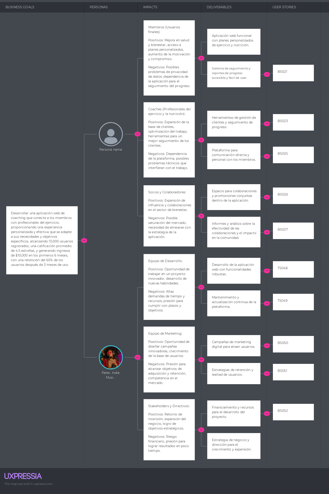

# **Capítulo III: Requirements Specification**
La especificación de requisitos será una etapa crucial en nuestro trabajo, ya que nos permitirá definir claramente los objetivos y las funcionalidades que nuestro producto debe cumplir.
## 3.1. To-Be Scenario Mapping.
El mapeo de escenarios "To-Be" nos permite visualizar cómo será el proceso o flujo de trabajo deseado en el futuro después de implementar las mejoras propuestas. Nos ayuda a identificar los cambios necesarios en los procesos actuales y a diseñar soluciones para optimizarlos. Al crear escenarios "To-Be", podemos visualizar claramente cómo se verá el proceso una vez que se implementen las mejoras, lo que nos permite comunicar mejor la visión del proyecto y alinear a todas las partes interesadas en torno a los objetivos comunes. Esto facilita la planificación y la implementación efectiva de los cambios para lograr los resultados deseados.
  
- To-Be del segmento objetivo usuario:

- To-Be del segmento objetivo coach:

## 3.2. User Stories.
Las User Stories, o historias de usuario, son descripciones breves y centradas en el usuario de una funcionalidad específica del producto. Nos ayudan a comprender las necesidades y expectativas de nuestros usuarios al abordar qué quieren lograr y por qué. Al escribir User Stories, nos centramos en el valor que proporcionará la funcionalidad para el usuario y en cómo la utilizará en su contexto. Esto nos permite priorizar las características del producto de acuerdo con su importancia para el usuario y desarrollar soluciones que realmente resuelvan sus problemas y satisfagan sus necesidades.
 
Para elaborar user stories que pertenecen a un epic. A continuación, las epics que consideramos como equipo:

| **Código** | **Título**                                      | **Epic**                                                                                                                                                                                                                                                            |
|------------|-------------------------------------------------|---------------------------------------------------------------------------------------------------------------------------------------------------------------------------------------------------------------------------------------------------------------------|
| EP001      | Gestión de cuentas                              | **Como** usuario de la plataforma, **Quiero** poder gestionar mi cuenta, **Para** poder actualizar mi información personal, cambiar mi contraseña y gestionar mis preferencias de privacidad.                                                                       |
| EP002      | Visualización de User Interface                | **Como** usuario de la plataforma, **Quiero** poder ver la interfaz de usuario del landing page y la plataforma, **Para** explorar todas las funcionalidades disponibles y entender cómo interactuar con la plataforma.                                             |
| EP003      | Interacción con la plataforma                  | **Como** usuario de la plataforma, **Quiero** poder interactuar con las diferentes características de la plataforma, **Para** poder realizar acciones como crear, editar y eliminar contenido, así como recibir retroalimentación y comunicarme con otros usuarios. |
| EP004      | Programación y Seguimiento de Sesiones de Entrenamiento | **Como** usuario de la plataforma, **Quiero** poder programar sesiones de entrenamiento con mi coach, **Para** poder establecer metas, seguir mi progreso y recibir recomendaciones personalizadas para mejorar mi rendimiento físico.                              |
| EP005      | Análisis de Datos y Planificación de Objetivos | **Como** usuario de la plataforma, **Quiero** tener acceso a herramientas de análisis de datos, **Para** poder revisar mi progreso, establecer metas alcanzables y planificar mi entrenamiento de manera efectiva.                                                  |
| EP006 | Desarrollo de Funcionalidades Principales | **Como** equipo de desarrollo, **Quiero** implementar las funcionalidades principales del sistema, **Para** establecer una base sólida y funcional sobre la cual construir el resto del proyecto.                                                                           |

A continuacion, la realizacion de los user stories con sus criterios de aceptacion con escenarios e ID de Épica:

| ID de Historia de Usuario | Título de User Story              | Descripción                                                                                                       | Criterios de Aceptación con Escenarios                                                                                                                                                                                                                                                                                                                                                                                                                                                                                                                                                                                                                                                                                                                                                                                                                                | ID de Épica |
|---------------------------|----------------------------------|---------------------------------------------------------------------------------------------------------------------|-----------------------------------------------------------------------------------------------------------------------------------------------------------------------------------------------------------------------------------------------------------------------------------------------------------------------------------------------------------------------------------------------------------------------------------------------------------------------------------------------------------------------------------------------------------------------------------------------------------------------------------------------------------------------------------------------------------------------------------------------------------------------------------------------------------------------------------------------------------------------|-------------|
| US001                     | Iniciar Sesión                   | Como usuario registrado, Quiero poder iniciar sesión en la plataforma, Para acceder a mi cuenta y utilizar las funciones disponibles. | **Happy Path:** **Given** el usuario tiene credenciales válidas. **When** el usuario ingresa sus credenciales válidas y presiona "Iniciar sesión".  **Unhappy Path:** **Given** el usuario tiene credenciales inválidas. **When** el usuario ingresa credenciales inválidas y presiona "Iniciar sesión".  **Unhappy Path:** **Given** el usuario no tiene una cuenta. **When** el usuario intenta iniciar sesión sin estar registrado. **Then** el sistema muestra un mensaje de error junto con un enlace para registrarse.                                                                                                                                                                                                                                         | EP001       |
| US002                     | Recuperar Contraseña             | Como usuario de la plataforma, Quiero poder recuperar mi contraseña olvidada, Para poder acceder nuevamente a mi cuenta. | **Happy Path:** **Given** el usuario ha olvidado su contraseña. **When** el usuario solicita restablecer la contraseña. **Then** el sistema envía un correo electrónico con un enlace de restablecimiento. **Unhappy Path:** **Given** el usuario no ha olvidado su contraseña. **When** el usuario intenta restablecerla sin haber olvidado la contraseña. **Then** el sistema muestra un mensaje indicando que la contraseña es incorrecta. **Unhappy Path:** **Given** el usuario no tiene una cuenta. **When** el usuario intenta restablecer la contraseña sin estar registrado. **Then** el sistema muestra un mensaje indicando que la cuenta no existe.| EP001       |
| US003                     | Actualizar Información Personal | Como usuario registrado, Quiero poder actualizar mi información personal en mi perfil, Para mantenerla actualizada y precisa. | **Happy Path:** **Given** que el usuario desea cambiar su información personal.   **When** el usuario realiza cambios en su perfil y guarda.   **Then** el sistema actualiza la información en la base de datos.   **Unhappy Path:** **Given** que el usuario intenta guardar información inválida.    **When** el usuario intenta guardar cambios con campos obligatorios vacíos.   **Then** el sistema muestra un mensaje indicando los campos obligatorios.   **Unhappy Path:** **Given** que el usuario desea eliminar su foto de perfil.   **When** el usuario elimina la foto y guarda los cambios.   **Then** el sistema elimina la foto de perfil y actualiza la información en la base de datos.                                                                                                                                                                      | EP001       |
| US004                     | Cambiar Idioma de la Plataforma | Como usuario, Quiero poder cambiar el idioma de la plataforma, Para utilizar la plataforma en mi idioma preferido. | **Happy Path:** **Given** que el usuario desea cambiar el idioma de la plataforma.   **When** el usuario selecciona un nuevo idioma en la configuración.   **Then** la plataforma muestra el contenido en el nuevo idioma. **Unhappy Path:** **Given** que el usuario selecciona el mismo idioma actual.    **When** el usuario intenta cambiar el idioma a uno que ya está seleccionado.   **Then** la plataforma no realiza cambios y muestra un mensaje informativo.   **Unhappy Path:** **Given** que el usuario selecciona un idioma no admitido.   **When** el usuario intenta cambiar el idioma a uno no admitido por la plataforma.   **Then** la plataforma no realiza cambios y muestra un mensaje de error.                                                                                                                                                            | EP002       |
| US005                     | Personalizar Tema de Interfaz   | Como usuario de la plataforma, Quiero poder personalizar el tema de la interfaz, Para adaptarla a mis preferencias visuales. | **Happy Path:** **Given** que el usuario desea cambiar el tema de la interfaz.   **When** el usuario elige un tema de interfaz en la configuración.   **Then** la plataforma cambia la apariencia según el tema seleccionado.  **Unhappy Path:** **Given** que el usuario selecciona el mismo tema actual.   **When** el usuario intenta cambiar el tema a uno que ya está seleccionado.   **Then** la plataforma no realiza cambios y muestra un mensaje informativo.   **Unhappy Path:** **Given** que el usuario selecciona un tema no admitido.   **When** el usuario intenta cambiar el tema a uno no admitido por la plataforma.   **Then** la plataforma no realiza cambios y muestra un mensaje de error.                                                                                                                                                                 | EP002       |
| US006                     | Filtrar Contenido por Categoría | Como usuario, Quiero poder filtrar el contenido por categoría, Para encontrar información relevante más fácilmente.  | **Happy Path:** **Given** que el usuario desea ver contenido específico.   **When** el usuario selecciona una categoría de filtrado.   **Then** la plataforma muestra solo el contenido de esa categoría.  **Unhappy Path:** **Given** que el usuario intenta filtrar contenido con una categoría no existente.   **When** el usuario selecciona una categoría inexistente.   **Then** la plataforma no muestra ningún contenido y muestra un mensaje informativo.  **Unhappy Path:** **Given** que el usuario intenta filtrar contenido sin seleccionar ninguna categoría.   **When** el usuario intenta aplicar un filtro sin seleccionar una categoría.   **Then** la plataforma no realiza cambios y muestra un mensaje informativo.                                                                                                                                          | EP002       |
| US007                     | Publicar Comentarios             | Como usuario, Quiero poder publicar comentarios en las publicaciones de otros usuarios, Para interactuar con la comunidad de la plataforma. | **Happy Path:** **Given** que el usuario encuentra una publicación interesante.   **When** el usuario escribe un comentario y lo publica.   **Then** el comentario se muestra debajo de la publicación.  **Unhappy Path:** **Given** que el usuario intenta publicar un comentario vacío.   **When** el usuario intenta publicar un comentario sin contenido.   **Then** el sistema muestra un mensaje indicando que el comentario no puede estar vacío.  **Unhappy Path:** **Given** que el usuario intenta publicar un comentario muy largo.   **When** el usuario intenta publicar un comentario que excede el límite de caracteres.   **Then** el sistema muestra un mensaje indicando que el comentario es demasiado largo.                                                                                                                                                  | EP003       |
| US008                     | Dar "Me Gusta" a Publicaciones | Como usuario de la plataforma, Quiero poder dar "Me Gusta" a las publicaciones de otros usuarios, Para mostrar aprecio por el contenido.    | **Happy Path:** **Given** que el usuario ve una publicación que le gusta.   **When** el usuario hace clic en el botón "Me Gusta".   **Then** el sistema incrementa el contador de "Me Gusta" en la publicación.  **Unhappy Path:** **Given** que el usuario intenta dar "Me Gusta" a una publicación ya gustada.   **When** el usuario intenta dar "Me Gusta" a una publicación que ya ha sido gustada por él.   **Then** el sistema no realiza cambios en el contador de "Me Gusta".  **Unhappy Path:** **Given** que el usuario intenta dar "Me Gusta" a una publicación sin estar autenticado.   **When** el usuario intenta dar "Me Gusta" a una publicación sin haber iniciado sesión.   **Then** el sistema redirige al usuario a la página de inicio de sesión.                                                                                                            | EP003       |
| US009                     | Compartir Publicaciones        | Como usuario, Quiero poder compartir publicaciones en mis redes sociales, Para compartir contenido interesante con otros.                    | **Happy Path:** **Given** que el usuario desea compartir una publicación.   **When** el usuario hace clic en el botón de compartir y selecciona una red social.   **Then** el sistema abre la página de la red social seleccionada.  **Unhappy Path:** **Given** que el usuario intenta compartir una publicación sin seleccionar una red social.   **When** el usuario intenta compartir una publicación sin seleccionar una red social.   **Then** el sistema muestra un mensaje indicando que se debe seleccionar una red social.  **Unhappy Path:** **Given** que el usuario intenta compartir una publicación sin estar autenticado.   **When** el usuario intenta compartir una publicación sin haber iniciado sesión.   **Then** el sistema redirige al usuario a la página de inicio de sesión.                                                                           | EP003       |
| US010                     | Programar Sesiones de Entrenamiento | Como usuario, Quiero programar una sesión de entrenamiento con un coach, Para recibir orientación personalizada.                            | **Happy Path:** **Given** que el usuario desea programar una sesión de entrenamiento.   **When** el usuario selecciona un horario disponible y confirma.   **Then** el sistema registra la sesión en el calendario del usuario y notifica al coach.   **Unhappy Path:** **Given** que el usuario intenta programar una sesión en un horario no disponible.   **When** el usuario selecciona un horario que ya está ocupado.   **Then** el sistema muestra un mensaje indicando que el horario no está disponible.   **Unhappy Path:** **Given** que el usuario intenta programar una sesión sin haber iniciado sesión.   **When** el usuario intenta programar una sesión sin haber iniciado sesión.   **Then** el sistema redirige al usuario a la página de inicio de sesión.                                                                                                   | EP004       |
| US011                     | Seguir Rutinas de Ejercicio          | Como usuario, Quiero poder seguir rutinas de ejercicio recomendadas por mi coach, Para mejorar mi rendimiento físico.                    | **Happy Path:** **Given** que el usuario desea seguir una rutina de ejercicio recomendada por su coach.   **When** el usuario selecciona una rutina y la inicia.   **Then** el sistema muestra los ejercicios de la rutina paso a paso.  **Unhappy Path:** **Given** que el usuario intenta seguir una rutina sin estar autenticado.   **When** el usuario intenta seguir una rutina sin haber iniciado sesión.   **Then** el sistema redirige al usuario a la página de inicio de sesión.   **Unhappy Path:** **Given** que el usuario intenta seguir una rutina que no está asignada por su coach.   **When** el usuario intenta seguir una rutina que no ha sido asignada por su coach.   **Then** el sistema muestra un mensaje indicando que la rutina no está disponible.                                                                                                   | EP004       |
| US012                     | Registrar Progreso                   | Como usuario, Quiero registrar mi progreso de entrenamiento, Para hacer un seguimiento de mi rendimiento y mejoras.                       | **Happy Path:** **Given** que el usuario desea registrar su progreso.   **When** el usuario ingresa sus datos de progreso y los guarda.   **Then** el sistema registra los datos en su perfil y los muestra en forma de gráficos y estadísticas.   **Unhappy Path:** **Given** que el usuario intenta registrar un progreso sin estar autenticado.   **When** el usuario intenta registrar un progreso sin haber iniciado sesión.   **Then** el sistema redirige al usuario a la página de inicio de sesión.   **Unhappy Path:** **Given** que el usuario intenta registrar un progreso con datos inválidos.   **When** el usuario intenta guardar datos de progreso con formatos incorrectos o valores no válidos.   **Then** el sistema muestra un mensaje indicando el error.                                                                                                    | EP005       |
| US013                     | Visualizar Estadísticas de Progreso | Como usuario, Quiero visualizar estadísticas de mi progreso de entrenamiento, Para analizar mi rendimiento a lo largo del tiempo.          | **Happy Path:** **Given** que el usuario desea ver estadísticas de su progreso.   **When** el usuario navega a la sección de estadísticas en su perfil.   **Then** el sistema muestra gráficos y métricas de su progreso.   **Unhappy Path:** **Given** que el usuario intenta visualizar estadísticas sin estar autenticado.   **When** el usuario intenta ver estadísticas sin haber iniciado sesión.   **Then** el sistema redirige al usuario a la página de inicio de sesión.   **Unhappy Path:** **Given** que el usuario intenta visualizar estadísticas sin tener datos registrados.   **When** el usuario navega a la sección de estadísticas sin haber registrado datos de progreso.   **Then** el sistema muestra un mensaje indicando que no hay datos disponibles.                                                                                                     | EP005       |
| US014                     | Establecer Objetivos de Entrenamiento | Como usuario, Quiero establecer objetivos de entrenamiento, Para tener metas claras y medibles.                                         | **Happy Path:** **Given** que el usuario desea establecer un objetivo de entrenamiento.   **When** el usuario define un objetivo específico y lo guarda.   **Then** el sistema registra el objetivo en su perfil y lo muestra como parte de su plan de entrenamiento.   **Unhappy Path:** **Given** que el usuario intenta establecer un objetivo sin estar autenticado.   **When** el usuario intenta definir un objetivo sin haber iniciado sesión.   **Then** el sistema redirige al usuario a la página de inicio de sesión.   **Unhappy Path:** **Given** que el usuario intenta establecer un objetivo con datos inválidos.   **When** el usuario intenta guardar un objetivo con valores no válidos o formatos incorrectos.   **Then** el sistema muestra un mensaje indicando el error.                                                                                     | EP005       |
| US015                     | Visualizar Planes de Nutrición     | Como usuario, Quiero visualizar los planes de nutrición personalizados, Para tener una guía alimentaria adaptada a mis necesidades.       | **Happy Path:** **Given** que el usuario desea ver los planes de nutrición.   **When** el usuario accede a la sección de nutrición en la plataforma.   **Then** el sistema muestra una lista de planes de nutrición personalizados disponibles.  **Unhappy Path:** **Given** que el usuario intenta visualizar planes de nutrición sin estar autenticado.   **When** el usuario intenta ver los planes de nutrición sin haber iniciado sesión.   **Then** el sistema redirige al usuario a la página de inicio de sesión.   **Unhappy Path:** **Given** que el usuario intenta visualizar planes de nutrición sin tener ningún plan disponible.   **When** el usuario accede a la sección de nutrición sin tener planes asignados.   **Then** el sistema muestra un mensaje indicando que no hay planes disponibles.                                                                | EP003       |
| US016                     | Acceder a Recetas Nutricionales    | Como usuario, Quiero acceder a recetas nutricionales saludables, Para mejorar mi alimentación y mantener un estilo de vida saludable.       | **Happy Path:** **Given** que el usuario desea acceder a recetas nutricionales.   **When** el usuario navega a la sección de recetas en la plataforma.   **Then** el sistema muestra una lista de recetas saludables disponibles.  **Unhappy Path:** **Given** que el usuario intenta acceder a recetas sin estar autenticado.   **When** el usuario intenta ver las recetas sin haber iniciado sesión.   **Then** el sistema redirige al usuario a la página de inicio de sesión.   **Unhappy Path:** **Given** que el usuario intenta acceder a recetas sin tener ninguna receta disponible.   **When** el usuario accede a la sección de recetas sin tener recetas asignadas.   **Then** el sistema muestra un mensaje indicando que no hay recetas disponibles.                                                                                                                | EP003       |
| US017                     | Seguir Planes de Nutrición        | Como usuario, Quiero poder seguir planes de nutrición personalizados, Para mejorar mis hábitos alimenticios.                               | **Happy Path:** **Given** que el usuario desea seguir un plan de nutrición.   **When** el usuario selecciona un plan de nutrición y lo inicia.   **Then** el sistema muestra las pautas y recomendaciones del plan de nutrición.  **Unhappy Path:** **Given** que el usuario intenta seguir un plan de nutrición sin estar autenticado.   **When** el usuario intenta iniciar un plan de nutrición sin haber iniciado sesión.   **Then** el sistema redirige al usuario a la página de inicio de sesión.   **Unhappy Path:** **Given** que el usuario intenta seguir un plan de nutrición sin tener ningún plan disponible.   **When** el usuario intenta iniciar un plan de nutrición sin tener planes asignados.   **Then** el sistema muestra un mensaje indicando que no hay planes disponibles.                                                                               | EP003       |
| US018                     | Compartir Recetas Nutricionales   | Como usuario, Quiero poder compartir recetas nutricionales con otros usuarios, Para ayudarles a mejorar su alimentación.                     | **Happy Path:** **Given** que el usuario desea compartir una receta nutricional.   **When** el usuario hace clic en el botón de compartir y selecciona una opción.   **Then** el sistema abre la opción seleccionada para compartir la receta.  **Unhappy Path:** **Given** que el usuario intenta compartir una receta sin estar autenticado.   **When** el usuario intenta compartir una receta sin haber iniciado sesión.   **Then** el sistema redirige al usuario a la página de inicio de sesión.   **Unhappy Path:** **Given** que el usuario intenta compartir una receta que no está disponible.   **When** el usuario intenta compartir una receta que no existe en la plataforma.   **Then** el sistema muestra un mensaje indicando que la receta no está disponible.                                                                                                  | EP003       |
| BS019                     | Visualizar Calendario de Sesiones   | Como coach, Quiero visualizar un calendario con las sesiones programadas de mis clientes, Para organizar mi agenda y planificar las sesiones. | **Happy Path:** **Given** que el coach desea ver el calendario de sesiones.    **When** el coach accede a la sección de calendario en la plataforma.   **Then** el sistema muestra las sesiones programadas con sus respectivos detalles.  **Unhappy Path:** **Given** que el coach no tiene sesiones programadas.   **When** el coach accede al calendario sin tener sesiones programadas.   **Then** el sistema muestra un mensaje indicando que no hay sesiones programadas.   **Unhappy Path:** **Given** que el coach intenta acceder al calendario sin estar autenticado.   **When** el coach intenta ver el calendario sin haber iniciado sesión.   **Then** el sistema redirige al coach a la página de inicio de sesión.                                                                                                                                                 | EP003       | 
| BS020                     | Asignar Rutinas de Ejercicio a Clientes      | Como coach, Quiero asignar rutinas de ejercicio a mis clientes, Para guiar su entrenamiento y seguimiento.                                  | **Happy Path:** **Given** que el coach desea asignar una rutina de ejercicio a un cliente.   **When** el coach selecciona un cliente y asigna una rutina de ejercicio.   **Then** el sistema registra la asignación en el perfil del cliente.   **Unhappy Path:** **Given** que el coach intenta asignar una rutina sin estar autenticado.   **When** el coach intenta asignar una rutina sin haber iniciado sesión.   **Then** el sistema redirige al coach a la página de inicio de sesión.   **Unhappy Path:** **Given** que el coach intenta asignar una rutina que no existe.   **When** el coach intenta asignar una rutina que no ha sido creada en la plataforma.   **Then** el sistema muestra un mensaje indicando que la rutina no está disponible.                                                                                                                    | EP004       |
| BS021                     | Generar Reportes de Progreso de Clientes     | Como coach, Quiero generar reportes de progreso de mis clientes, Para analizar su evolución y ajustar sus entrenamientos.                   | **Happy Path:** **Dado** que el coach desea generar un reporte de progreso de un cliente. **When** el coach selecciona un cliente y solicita el reporte de progreso. **Then** el sistema genera y muestra el reporte con los datos del cliente. **Unhappy Path:** **Dado** que el coach intenta generar un reporte sin estar autenticado. **When** el coach intenta generar un reporte sin haber iniciado sesión. **Then** el sistema redirige al coach a la página de inicio de sesión. **Unhappy Path:** **Dado** que el coach intenta generar un reporte para un cliente sin datos registrados. **When** el coach solicita un reporte de progreso para un cliente sin datos registrados. **Then** el sistema muestra un mensaje indicando que no hay datos disponibles.                                                                                     | EP005       |
| BS022                     | Crear Rutinas de Ejercicio Personalizadas   | Como coach, Quiero crear rutinas de ejercicio personalizadas para mis clientes, Para adaptar los entrenamientos a sus necesidades específicas. | **Happy Path:** **Dado** que el coach desea crear una rutina de ejercicio personalizada. **When** el coach accede a la herramienta de creación de rutinas en la plataforma. **Then** el sistema muestra las opciones para personalizar la rutina. **Unhappy Path:** **Dado** que el coach intenta crear una rutina sin estar autenticado. **When** el coach intenta crear una rutina sin haber iniciado sesión. **Then** el sistema redirige al coach a la página de inicio de sesión. **Unhappy Path:** **Dado** que el coach intenta crear una rutina con datos inválidos. **When** el coach intenta guardar una rutina con campos obligatorios vacíos o valores incorrectos. **Then** el sistema muestra un mensaje indicando el error.                                                                                                                     | EP004       |
| BS023                     | Asignar Rutinas de Ejercicio a Clientes     | Como coach, Quiero asignar rutinas de ejercicio a mis clientes, Para guiar su entrenamiento y seguimiento.                                  | **Happy Path:** **Dado** que el coach desea asignar una rutina de ejercicio a un cliente. **When** el coach selecciona un cliente y asigna una rutina de ejercicio. **Then** el sistema registra la asignación en el perfil del cliente. **Unhappy Path:** **Dado** que el coach intenta asignar una rutina sin estar autenticado. **When** el coach intenta asignar una rutina sin haber iniciado sesión. **Then** el sistema redirige al coach a la página de inicio de sesión. **Unhappy Path:** **Dado** que el coach intenta asignar una rutina que no existe. **When** el coach intenta asignar una rutina que no ha sido creada en la plataforma. **Then** el sistema muestra un mensaje indicando que la rutina no está disponible.                                                                                                                    | EP004       |
| BS024                     | Generar Reportes de Progreso de Clientes     | Como coach, Quiero generar reportes de progreso de mis clientes, Para analizar su evolución y ajustar sus entrenamientos.                   | **Happy Path:** **Dado** que el coach desea generar un reporte de progreso de un cliente. **When** el coach selecciona un cliente y solicita el reporte de progreso. **Then** el sistema genera y muestra el reporte con los datos del cliente. **Unhappy Path:** **Dado** que el coach intenta generar un reporte sin estar autenticado. **When** el coach intenta generar un reporte sin haber iniciado sesión. **Then** el sistema redirige al coach a la página de inicio de sesión. **Unhappy Path:** **Dado** que el coach intenta generar un reporte para un cliente sin datos registrados. **When** el coach solicita un reporte de progreso para un cliente sin datos registrados. **Then** el sistema muestra un mensaje indicando que no hay datos disponibles.                                                                                     | EP005       |
| BS025                     | Enviar Recordatorios de Sesiones             | Como coach, Quiero enviar recordatorios automáticos de sesiones a mis clientes, Para ayudarles a mantenerse comprometidos con sus entrenamientos. | **Happy Path:** **Dado** que el coach desea enviar recordatorios de sesiones. **When** el coach programa una sesión y activa la opción de recordatorio. **Then** el sistema envía un recordatorio automático al cliente antes de la sesión. **Unhappy Path:** **Dado** que el coach intenta enviar recordatorios sin estar autenticado. **When** el coach intenta programar sesiones y enviar recordatorios sin haber iniciado sesión. **Then** el sistema redirige al coach a la página de inicio de sesión. **Unhappy Path:** **Dado** que el coach programa una sesión y el cliente cancela la sesión antes del recordatorio. **When** el coach programa una sesión y el cliente la cancela antes de recibir el recordatorio. **Then** el sistema no envía el recordatorio.                                                                                | EP003       |
| BS026                     | Gestionar Lista de Clientes                   | Como coach, Quiero gestionar una lista de clientes, Para tener un registro organizado de las personas que entreno.                          | **Happy Path:** **Dado** que el coach desea gestionar su lista de clientes. **When** el coach accede a la sección de gestión de clientes en la plataforma. **Then** el sistema muestra la lista de clientes y las opciones de gestión disponibles. **Unhappy Path:** **Dado** que el coach intenta gestionar la lista de clientes sin estar autenticado. **When** el coach intenta acceder a la gestión de clientes sin haber iniciado sesión. **Then** el sistema redirige al coach a la página de inicio de sesión. **Unhappy Path:** **Dado** que el coach desea eliminar a un cliente de la lista. **When** el coach selecciona un cliente y solicita eliminarlo de la lista. **Then** el sistema elimina al cliente de la lista y actualiza la interfaz.                                                                                                 | EP001       |
| BS027                     | Visualizar Estadísticas de Clientes          | Como coach, Quiero visualizar estadísticas de mis clientes, Para evaluar su progreso y ajustar sus entrenamientos.                         | **Happy Path:** **Dado** que el coach desea ver las estadísticas de sus clientes. **When** el coach accede a la sección de estadísticas en la plataforma. **Then** el sistema muestra gráficos y datos relevantes sobre el progreso de los clientes. **Unhappy Path:** **Dado** que el coach intenta ver las estadísticas sin estar autenticado. **When** el coach intenta acceder a las estadísticas sin haber iniciado sesión. **Then** el sistema redirige al coach a la página de inicio de sesión. **Unhappy Path:** **Dado** que el coach intenta ver las estadísticas de un cliente sin datos registrados. **When** el coach selecciona un cliente sin datos registrados y solicita ver sus estadísticas. **Then** el sistema muestra un mensaje indicando que no hay datos disponibles.                                                                             | EP005       |
| BS028                     | Gestionar Información del Perfil             | Como coach, Quiero gestionar la información de mi perfil, Para mantener actualizados mis datos personales y de contacto.                  | **Happy Path:** **Dado** que el coach desea gestionar su información de perfil. **When** el coach accede a la sección de información de perfil. **Then** el sistema muestra los datos actuales y permite al coach actualizarlos. **Unhappy Path:** **Dado** que el coach intenta gestionar su información de perfil sin estar autenticado. **When** el coach intenta acceder a la información de perfil sin haber iniciado sesión. **Then** el sistema redirige al coach a la página de inicio de sesión. **Unhappy Path:** **Dado** que el coach intenta actualizar su información de perfil con datos inválidos. **When** el coach intenta guardar cambios con campos obligatorios vacíos o valores incorrectos. **Then** el sistema muestra un mensaje indicando el error.                                                                               | EP002       |
| BS029                     | Buscar Clientes en la Plataforma            | Como coach, Quiero buscar clientes en la plataforma, Para acceder rápidamente a la información de un cliente específico.                 | **Happy Path:** **Dado** que el coach desea buscar un cliente en la plataforma. **When** el coach utiliza la función de búsqueda e ingresa el nombre o información del cliente. **Then** el sistema muestra los resultados de la búsqueda coincidentes con la información ingresada. **Unhappy Path:** **Dado** que el coach intenta buscar clientes sin estar autenticado. **When** el coach intenta utilizar la función de búsqueda sin haber iniciado sesión. **Then** el sistema redirige al coach a la página de inicio de sesión. **Unhappy Path:** **Dado** que el coach realiza una búsqueda que no coincide con ningún cliente. **When** el coach ingresa un término de búsqueda que no coincide con ningún cliente registrado. **Then** el sistema muestra un mensaje indicando que no se encontraron resultados.                                                                                                     | EP002       |
| BS030                     | Programar Sesiones de Entrenamiento Recurrentes | Como coach, Quiero programar sesiones de entrenamiento recurrentes para mis clientes, Para establecer una rutina de entrenamiento consistente. | **Happy Path:** **Dado** que el coach desea programar sesiones recurrentes para un cliente. **When** el coach selecciona un cliente, elige la frecuencia y duración de las sesiones, y programa las sesiones recurrentes. **Then** el sistema registra las sesiones programadas en el perfil del cliente. **Unhappy Path:** **Dado** que el coach intenta programar sesiones recurrentes sin estar autenticado. **When** el coach intenta programar sesiones recurrentes sin haber iniciado sesión. **Then** el sistema redirige al coach a la página de inicio de sesión. **Unhappy Path:** **Dado** que el coach desea modificar las sesiones recurrentes de un cliente. **When** el coach selecciona un cliente y accede a la lista de sesiones programadas. **Then** el sistema muestra las sesiones recurrentes y permite al coach realizar modificaciones. | EP003       |
| TS031                     | Configurar Entorno de Desarrollo            | Como desarrollador, Quiero configurar mi entorno de desarrollo local, Para poder comenzar a trabajar en el proyecto.                        | **Happy Path:** **Dado** que el desarrollador necesita configurar su entorno de desarrollo. **When** el desarrollador sigue las instrucciones de configuración. **Then** el entorno de desarrollo local se configura correctamente y está listo para trabajar. **Unhappy Path:** **Dado** que el desarrollador no sigue las instrucciones de configuración. **When** el desarrollador no completa la configuración correctamente. **Then** el entorno de desarrollo local no está listo para trabajar y se muestra un mensaje de error.                                                                                                                                                                                                                                                                                                                                                                                                                                      | EP006       |
| TS032                     | Implementar Funcionalidad Esencial           | Como desarrollador, Quiero implementar la funcionalidad esencial del sistema, Para tener una base funcional sobre la cual construir.          | **Happy Path:** **Dado** que el desarrollador necesita implementar la funcionalidad esencial. **When** el desarrollador sigue el diseño y las especificaciones. **Then** la funcionalidad esencial se implementa correctamente y pasa las pruebas de unidad. **Unhappy Path:** **Dado** que el desarrollador intenta implementar la funcionalidad sin tener especificaciones claras. **When** el desarrollador procede sin una guía clara. **Then** la implementación es incorrecta y se requiere revisión.                                                                                                                                                                                                                                                                                                                                                                                                                               | EP006       |
| TS033                     | Corregir Errores Reportados por QA          | Como desarrollador, Quiero corregir los errores reportados por el equipo de control de calidad (QA), Para mejorar la calidad del software.   | **Happy Path:** **Dado** que el desarrollador tiene una lista de errores reportados por QA. **When** el desarrollador revisa y corrige los errores uno por uno. **Then** los errores corregidos pasan las pruebas de regresión y el sistema funciona correctamente. **Unhappy Path:** **Dado** que el desarrollador intenta corregir un error sin entender la causa subyacente. **When** el desarrollador realiza una corrección superficial. **Then** el error persiste o se crean nuevos problemas.                                                                                                                                                                                                                                                                                                                                                             | EP006       |
| TS034                     | Optimizar el Rendimiento del Sistema        | Como desarrollador, Quiero optimizar el rendimiento del sistema, Para garantizar una experiencia fluida para los usuarios.                   | **Happy Path:** **Dado** que el desarrollador identifica áreas de mejora en el rendimiento del sistema. **When** el desarrollador implementa optimizaciones según las mejores prácticas y técnicas de rendimiento. **Then** el rendimiento del sistema mejora significativamente y se reduce la carga en los recursos del servidor. **Unhappy Path:** **Dado** que el desarrollador intenta implementar optimizaciones sin una comprensión adecuada del sistema. **When** el desarrollador realiza cambios que empeoran el rendimiento o introducen nuevos errores. **Then** se revierten los cambios y se realiza una revisión más exhaustiva.                                                                                                                                                                                                                   | EP006       |
| TS035                     | Integrar Sistema con Servicio Externo       | Como desarrollador, Quiero integrar el sistema con un servicio externo, Para ampliar la funcionalidad y mejorar la interoperabilidad.         | **Happy Path:** **Dado** que el desarrollador tiene la documentación y las credenciales necesarias del servicio externo. **When** el desarrollador implementa la integración siguiendo las especificaciones del servicio externo. **Then** la integración se completa correctamente y el sistema puede comunicarse con el servicio externo. **Unhappy Path:** **Dado** que el desarrollador intenta integrar el sistema sin entender los requisitos del servicio externo. **When** el desarrollador implementa la integración de manera incorrecta o incompleta. **Then** la comunicación con el servicio externo falla o produce resultados incorrectos.                                                                                                                                                                                                         | EP006       |
| TS036                     | Refactorizar Código para Mejorar Mantenibilidad | Como desarrollador, Quiero refactorizar el código existente, Para mejorar su estructura y facilitar el mantenimiento futuro.                 | **Happy Path:** **Dado** que el desarrollador identifica áreas de código que pueden refactorizarse. **When** el desarrollador realiza cambios para mejorar la estructura y legibilidad del código. **Then** el código refactorizado pasa las pruebas de unidad y las funcionalidades existentes no se ven afectadas negativamente. **Unhappy Path:** **Dado** que el desarrollador intenta refactorizar el código sin entender completamente su funcionalidad. **When** el desarrollador realiza cambios que introducen errores o cambios no deseados en el sistema. **Then** se revierten los cambios y se realiza una revisión más cuidadosa.                                                                                                                                                                                                                   | EP006       |
| TS037                     | Implementar Autenticación de Dos Factores   | Como desarrollador, Quiero implementar la autenticación de dos factores, Para mejorar la seguridad de la plataforma.                         | **Happy Path:** **Dado** que el desarrollador tiene especificaciones claras sobre la autenticación de dos factores. **When** el desarrollador implementa la funcionalidad según las especificaciones. **Then** la autenticación de dos factores se activa y funciona correctamente para los usuarios. **Unhappy Path:** **Dado** que el desarrollador intenta implementar la autenticación de dos factores sin entender los requisitos de seguridad. **When** el desarrollador realiza implementaciones incompletas o incorrectas. **Then** la autenticación de dos factores no proporciona una capa de seguridad adecuada o causa problemas de acceso para los usuarios.                                                                                                                                                                                         | EP007       |
| TS038                     | Desarrollar Funcionalidad de Notificaciones | Como desarrollador, Quiero desarrollar la funcionalidad de notificaciones, Para mantener a los usuarios informados sobre eventos importantes.   | **Happy Path:** **Dado** que el desarrollador tiene especificaciones detalladas sobre los tipos de notificaciones requeridos. **When** el desarrollador implementa la funcionalidad de notificaciones de acuerdo con las especificaciones. **Then** el sistema envía notificaciones apropiadas a los usuarios en los momentos adecuados. **Unhappy Path:** **Dado** que el desarrollador intenta implementar la funcionalidad de notificaciones sin entender los casos de uso y la lógica de negocio. **When** el desarrollador realiza implementaciones incorrectas o incompletas. **Then** las notificaciones no se envían correctamente o pueden causar confusión entre los usuarios.                                                                                                                                                                          | EP006       |
| TS039                     | Crear Herramientas de Monitoreo y Depuración | Como desarrollador, Quiero crear herramientas de monitoreo y depuración, Para facilitar la identificación y resolución de problemas.           | **Happy Path:** **Dado** que el desarrollador necesita herramientas para monitorear el rendimiento y depurar problemas. **When** el desarrollador implementa herramientas de monitoreo y depuración según las mejores prácticas. **Then** las herramientas proporcionan información útil sobre el estado del sistema y ayudan a identificar y resolver problemas rápidamente. **Unhappy Path:** **Dado** que el desarrollador intenta implementar herramientas de monitoreo y depuración sin entender completamente las necesidades del sistema. **When** el desarrollador crea herramientas inadecuadas o incompletas. **Then** las herramientas no proporcionan información útil o pueden causar confusión al intentar utilizarlas.                                                                                                                             | EP006       |
| TSO40                     | Implementar Pruebas de Integración Continua | Como desarrollador, Quiero implementar pruebas de integración continua, Para garantizar la estabilidad del sistema durante el desarrollo.      | **Happy Path:** **Dado** que el desarrollador necesita mantener la estabilidad del sistema mientras realiza cambios. **When** el desarrolladorn implementa pruebas de integración continua según  las mejore s prácticas. **Then** las pruebas se ejecutan automáticamente después de cada cambio y proporcionan retroalimentación rápida sobre la integridad del sistema. **Unhappy Path:** **Dado** que el desarrollador intenta implementar pruebas de integración continua sin entender completamente la arquitectura del sistema. **When** el desarrollador crea pruebas que no cubren adecuadamente las funcionalidades críticas o producen resultados incorrectos. **Then** las pruebas de integración continua no son efectivas para garantizar la estabilidad del sistema. | EP006 |
TS041|Registro de Usuarios|Como desarrollador, quiero implementar una API que permita registrar nuevos usuarios, para asegurar la disponibilidad de esta funcionalidad al integrar en la aplicación.|**Scenario:** Registro de nuevo usuario Given que el Endpoint "/api/v1/authentication/sign-up" esté disponible. When se envíe una solicitud POST con los datos del usuario (username, password, role). Then se recibe una respuesta con el estado 201. And el usuario recién registrado debe incluirse en el cuerpo de la respuesta, junto con un nuevo ID generado automáticamente. And el rol del usuario debe ser "ROLE_COACH" o "ROLE_MEMBER". **Scenario:** Registro con username ya existente Given que el Endpoint "/api/v1/authentication/sign-up" esté disponible. When se envíe una solicitud POST con un username que ya existe en la base de datos. Then se recibe una respuesta con el estado 409. And se recibe un mensaje de error indicando que el username ya está en uso.|EP006|
TS042|Autenticación de Usuarios| Como desarrollador, quiero implementar una API que permita a los usuarios autenticarse, para asegurar que solo los usuarios registrados puedan acceder a la plataforma.|**Scenario:** Inicio de sesión de usuario existente Given que el Endpoint "/api/v1/authentication/sign-in" esté disponible. When se envíe una solicitud POST con las credenciales del usuario (username, password). Then se recibe una respuesta con el estado 200. And se recibe en el cuerpo un token de autenticación, el username, el ID y el role del usuario **Scenario:** Autenticación con credenciales inválidas Given que el Endpoint "/api/v1/authentication/sign-in" esté disponible. When se envíe una solicitud POST con credenciales incorrectas. Then se recibe una respuesta con el estado 401. And se recibe un mensaje de error indicando que las credenciales son inválidas.|EP006|
TS043|Manejo de  Perfil de Usuario|Como desarrollador, quiero implementar una API que permita crear un nuevo perfil de usuario, para asegurar que los usuarios puedan ingresar y almacenar su información personal|**Scenario:** Crear un nuevo perfil de usuario Given que el Endpoint "/api/v1/profiles" esté disponible. When se envíe una solicitud POST con los datos del perfil (firstName, lastName, email, weight, height, phone). Then se recibe una respuesta con el estado 201. And el perfil recién creado debe incluirse en el cuerpo de la respuesta, junto con un nuevo ID generado automáticamente. **Scenario:** Obtener todos los perfiles de usuario Given que el Endpoint "/api/v1/profiles" esté disponible. When se envíe una solicitud GET. Then se recibe una respuesta con el estado 200. And se reciben en el cuerpo los registros de todos los perfiles de usuario. **Scenario:** Actualizar peso y altura de un perfil de usuario Given que el Endpoint "/api/v1/profiles/"esté disponible. When se envíe una solicitud PUT con los datos actualizados de weight y height de un usuario específico. Then se recibe una respuesta con el estado 200. And el perfil actualizado debe reflejar los nuevos valores de weight y height en el cuerpo de la respuesta. **Scenario:** Intentar actualizar datos no permitidos en el perfil Given que el Endpoint "/api/v1/profiles/" esté disponible. When se envíe una solicitud PUT con datos que no sean weight o height. Then se recibe una respuesta con el estado 400. And se recibe un mensaje de error indicando que solo se pueden actualizar los campos weight y height.|EP006|
TS044|Creación de Coach|Como desarrollador, quiero implementar una API que permita crear un nuevo coach, para asegurar que la plataforma pueda registrar y almacenar información de los coaches disponibles|**Scenario:** Crear un nuevo coach Given que el Endpoint "/api/v1/coaches" esté disponible. When se envíe una solicitud POST con los datos del coach (firstName, lastName, email, phone, knowledge). Then se recibe una respuesta con el estado 201. And el coach recién creado debe incluirse en el cuerpo de la respuesta, junto con un nuevo ID generado automáticamente. **Scenario:** Intentar crear coach con datos faltantes Given que el Endpoint "/api/v1/coaches" esté disponible. When se envíe una solicitud POST con datos faltantes o inválidos. Then se recibe una respuesta con el estado 400. and se recibe un mensaje de error indicando qué datos son inválidos o faltantes.|EP006|
TS045|Creación de Plan de Fitness|Descripción: Como desarrollador, quiero implementar una API que permita crear un nuevo plan de fitness, para asegurar que los usuarios puedan recibir planes de entrenamiento personalizados de un coach.|**Scenario:** Crear un nuevo plan de fitness Given que el Endpoint "/api/v1/fitness-plans" esté disponible. When se envíe una solicitud POST con los datos del plan de fitness (profileId, coachId). Then se recibe una respuesta con el estado 201. And el plan de fitness recién creado debe incluirse en el cuerpo de la respuesta, junto con un nuevo ID generado automáticamente. **Scenario:** Crear plan de fitness con profileId o coachId inválido Given que el Endpoint "/api/v1/fitness-plans" esté disponible. When se envíe una solicitud POST con un profileId o coachId que no existe en la base de datos. Then se recibe una respuesta con el estado 400. And se recibe un mensaje de error indicando que el profileId o coachId es inválido|EP006|
TS046|Creación de Rutina en Plan de Fitness|Como desarrollador, quiero implementar una API que permita agregar una rutina a un plan de fitness existente, para asegurar que los usuarios puedan recibir detalles específicos de entrenamiento en su plan.|**Scenario:** Agregar una rutina a un plan de fitness Given que el Endpoint "/api/v1/fitness-plans/{fitnessPlansId}/routine-items" esté disponible. When se envíe una solicitud POST con los datos de la rutina (name, sets, reps, type, restTime). Then se recibe una respuesta con el estado 201. And la rutina recién agregada debe incluirse en el cuerpo de la respuesta, junto con un nuevo ID generado automáticamente.|EP006|
TS047|Creación de Comida Nutricional en Plan de Fitness|Como desarrollador, quiero implementar una API que permita agregar una comida nutricional a un plan de fitness existente, para asegurar que los usuarios puedan recibir detalles específicos de nutrición en su plan.|**Scenario:** Agregar una comida nutricional a un plan de fitness Given que el Endpoint "/api/v1/fitness-plans/{fitnessPlansId}/nutritional-meals" esté disponible. When se envíe una solicitud POST con los datos de la comida nutricional (name, weight). Then se recibe una respuesta con el estado 201. And la comida nutricional recién agregada debe incluirse en el cuerpo de la respuesta, junto con un nuevo ID generado automáticamente. **Scenario:** Crear comida nutricional con datos inválidos Given que el Endpoint "/api/v1/fitness-plans/{fitnessPlansId}/nutritional-meals" esté disponible. When se envíe una solicitud POST con datos inválidos (weight negativo, etc.). Then se recibe una respuesta con el estado 400. And se recibe un mensaje de error indicando que los datos proporcionados son inválidos.|EP006|
| TS048  | Desarrollar la Aplicación Web con Funcionalidades Robustas | Como desarrollador, quiero desarrollar una aplicación web con funcionalidades robustas para mejorar la experiencia del usuario.|**Happy Path:** **Dado** que el desarrollador tiene especificaciones claras sobre las funcionalidades avanzadas requeridas. **When** Se implementan las funcionalidades robustas de acuerdo a las especificaciones. **Then** La aplicación proporciona una experiencia de usuario fluida y confiable. **Unhappy Path:** **Dado** que el desarrollador implementa funcionalidades sin entender completamente los requisitos avanzados. **When** Se desarrollan funcionalidades incompletas o incorrectas. **Then** La aplicación presenta problemas de rendimiento o funcionalidad. | EP006       |
| TS049  | Mantenimiento y Actualización Continua de la Plataforma | Como desarrollador, quiero mantener y actualizar continuamente la plataforma para garantizar su rendimiento y seguridad.|**Happy Path:** **Given** La plataforma tiene procedimientos establecidos para actualizaciones y mantenimientos regulares. **When** Se aplican parches de seguridad y actualizaciones de software de manera regular. **Then** La plataforma funciona de manera óptima y segura para los usuarios. **Unhappy Path:** **Given** La plataforma no recibe actualizaciones de seguridad ni mantenimientos adecuados. **When** No se realizan actualizaciones periódicas o mantenimientos preventivos. **Then** La plataforma es vulnerable a ataques y problemas de rendimiento. | EP006      |
| BS050  | Ejecutar Campañas de Marketing Digital para Atraer Usuarios | Como especialista en marketing, quiero diseñar y ejecutar campañas digitales para atraer nuevos usuarios a la plataforma.|**Happy Path:** **Given** Se realiza un análisis de mercado y comportamiento del usuario para diseñar las campañas. **When** Se lanzan campañas digitales efectivas en plataformas adecuadas. **Then** Aumenta el número de usuarios interesados en la aplicación y sus servicios. **Unhappy Path:** **Given** Las campañas no están optimizadas ni dirigidas adecuadamente. **When** La estrategia de marketing no alcanza a los usuarios objetivo de manera efectiva. **Then** La adquisición de nuevos usuarios es baja y las inversiones en marketing no son efectivas. | EP006      |
| BS051  | Desarrollar Estrategias de Fidelización y Retención de Usuarios | Como especialista en marketing, quiero desarrollar estrategias efectivas para fidelizar a los usuarios y mantener su compromiso con la aplicación.|**Happy Path:** **Given** Se implementan programas de fidelización y beneficios para los usuarios existentes. **When** Se desarrollan estrategias que fortalezcan la lealtad de los usuarios hacia la plataforma. **Then** Los usuarios existentes se mantienen activos y comprometidos con la aplicación a largo plazo. **Unhappy Path:** **Given** No se implementan estrategias efectivas de retención y fidelización. **When** Los usuarios no perciben valor añadido ni beneficios por su lealtad. **Then** La retención de usuarios disminuye y la tasa de abandono aumenta. | EP006       |
| BS052  | Asegurar Financiamiento y Recursos para el Desarrollo del Proyecto | Como stakeholder, quiero asegurar recursos financieros necesarios para el desarrollo del proyecto.|**Happy Path:** **Given** Se presenta un plan detallado y convincente sobre los recursos necesarios. **When** Se obtiene el financiamiento necesario para iniciar y mantener el proyecto. **Then** Se aseguran los recursos financieros para el desarrollo exitoso del proyecto. **Unhappy Path:** **Given** No se presenta un plan claro o convincente sobre los recursos requeridos. **When** No se obtiene el financiamiento necesario para el proyecto. **Then** El desarrollo del proyecto se ve afectado o detenido por falta de recursos. | EP006       |

## 3.3. Impact Mapping.
Impact Mapping es una herramienta poderosa que nos ayudará a visualizar y planificar cómo nuestro proyecto puede generar un impacto significativo en nuestros usuarios y en nuestro objetivo final. Nos permitirá identificar claramente los resultados deseados, los comportamientos esperados de nuestros usuarios y las acciones necesarias para alcanzar esos objetivos. Al utilizar Impact Mapping, podremos alinear mejor nuestras actividades con nuestros objetivos, tomar decisiones más informadas y maximizar el impacto de nuestro proyecto.
  

## 3.4. Product Backlog.
| Orden | User Story ID | Título | Descripción | Story Points |
|-------|---------------|--------|-------------|--------------|
| 1     | US012         | Registrar Progreso | Como usuario, quiero registrar mi progreso de entrenamiento, para hacer un seguimiento de mi rendimiento y mejoras. | 5 |
| 2     | US013         | Visualizar Estadísticas de Progreso | Como usuario, quiero visualizar estadísticas de mi progreso de entrenamiento, para analizar mi rendimiento a lo largo del tiempo. | 5 |
| 3     | US014         | Establecer Objetivos de Entrenamiento | Como usuario, quiero establecer objetivos de entrenamiento, para tener metas claras y medibles. | 5 |
| 4     | US001         | Iniciar Sesión | Como usuario registrado, quiero poder iniciar sesión en la plataforma, para acceder a mi cuenta y utilizar las funciones disponibles. | 3 |
| 5     | US002         | Recuperar Contraseña | Como usuario de la plataforma, quiero poder recuperar mi contraseña olvidada, para poder acceder nuevamente a mi cuenta. | 3 |
| 6     | US010         | Programar Sesiones de Entrenamiento | Como usuario, quiero programar una sesión de entrenamiento con un coach, para recibir orientación personalizada. | 3 |
| 7     | US011         | Seguir Rutinas de Ejercicio | Como usuario, quiero poder seguir rutinas de ejercicio recomendadas por mi coach, para mejorar mi rendimiento físico. | 3 |
| 8     | US019         | Visualizar Calendario de Sesiones | Como coach, quiero visualizar un calendario con las sesiones programadas de mis clientes, para organizar mi agenda y planificar las sesiones. | 3 |
| 9     | BS020         | Asignar Rutinas de Ejercicio a Clientes | Como coach, quiero asignar rutinas de ejercicio a mis clientes, para guiar su entrenamiento y seguimiento. | 3 |
| 10    | BS021         | Generar Reportes de Progreso de Clientes | Como coach, quiero generar reportes de progreso de mis clientes, para analizar su evolución y ajustar sus entrenamientos. | 3 |
| 11    | BS022         | Crear Rutinas de Ejercicio Personalizadas | Como coach, quiero crear rutinas de ejercicio personalizadas para mis clientes, para adaptar los entrenamientos a sus necesidades específicas. | 3 |
| 12    | BS023         | Asignar Rutinas de Ejercicio a Clientes | Como coach, quiero asignar rutinas de ejercicio a mis clientes, para guiar su entrenamiento y seguimiento. | 3 |
| 13    | BS024         | Generar Reportes de Progreso de Clientes | Como coach, quiero generar reportes de progreso de mis clientes, para analizar su evolución y ajustar sus entrenamientos. | 3 |
| 14    | BS026         | Gestionar Lista de Clientes | Como coach, quiero gestionar una lista de clientes, para tener un registro organizado de las personas que entreno. | 3 |
| 15    | BS027         | Visualizar Estadísticas de Clientes | Como coach, quiero visualizar estadísticas de mis clientes, para evaluar su progreso y ajustar sus entrenamientos. | 3 |
| 16    | US003         | Actualizar Información Personal | Como usuario registrado, quiero poder actualizar mi información personal en mi perfil, para mantenerla actualizada y precisa. | 3 |
| 17    | US015         | Visualizar Planes de Nutrición | Como usuario, quiero visualizar los planes de nutrición personalizados, para tener una guía alimentaria adaptada a mis necesidades. | 3 |
| 18    | US016         | Acceder a Recetas Nutricionales | Como usuario, quiero acceder a recetas nutricionales saludables, para mejorar mi alimentación y mantener un estilo de vida saludable. | 3 |
| 19    | US017         | Seguir Planes de Nutrición | Como usuario, quiero poder seguir planes de nutrición personalizados, para mejorar mis hábitos alimenticios. | 3 |
| 20    | BS028         | Gestionar Información del Perfil | Como coach, quiero gestionar la información de mi perfil, para mantener actualizados mis datos personales y de contacto. | 2 |
| 21    | BS029         | Buscar Clientes en la Plataforma | Como coach, quiero buscar clientes en la plataforma, para acceder rápidamente a la información de un cliente específico. | 2 |
| 22    | BS030         | Programar Sesiones de Entrenamiento Recurrentes | Como coach, quiero programar sesiones de entrenamiento recurrentes para mis clientes, para establecer una rutina de entrenamiento consistente. | 3 |
| 23    | BS025         | Enviar Recordatorios de Sesiones | Como coach, quiero enviar recordatorios automáticos de sesiones a mis clientes, para ayudarles a mantenerse comprometidos con sus entrenamientos. | 2 |
| 24    | US018         | Compartir Recetas Nutricionales | Como usuario, quiero poder compartir recetas nutricionales con otros usuarios, para ayudarles a mejorar su alimentación. | 2 |
| 25    | US004         | Cambiar Idioma de la Plataforma | Como usuario, quiero poder cambiar el idioma de la plataforma, para utilizar la plataforma en mi idioma preferido. | 1 |
| 26    | US005         | Personalizar Tema de Interfaz | Como usuario de la plataforma, quiero poder personalizar el tema de la interfaz, para adaptarla a mis preferencias visuales. | 1 |
| 27    | US006         | Filtrar Contenido por Categoría | Como usuario, quiero poder filtrar el contenido por categoría, para encontrar información relevante más fácilmente. | 2 |
| 28    | US007         | Publicar Comentarios | Como usuario, quiero poder publicar comentarios en las publicaciones de otros usuarios, para interactuar con la comunidad de la plataforma. | 2 |
| 29    | US008         | Dar "Me Gusta" a Publicaciones | Como usuario de la plataforma, quiero poder dar "Me Gusta" a las publicaciones de otros usuarios, para mostrar aprecio por el contenido. | 1 |
| 30    | US009         | Compartir Publicaciones | Como usuario, quiero poder compartir publicaciones en mis redes sociales, para compartir contenido interesante con otros. | 2 |
| 31    | TS032         | Implementar Funcionalidad Esencial | Como desarrollador, quiero implementar la funcionalidad esencial del sistema, para tener una base funcional sobre la cual construir. | 5 |
| 32    | TS034         | Optimizar el Rendimiento del Sistema | Como desarrollador, quiero optimizar el rendimiento del sistema, para garantizar una experiencia fluida para los usuarios. | 5 |
| 33    | TS035         | Integrar Sistema con Servicio Externo | Como desarrollador, quiero integrar el sistema con un servicio externo, para ampliar la funcionalidad y mejorar la interoperabilidad. | 5 |
| 34    | TS037         | Implementar Autenticación de Dos Factores | Como desarrollador, quiero implementar la autenticación de dos factores, para mejorar la seguridad de la plataforma. | 5 |
| 35    | TS038         | Desarrollar Funcionalidad de Notificaciones | Como desarrollador, quiero desarrollar la funcionalidad de notificaciones, para mantener a los usuarios informados sobre eventos importantes. | 3 |
| 36    | TS039         | Crear Herramientas de Monitoreo y Depuración | Como desarrollador, quiero crear herramientas de monitoreo y depuración, para facilitar la identificación y resolución de problemas. | 3 |
| 37    | TS033         | Corregir Errores Reportados por QA | Como desarrollador, quiero corregir los errores reportados por el equipo de control de calidad (QA), para mejorar la calidad del software. | 3 |
| 38    | TS036         | Refactorizar Código para Mejorar Mantenibilidad | Como desarrollador, quiero refactorizar el código existente, para mejorar su estructura y facilitar el mantenimiento futuro. | 3 |
| 39    | TS040         | Implementar Pruebas de Integración Continua | Como desarrollador, quiero implementar pruebas de integración continua, para garantizar la estabilidad del sistema durante el desarrollo. | 3 |
| 40    | TS031         | Configurar Entorno de Desarrollo | Como desarrollador, quiero configurar mi entorno de desarrollo local, para poder comenzar a trabajar en el proyecto. | 1 |
