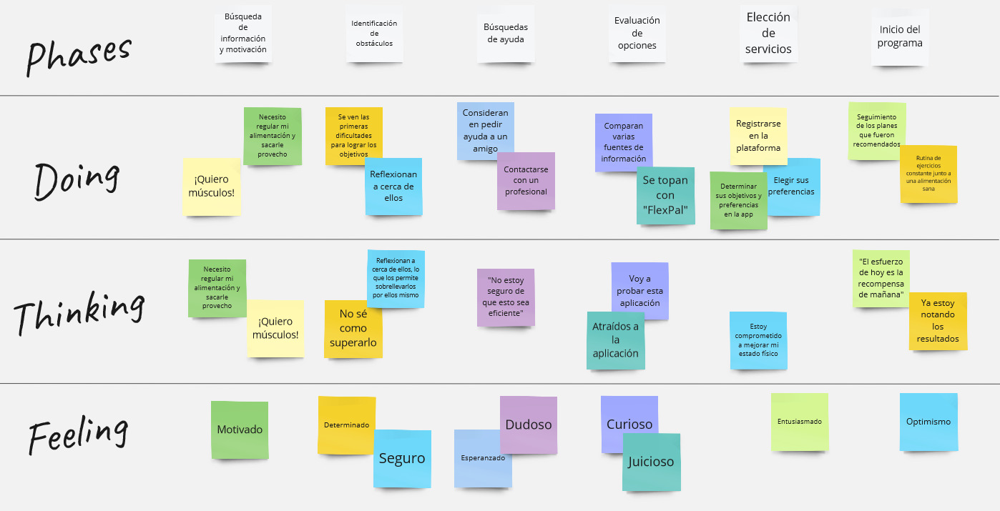
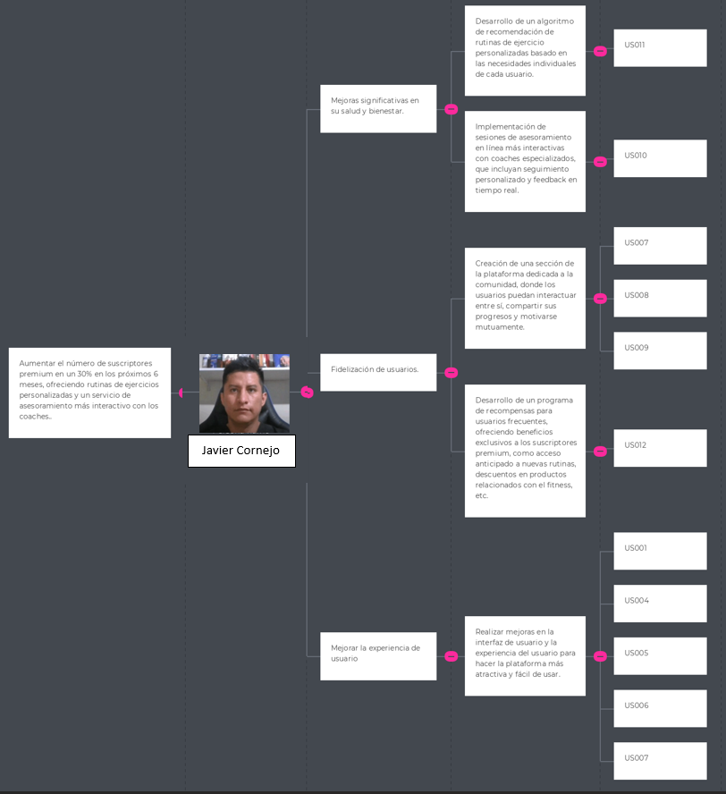
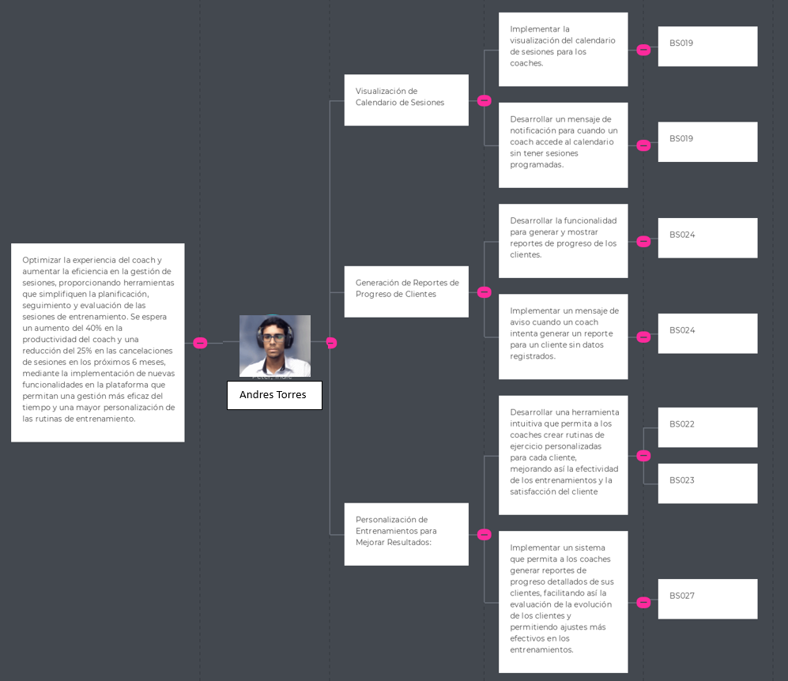

# **Capítulo III: Requirements Specification**

## 3.1. To-Be Scenario Mapping.
- To-Be del segmento objetivo usuario:

- To-Be del segmento objetivo coach:

## 3.2. User Stories.
Para elaborar user stories que pertenecen a un epic. A continuación, las epics que consideramos como equipo:

| **Código** | **Título**                                      | **Epic**                                                                                                                                                                                                                                                            |
|------------|-------------------------------------------------|---------------------------------------------------------------------------------------------------------------------------------------------------------------------------------------------------------------------------------------------------------------------|
| EP001      | Gestión de cuentas                              | **Como** usuario de la plataforma, **Quiero** poder gestionar mi cuenta, **Para** poder actualizar mi información personal, cambiar mi contraseña y gestionar mis preferencias de privacidad.                                                                       |
| EP002      | Visualización de User Interface                | **Como** usuario de la plataforma, **Quiero** poder ver la interfaz de usuario del landing page y la plataforma, **Para** explorar todas las funcionalidades disponibles y entender cómo interactuar con la plataforma.                                             |
| EP003      | Interacción con la plataforma                  | **Como** usuario de la plataforma, **Quiero** poder interactuar con las diferentes características de la plataforma, **Para** poder realizar acciones como crear, editar y eliminar contenido, así como recibir retroalimentación y comunicarme con otros usuarios. |
| EP004      | Programación y Seguimiento de Sesiones de Entrenamiento | **Como** usuario de la plataforma, **Quiero** poder programar sesiones de entrenamiento con mi coach, **Para** poder establecer metas, seguir mi progreso y recibir recomendaciones personalizadas para mejorar mi rendimiento físico.                              |
| EP005      | Análisis de Datos y Planificación de Objetivos | **Como** usuario de la plataforma, **Quiero** tener acceso a herramientas de análisis de datos, **Para** poder revisar mi progreso, establecer metas alcanzables y planificar mi entrenamiento de manera efectiva.                                                  |
| EP006      | Seguridad y Privacidad de Datos                | **Como** usuario de la plataforma, **Quiero** tener la seguridad de que mis datos personales están protegidos, **Para** poder utilizar la plataforma con confianza y tranquilidad, sabiendo que mi privacidad está garantizada.                                     |
| EP007 | Desarrollo de Funcionalidades Principales | **Como** equipo de desarrollo, **Quiero** implementar las funcionalidades principales del sistema, **Para** establecer una base sólida y funcional sobre la cual construir el resto del proyecto.                                                                           |

| ID de Historia de Usuario | Título de User Story              | Descripción                                                                                                       | Criterios de Aceptación con Escenarios                                                                                                                                                                                                                                                                                                                                                                                                                                                                                                                                                                                                                                                                                                                                                                                                                               | ID de Épica |
|---------------------------|----------------------------------|---------------------------------------------------------------------------------------------------------------------|----------------------------------------------------------------------------------------------------------------------------------------------------------------------------------------------------------------------------------------------------------------------------------------------------------------------------------------------------------------------------------------------------------------------------------------------------------------------------------------------------------------------------------------------------------------------------------------------------------------------------------------------------------------------------------------------------------------------------------------------------------------------------------------------------------------------------------------------------------------------|-------------|
| US001                     | Iniciar Sesión                   | Como usuario registrado, Quiero poder iniciar sesión en la plataforma, Para acceder a mi cuenta y utilizar las funciones disponibles. | **Happy Path:** **Given** el usuario tiene credenciales válidas. **When** el usuario ingresa sus credenciales válidas y presiona "Iniciar sesión".  **Unhappy Path:** **Given** el usuario tiene credenciales inválidas. **When** el usuario ingresa credenciales inválidas y presiona "Iniciar sesión".  **Unhappy Path:** **Given** el usuario no tiene una cuenta. **When** el usuario intenta iniciar sesión sin estar registrado. **Then** el sistema muestra un mensaje de error junto con un enlace para registrarse.                                                                                                                                                                                                                                         | EP001       |
| US002                     | Recuperar Contraseña             | Como usuario de la plataforma, Quiero poder recuperar mi contraseña olvidada, Para poder acceder nuevamente a mi cuenta. | **Happy Path:** **Given** el usuario ha olvidado su contraseña. **When** el usuario solicita restablecer la contraseña. **Then** el sistema envía un correo electrónico con un enlace de restablecimiento. **Unhappy Path:** **Given** el usuario no ha olvidado su contraseña. **When** el usuario intenta restablecerla sin haber olvidado la contraseña. **Then** el sistema muestra un mensaje indicando que la contraseña es incorrecta. **Unhappy Path:** **Given** el usuario no tiene una cuenta. **When** el usuario intenta restablecer la contraseña sin estar registrado. **Then** el sistema muestra un mensaje indicando que la cuenta no existe.| EP001       |
| US003                     | Actualizar Información Personal | Como usuario registrado, Quiero poder actualizar mi información personal en mi perfil, Para mantenerla actualizada y precisa. | **Happy Path:** **Given** que el usuario desea cambiar su información personal.   **When** el usuario realiza cambios en su perfil y guarda.   **Then** el sistema actualiza la información en la base de datos.   **Unhappy Path:** **Given** que el usuario intenta guardar información inválida.    **When** el usuario intenta guardar cambios con campos obligatorios vacíos.   **Then** el sistema muestra un mensaje indicando los campos obligatorios.   **Unhappy Path:** **Given** que el usuario desea eliminar su foto de perfil.   **When** el usuario elimina la foto y guarda los cambios.   **Then** el sistema elimina la foto de perfil y actualiza la información en la base de datos.                                                                                                                                                                      | EP001       |
| US004                     | Cambiar Idioma de la Plataforma | Como usuario, Quiero poder cambiar el idioma de la plataforma, Para utilizar la plataforma en mi idioma preferido. | **Happy Path:** **Given** que el usuario desea cambiar el idioma de la plataforma.   **When** el usuario selecciona un nuevo idioma en la configuración.   **Then** la plataforma muestra el contenido en el nuevo idioma. **Unhappy Path:** **Given** que el usuario selecciona el mismo idioma actual.    **When** el usuario intenta cambiar el idioma a uno que ya está seleccionado.   **Then** la plataforma no realiza cambios y muestra un mensaje informativo.   **Unhappy Path:** **Given** que el usuario selecciona un idioma no admitido.   **When** el usuario intenta cambiar el idioma a uno no admitido por la plataforma.   **Then** la plataforma no realiza cambios y muestra un mensaje de error.                                                                                                                                                            | EP002       |
| US005                     | Personalizar Tema de Interfaz   | Como usuario de la plataforma, Quiero poder personalizar el tema de la interfaz, Para adaptarla a mis preferencias visuales. | **Happy Path:** **Given** que el usuario desea cambiar el tema de la interfaz.   **When** el usuario elige un tema de interfaz en la configuración.   **Then** la plataforma cambia la apariencia según el tema seleccionado.  **Unhappy Path:** **Given** que el usuario selecciona el mismo tema actual.   **When** el usuario intenta cambiar el tema a uno que ya está seleccionado.   **Then** la plataforma no realiza cambios y muestra un mensaje informativo.   **Unhappy Path:** **Given** que el usuario selecciona un tema no admitido.   **When** el usuario intenta cambiar el tema a uno no admitido por la plataforma.   **Then** la plataforma no realiza cambios y muestra un mensaje de error.                                                                                                                                                                 | EP002       |
| US006                     | Filtrar Contenido por Categoría | Como usuario, Quiero poder filtrar el contenido por categoría, Para encontrar información relevante más fácilmente.  | **Happy Path:** **Given** que el usuario desea ver contenido específico.   **When** el usuario selecciona una categoría de filtrado.   **Then** la plataforma muestra solo el contenido de esa categoría.  **Unhappy Path:** **Given** que el usuario intenta filtrar contenido con una categoría no existente.   **When** el usuario selecciona una categoría inexistente.   **Then** la plataforma no muestra ningún contenido y muestra un mensaje informativo.  **Unhappy Path:** **Given** que el usuario intenta filtrar contenido sin seleccionar ninguna categoría.   **When** el usuario intenta aplicar un filtro sin seleccionar una categoría.   **Then** la plataforma no realiza cambios y muestra un mensaje informativo.                                                                                                                                          | EP002       |
| US007                     | Publicar Comentarios             | Como usuario, Quiero poder publicar comentarios en las publicaciones de otros usuarios, Para interactuar con la comunidad de la plataforma. | **Happy Path:** **Given** que el usuario encuentra una publicación interesante.   **When** el usuario escribe un comentario y lo publica.   **Then** el comentario se muestra debajo de la publicación.  **Unhappy Path:** **Given** que el usuario intenta publicar un comentario vacío.   **When** el usuario intenta publicar un comentario sin contenido.   **Then** el sistema muestra un mensaje indicando que el comentario no puede estar vacío.  **Unhappy Path:** **Given** que el usuario intenta publicar un comentario muy largo.   **When** el usuario intenta publicar un comentario que excede el límite de caracteres.   **Then** el sistema muestra un mensaje indicando que el comentario es demasiado largo.                                                                                                                                                  | EP003       |
| US008                     | Dar "Me Gusta" a Publicaciones | Como usuario de la plataforma, Quiero poder dar "Me Gusta" a las publicaciones de otros usuarios, Para mostrar aprecio por el contenido.    | **Happy Path:** **Given** que el usuario ve una publicación que le gusta.   **When** el usuario hace clic en el botón "Me Gusta".   **Then** el sistema incrementa el contador de "Me Gusta" en la publicación.  **Unhappy Path:** **Given** que el usuario intenta dar "Me Gusta" a una publicación ya gustada.   **When** el usuario intenta dar "Me Gusta" a una publicación que ya ha sido gustada por él.   **Then** el sistema no realiza cambios en el contador de "Me Gusta".  **Unhappy Path:** **Given** que el usuario intenta dar "Me Gusta" a una publicación sin estar autenticado.   **When** el usuario intenta dar "Me Gusta" a una publicación sin haber iniciado sesión.   **Then** el sistema redirige al usuario a la página de inicio de sesión.                                                                                                            | EP003       |
| US009                     | Compartir Publicaciones        | Como usuario, Quiero poder compartir publicaciones en mis redes sociales, Para compartir contenido interesante con otros.                    | **Happy Path:** **Given** que el usuario desea compartir una publicación.   **When** el usuario hace clic en el botón de compartir y selecciona una red social.   **Then** el sistema abre la página de la red social seleccionada.  **Unhappy Path:** **Given** que el usuario intenta compartir una publicación sin seleccionar una red social.   **When** el usuario intenta compartir una publicación sin seleccionar una red social.   **Then** el sistema muestra un mensaje indicando que se debe seleccionar una red social.  **Unhappy Path:** **Given** que el usuario intenta compartir una publicación sin estar autenticado.   **When** el usuario intenta compartir una publicación sin haber iniciado sesión.   **Then** el sistema redirige al usuario a la página de inicio de sesión.                                                                           | EP003       |
| US010                     | Programar Sesiones de Entrenamiento | Como usuario, Quiero programar una sesión de entrenamiento con un coach, Para recibir orientación personalizada.                            | **Happy Path:** **Given** que el usuario desea programar una sesión de entrenamiento.   **When** el usuario selecciona un horario disponible y confirma.   **Then** el sistema registra la sesión en el calendario del usuario y notifica al coach.   **Unhappy Path:** **Given** que el usuario intenta programar una sesión en un horario no disponible.   **When** el usuario selecciona un horario que ya está ocupado.   **Then** el sistema muestra un mensaje indicando que el horario no está disponible.   **Unhappy Path:** **Given** que el usuario intenta programar una sesión sin haber iniciado sesión.   **When** el usuario intenta programar una sesión sin haber iniciado sesión.   **Then** el sistema redirige al usuario a la página de inicio de sesión.                                                                                                   | EP004       |
| US011                     | Seguir Rutinas de Ejercicio          | Como usuario, Quiero poder seguir rutinas de ejercicio recomendadas por mi coach, Para mejorar mi rendimiento físico.                    | **Happy Path:** **Given** que el usuario desea seguir una rutina de ejercicio recomendada por su coach.   **When** el usuario selecciona una rutina y la inicia.   **Then** el sistema muestra los ejercicios de la rutina paso a paso.  **Unhappy Path:** **Given** que el usuario intenta seguir una rutina sin estar autenticado.   **When** el usuario intenta seguir una rutina sin haber iniciado sesión.   **Then** el sistema redirige al usuario a la página de inicio de sesión.   **Unhappy Path:** **Given** que el usuario intenta seguir una rutina que no está asignada por su coach.   **When** el usuario intenta seguir una rutina que no ha sido asignada por su coach.   **Then** el sistema muestra un mensaje indicando que la rutina no está disponible.                                                                                                   | EP004       |
| US012                     | Registrar Progreso                   | Como usuario, Quiero registrar mi progreso de entrenamiento, Para hacer un seguimiento de mi rendimiento y mejoras.                       | **Happy Path:** **Given** que el usuario desea registrar su progreso.   **When** el usuario ingresa sus datos de progreso y los guarda.   **Then** el sistema registra los datos en su perfil y los muestra en forma de gráficos y estadísticas.   **Unhappy Path:** **Given** que el usuario intenta registrar un progreso sin estar autenticado.   **When** el usuario intenta registrar un progreso sin haber iniciado sesión.   **Then** el sistema redirige al usuario a la página de inicio de sesión.   **Unhappy Path:** **Given** que el usuario intenta registrar un progreso con datos inválidos.   **When** el usuario intenta guardar datos de progreso con formatos incorrectos o valores no válidos.   **Then** el sistema muestra un mensaje indicando el error.                                                                                                    | EP005       |
| US013                     | Visualizar Estadísticas de Progreso | Como usuario, Quiero visualizar estadísticas de mi progreso de entrenamiento, Para analizar mi rendimiento a lo largo del tiempo.          | **Happy Path:** **Given** que el usuario desea ver estadísticas de su progreso.   **When** el usuario navega a la sección de estadísticas en su perfil.   **Then** el sistema muestra gráficos y métricas de su progreso.   **Unhappy Path:** **Given** que el usuario intenta visualizar estadísticas sin estar autenticado.   **When** el usuario intenta ver estadísticas sin haber iniciado sesión.   **Then** el sistema redirige al usuario a la página de inicio de sesión.   **Unhappy Path:** **Given** que el usuario intenta visualizar estadísticas sin tener datos registrados.   **When** el usuario navega a la sección de estadísticas sin haber registrado datos de progreso.   **Then** el sistema muestra un mensaje indicando que no hay datos disponibles.                                                                                                     | EP005       |
| US014                     | Establecer Objetivos de Entrenamiento | Como usuario, Quiero establecer objetivos de entrenamiento, Para tener metas claras y medibles.                                         | **Happy Path:** **Given** que el usuario desea establecer un objetivo de entrenamiento.   **When** el usuario define un objetivo específico y lo guarda.   **Then** el sistema registra el objetivo en su perfil y lo muestra como parte de su plan de entrenamiento.   **Unhappy Path:** **Given** que el usuario intenta establecer un objetivo sin estar autenticado.   **When** el usuario intenta definir un objetivo sin haber iniciado sesión.   **Then** el sistema redirige al usuario a la página de inicio de sesión.   **Unhappy Path:** **Given** que el usuario intenta establecer un objetivo con datos inválidos.   **When** el usuario intenta guardar un objetivo con valores no válidos o formatos incorrectos.   **Then** el sistema muestra un mensaje indicando el error.                                                                                     | EP005       |
| US015                     | Visualizar Planes de Nutrición     | Como usuario, Quiero visualizar los planes de nutrición personalizados, Para tener una guía alimentaria adaptada a mis necesidades.       | **Happy Path:** **Given** que el usuario desea ver los planes de nutrición.   **When** el usuario accede a la sección de nutrición en la plataforma.   **Then** el sistema muestra una lista de planes de nutrición personalizados disponibles.  **Unhappy Path:** **Given** que el usuario intenta visualizar planes de nutrición sin estar autenticado.   **When** el usuario intenta ver los planes de nutrición sin haber iniciado sesión.   **Then** el sistema redirige al usuario a la página de inicio de sesión.   **Unhappy Path:** **Given** que el usuario intenta visualizar planes de nutrición sin tener ningún plan disponible.   **When** el usuario accede a la sección de nutrición sin tener planes asignados.   **Then** el sistema muestra un mensaje indicando que no hay planes disponibles.                                                                | EP003       |
| US016                     | Acceder a Recetas Nutricionales    | Como usuario, Quiero acceder a recetas nutricionales saludables, Para mejorar mi alimentación y mantener un estilo de vida saludable.       | **Happy Path:** **Given** que el usuario desea acceder a recetas nutricionales.   **When** el usuario navega a la sección de recetas en la plataforma.   **Then** el sistema muestra una lista de recetas saludables disponibles.  **Unhappy Path:** **Given** que el usuario intenta acceder a recetas sin estar autenticado.   **When** el usuario intenta ver las recetas sin haber iniciado sesión.   **Then** el sistema redirige al usuario a la página de inicio de sesión.   **Unhappy Path:** **Given** que el usuario intenta acceder a recetas sin tener ninguna receta disponible.   **When** el usuario accede a la sección de recetas sin tener recetas asignadas.   **Then** el sistema muestra un mensaje indicando que no hay recetas disponibles.                                                                                                                | EP003       |
| US017                     | Seguir Planes de Nutrición        | Como usuario, Quiero poder seguir planes de nutrición personalizados, Para mejorar mis hábitos alimenticios.                               | **Happy Path:** **Given** que el usuario desea seguir un plan de nutrición.   **When** el usuario selecciona un plan de nutrición y lo inicia.   **Then** el sistema muestra las pautas y recomendaciones del plan de nutrición.  **Unhappy Path:** **Given** que el usuario intenta seguir un plan de nutrición sin estar autenticado.   **When** el usuario intenta iniciar un plan de nutrición sin haber iniciado sesión.   **Then** el sistema redirige al usuario a la página de inicio de sesión.   **Unhappy Path:** **Given** que el usuario intenta seguir un plan de nutrición sin tener ningún plan disponible.   **When** el usuario intenta iniciar un plan de nutrición sin tener planes asignados.   **Then** el sistema muestra un mensaje indicando que no hay planes disponibles.                                                                               | EP003       |
| US018                     | Compartir Recetas Nutricionales   | Como usuario, Quiero poder compartir recetas nutricionales con otros usuarios, Para ayudarles a mejorar su alimentación.                     | **Happy Path:** **Given** que el usuario desea compartir una receta nutricional.   **When** el usuario hace clic en el botón de compartir y selecciona una opción.   **Then** el sistema abre la opción seleccionada para compartir la receta.  **Unhappy Path:** **Given** que el usuario intenta compartir una receta sin estar autenticado.   **When** el usuario intenta compartir una receta sin haber iniciado sesión.   **Then** el sistema redirige al usuario a la página de inicio de sesión.   **Unhappy Path:** **Given** que el usuario intenta compartir una receta que no está disponible.   **When** el usuario intenta compartir una receta que no existe en la plataforma.   **Then** el sistema muestra un mensaje indicando que la receta no está disponible.                                                                                                  | EP003       |
| BS019                     | Visualizar Calendario de Sesiones   | Como coach, Quiero visualizar un calendario con las sesiones programadas de mis clientes, Para organizar mi agenda y planificar las sesiones. | **Happy Path:** **Given** que el coach desea ver el calendario de sesiones.    **When** el coach accede a la sección de calendario en la plataforma.   **Then** el sistema muestra las sesiones programadas con sus respectivos detalles.  **Unhappy Path:** **Given** que el coach no tiene sesiones programadas.   **When** el coach accede al calendario sin tener sesiones programadas.   **Then** el sistema muestra un mensaje indicando que no hay sesiones programadas.   **Unhappy Path:** **Given** que el coach intenta acceder al calendario sin estar autenticado.   **When** el coach intenta ver el calendario sin haber iniciado sesión.   **Then** el sistema redirige al coach a la página de inicio de sesión.                                                                                                                                                 | EP003       | 
| BS020                     | Asignar Rutinas de Ejercicio a Clientes      | Como coach, Quiero asignar rutinas de ejercicio a mis clientes, Para guiar su entrenamiento y seguimiento.                                  | **Happy Path:** **Given** que el coach desea asignar una rutina de ejercicio a un cliente.   **When** el coach selecciona un cliente y asigna una rutina de ejercicio.   **Then** el sistema registra la asignación en el perfil del cliente.   **Unhappy Path:** **Given** que el coach intenta asignar una rutina sin estar autenticado.   **When** el coach intenta asignar una rutina sin haber iniciado sesión.   **Then** el sistema redirige al coach a la página de inicio de sesión.   **Unhappy Path:** **Given** que el coach intenta asignar una rutina que no existe.   **When** el coach intenta asignar una rutina que no ha sido creada en la plataforma.   **Then** el sistema muestra un mensaje indicando que la rutina no está disponible.                                                                                                                    | EP004       |
| BS021                     | Generar Reportes de Progreso de Clientes     | Como coach, Quiero generar reportes de progreso de mis clientes, Para analizar su evolución y ajustar sus entrenamientos.                   | **Happy Path:** **Dado** que el coach desea generar un reporte de progreso de un cliente. **When** el coach selecciona un cliente y solicita el reporte de progreso. **Then** el sistema genera y muestra el reporte con los datos del cliente. **Unhappy Path:** **Dado** que el coach intenta generar un reporte sin estar autenticado. **When** el coach intenta generar un reporte sin haber iniciado sesión. **Then** el sistema redirige al coach a la página de inicio de sesión. **Unhappy Path:** **Dado** que el coach intenta generar un reporte para un cliente sin datos registrados. **When** el coach solicita un reporte de progreso para un cliente sin datos registrados. **Then** el sistema muestra un mensaje indicando que no hay datos disponibles.                                                                                     | EP005       |
| BS022                     | Crear Rutinas de Ejercicio Personalizadas   | Como coach, Quiero crear rutinas de ejercicio personalizadas para mis clientes, Para adaptar los entrenamientos a sus necesidades específicas. | **Happy Path:** **Dado** que el coach desea crear una rutina de ejercicio personalizada. **When** el coach accede a la herramienta de creación de rutinas en la plataforma. **Then** el sistema muestra las opciones para personalizar la rutina. **Unhappy Path:** **Dado** que el coach intenta crear una rutina sin estar autenticado. **When** el coach intenta crear una rutina sin haber iniciado sesión. **Then** el sistema redirige al coach a la página de inicio de sesión. **Unhappy Path:** **Dado** que el coach intenta crear una rutina con datos inválidos. **When** el coach intenta guardar una rutina con campos obligatorios vacíos o valores incorrectos. **Then** el sistema muestra un mensaje indicando el error.                                                                                                                     | EP004       |
| BS023                     | Asignar Rutinas de Ejercicio a Clientes     | Como coach, Quiero asignar rutinas de ejercicio a mis clientes, Para guiar su entrenamiento y seguimiento.                                  | **Happy Path:** **Dado** que el coach desea asignar una rutina de ejercicio a un cliente. **When** el coach selecciona un cliente y asigna una rutina de ejercicio. **Then** el sistema registra la asignación en el perfil del cliente. **Unhappy Path:** **Dado** que el coach intenta asignar una rutina sin estar autenticado. **When** el coach intenta asignar una rutina sin haber iniciado sesión. **Then** el sistema redirige al coach a la página de inicio de sesión. **Unhappy Path:** **Dado** que el coach intenta asignar una rutina que no existe. **When** el coach intenta asignar una rutina que no ha sido creada en la plataforma. **Then** el sistema muestra un mensaje indicando que la rutina no está disponible.                                                                                                                    | EP004       |
| BS024                     | Generar Reportes de Progreso de Clientes     | Como coach, Quiero generar reportes de progreso de mis clientes, Para analizar su evolución y ajustar sus entrenamientos.                   | **Happy Path:** **Dado** que el coach desea generar un reporte de progreso de un cliente. **When** el coach selecciona un cliente y solicita el reporte de progreso. **Then** el sistema genera y muestra el reporte con los datos del cliente. **Unhappy Path:** **Dado** que el coach intenta generar un reporte sin estar autenticado. **When** el coach intenta generar un reporte sin haber iniciado sesión. **Then** el sistema redirige al coach a la página de inicio de sesión. **Unhappy Path:** **Dado** que el coach intenta generar un reporte para un cliente sin datos registrados. **When** el coach solicita un reporte de progreso para un cliente sin datos registrados. **Then** el sistema muestra un mensaje indicando que no hay datos disponibles.                                                                                     | EP005       |
| BS025                     | Enviar Recordatorios de Sesiones             | Como coach, Quiero enviar recordatorios automáticos de sesiones a mis clientes, Para ayudarles a mantenerse comprometidos con sus entrenamientos. | **Happy Path:** **Dado** que el coach desea enviar recordatorios de sesiones. **When** el coach programa una sesión y activa la opción de recordatorio. **Then** el sistema envía un recordatorio automático al cliente antes de la sesión. **Unhappy Path:** **Dado** que el coach intenta enviar recordatorios sin estar autenticado. **When** el coach intenta programar sesiones y enviar recordatorios sin haber iniciado sesión. **Then** el sistema redirige al coach a la página de inicio de sesión. **Unhappy Path:** **Dado** que el coach programa una sesión y el cliente cancela la sesión antes del recordatorio. **When** el coach programa una sesión y el cliente la cancela antes de recibir el recordatorio. **Then** el sistema no envía el recordatorio.                                                                                | EP003       |
| BS026                     | Gestionar Lista de Clientes                   | Como coach, Quiero gestionar una lista de clientes, Para tener un registro organizado de las personas que entreno.                          | **Happy Path:** **Dado** que el coach desea gestionar su lista de clientes. **When** el coach accede a la sección de gestión de clientes en la plataforma. **Then** el sistema muestra la lista de clientes y las opciones de gestión disponibles. **Unhappy Path:** **Dado** que el coach intenta gestionar la lista de clientes sin estar autenticado. **When** el coach intenta acceder a la gestión de clientes sin haber iniciado sesión. **Then** el sistema redirige al coach a la página de inicio de sesión. **Unhappy Path:** **Dado** que el coach desea eliminar a un cliente de la lista. **When** el coach selecciona un cliente y solicita eliminarlo de la lista. **Then** el sistema elimina al cliente de la lista y actualiza la interfaz.                                                                                                 | EP001       |
| BS027                     | Visualizar Estadísticas de Clientes          | Como coach, Quiero visualizar estadísticas de mis clientes, Para evaluar su progreso y ajustar sus entrenamientos.                         | **Happy Path:** **Dado** que el coach desea ver las estadísticas de sus clientes. **When** el coach accede a la sección de estadísticas en la plataforma. **Then** el sistema muestra gráficos y datos relevantes sobre el progreso de los clientes. **Unhappy Path:** **Dado** que el coach intenta ver las estadísticas sin estar autenticado. **When** el coach intenta acceder a las estadísticas sin haber iniciado sesión. **Then** el sistema redirige al coach a la página de inicio de sesión. **Unhappy Path:** **Dado** que el coach intenta ver las estadísticas de un cliente sin datos registrados. **When** el coach selecciona un cliente sin datos registrados y solicita ver sus estadísticas. **Then** el sistema muestra un mensaje indicando que no hay datos disponibles.                                                                             | EP005       |
| BS028                     | Gestionar Información del Perfil             | Como coach, Quiero gestionar la información de mi perfil, Para mantener actualizados mis datos personales y de contacto.                  | **Happy Path:** **Dado** que el coach desea gestionar su información de perfil. **When** el coach accede a la sección de información de perfil. **Then** el sistema muestra los datos actuales y permite al coach actualizarlos. **Unhappy Path:** **Dado** que el coach intenta gestionar su información de perfil sin estar autenticado. **When** el coach intenta acceder a la información de perfil sin haber iniciado sesión. **Then** el sistema redirige al coach a la página de inicio de sesión. **Unhappy Path:** **Dado** que el coach intenta actualizar su información de perfil con datos inválidos. **When** el coach intenta guardar cambios con campos obligatorios vacíos o valores incorrectos. **Then** el sistema muestra un mensaje indicando el error.                                                                               | EP002       |
| BS029                     | Buscar Clientes en la Plataforma            | Como coach, Quiero buscar clientes en la plataforma, Para acceder rápidamente a la información de un cliente específico.                 | **Happy Path:** **Dado** que el coach desea buscar un cliente en la plataforma. **When** el coach utiliza la función de búsqueda e ingresa el nombre o información del cliente. **Then** el sistema muestra los resultados de la búsqueda coincidentes con la información ingresada. **Unhappy Path:** **Dado** que el coach intenta buscar clientes sin estar autenticado. **When** el coach intenta utilizar la función de búsqueda sin haber iniciado sesión. **Then** el sistema redirige al coach a la página de inicio de sesión. **Unhappy Path:** **Dado** que el coach realiza una búsqueda que no coincide con ningún cliente. **When** el coach ingresa un término de búsqueda que no coincide con ningún cliente registrado. **Then** el sistema muestra un mensaje indicando que no se encontraron resultados.                                                                                                     | EP002       |
| BS030                     | Programar Sesiones de Entrenamiento Recurrentes | Como coach, Quiero programar sesiones de entrenamiento recurrentes para mis clientes, Para establecer una rutina de entrenamiento consistente. | **Happy Path:** **Dado** que el coach desea programar sesiones recurrentes para un cliente. **When** el coach selecciona un cliente, elige la frecuencia y duración de las sesiones, y programa las sesiones recurrentes. **Then** el sistema registra las sesiones programadas en el perfil del cliente. **Unhappy Path:** **Dado** que el coach intenta programar sesiones recurrentes sin estar autenticado. **When** el coach intenta programar sesiones recurrentes sin haber iniciado sesión. **Then** el sistema redirige al coach a la página de inicio de sesión. **Unhappy Path:** **Dado** que el coach desea modificar las sesiones recurrentes de un cliente. **When** el coach selecciona un cliente y accede a la lista de sesiones programadas. **Then** el sistema muestra las sesiones recurrentes y permite al coach realizar modificaciones. | EP003       |
| TS031                     | Configurar Entorno de Desarrollo            | Como desarrollador, Quiero configurar mi entorno de desarrollo local, Para poder comenzar a trabajar en el proyecto.                        | **Happy Path:** **Dado** que el desarrollador necesita configurar su entorno de desarrollo. **When** el desarrollador sigue las instrucciones de configuración. **Then** el entorno de desarrollo local se configura correctamente y está listo para trabajar. **Unhappy Path:** **Dado** que el desarrollador no sigue las instrucciones de configuración. **When** el desarrollador no completa la configuración correctamente. **Then** el entorno de desarrollo local no está listo para trabajar y se muestra un mensaje de error.                                                                                                                                                                                                                                                                                                                                                                                                                                      | EP007       |
| TS032                     | Implementar Funcionalidad Esencial           | Como desarrollador, Quiero implementar la funcionalidad esencial del sistema, Para tener una base funcional sobre la cual construir.          | **Happy Path:** **Dado** que el desarrollador necesita implementar la funcionalidad esencial. **When** el desarrollador sigue el diseño y las especificaciones. **Then** la funcionalidad esencial se implementa correctamente y pasa las pruebas de unidad. **Unhappy Path:** **Dado** que el desarrollador intenta implementar la funcionalidad sin tener especificaciones claras. **When** el desarrollador procede sin una guía clara. **Then** la implementación es incorrecta y se requiere revisión.                                                                                                                                                                                                                                                                                                                                                                                                                               | EP007       |
| TS033                     | Corregir Errores Reportados por QA          | Como desarrollador, Quiero corregir los errores reportados por el equipo de control de calidad (QA), Para mejorar la calidad del software.   | **Happy Path:** **Dado** que el desarrollador tiene una lista de errores reportados por QA. **When** el desarrollador revisa y corrige los errores uno por uno. **Then** los errores corregidos pasan las pruebas de regresión y el sistema funciona correctamente. **Unhappy Path:** **Dado** que el desarrollador intenta corregir un error sin entender la causa subyacente. **When** el desarrollador realiza una corrección superficial. **Then** el error persiste o se crean nuevos problemas.                                                                                                                                                                                                                                                                                                                                                             | EP007       |
| TS034                     | Optimizar el Rendimiento del Sistema        | Como desarrollador, Quiero optimizar el rendimiento del sistema, Para garantizar una experiencia fluida para los usuarios.                   | **Happy Path:** **Dado** que el desarrollador identifica áreas de mejora en el rendimiento del sistema. **When** el desarrollador implementa optimizaciones según las mejores prácticas y técnicas de rendimiento. **Then** el rendimiento del sistema mejora significativamente y se reduce la carga en los recursos del servidor. **Unhappy Path:** **Dado** que el desarrollador intenta implementar optimizaciones sin una comprensión adecuada del sistema. **When** el desarrollador realiza cambios que empeoran el rendimiento o introducen nuevos errores. **Then** se revierten los cambios y se realiza una revisión más exhaustiva.                                                                                                                                                                                                                   | EP007       |
| TS035                     | Integrar Sistema con Servicio Externo       | Como desarrollador, Quiero integrar el sistema con un servicio externo, Para ampliar la funcionalidad y mejorar la interoperabilidad.         | **Happy Path:** **Dado** que el desarrollador tiene la documentación y las credenciales necesarias del servicio externo. **When** el desarrollador implementa la integración siguiendo las especificaciones del servicio externo. **Then** la integración se completa correctamente y el sistema puede comunicarse con el servicio externo. **Unhappy Path:** **Dado** que el desarrollador intenta integrar el sistema sin entender los requisitos del servicio externo. **When** el desarrollador implementa la integración de manera incorrecta o incompleta. **Then** la comunicación con el servicio externo falla o produce resultados incorrectos.                                                                                                                                                                                                         | EP007       |
| TS036                     | Refactorizar Código para Mejorar Mantenibilidad | Como desarrollador, Quiero refactorizar el código existente, Para mejorar su estructura y facilitar el mantenimiento futuro.                 | **Happy Path:** **Dado** que el desarrollador identifica áreas de código que pueden refactorizarse. **When** el desarrollador realiza cambios para mejorar la estructura y legibilidad del código. **Then** el código refactorizado pasa las pruebas de unidad y las funcionalidades existentes no se ven afectadas negativamente. **Unhappy Path:** **Dado** que el desarrollador intenta refactorizar el código sin entender completamente su funcionalidad. **When** el desarrollador realiza cambios que introducen errores o cambios no deseados en el sistema. **Then** se revierten los cambios y se realiza una revisión más cuidadosa.                                                                                                                                                                                                                   | EP007       |
| TS037                     | Implementar Autenticación de Dos Factores   | Como desarrollador, Quiero implementar la autenticación de dos factores, Para mejorar la seguridad de la plataforma.                         | **Happy Path:** **Dado** que el desarrollador tiene especificaciones claras sobre la autenticación de dos factores. **When** el desarrollador implementa la funcionalidad según las especificaciones. **Then** la autenticación de dos factores se activa y funciona correctamente para los usuarios. **Unhappy Path:** **Dado** que el desarrollador intenta implementar la autenticación de dos factores sin entender los requisitos de seguridad. **When** el desarrollador realiza implementaciones incompletas o incorrectas. **Then** la autenticación de dos factores no proporciona una capa de seguridad adecuada o causa problemas de acceso para los usuarios.                                                                                                                                                                                         | EP007       |
| TS038                     | Desarrollar Funcionalidad de Notificaciones | Como desarrollador, Quiero desarrollar la funcionalidad de notificaciones, Para mantener a los usuarios informados sobre eventos importantes.   | **Happy Path:** **Dado** que el desarrollador tiene especificaciones detalladas sobre los tipos de notificaciones requeridos. **When** el desarrollador implementa la funcionalidad de notificaciones de acuerdo con las especificaciones. **Then** el sistema envía notificaciones apropiadas a los usuarios en los momentos adecuados. **Unhappy Path:** **Dado** que el desarrollador intenta implementar la funcionalidad de notificaciones sin entender los casos de uso y la lógica de negocio. **When** el desarrollador realiza implementaciones incorrectas o incompletas. **Then** las notificaciones no se envían correctamente o pueden causar confusión entre los usuarios.                                                                                                                                                                          | EP007       |
| TS039                     | Crear Herramientas de Monitoreo y Depuración | Como desarrollador, Quiero crear herramientas de monitoreo y depuración, Para facilitar la identificación y resolución de problemas.           | **Happy Path:** **Dado** que el desarrollador necesita herramientas para monitorear el rendimiento y depurar problemas. **When** el desarrollador implementa herramientas de monitoreo y depuración según las mejores prácticas. **Then** las herramientas proporcionan información útil sobre el estado del sistema y ayudan a identificar y resolver problemas rápidamente. **Unhappy Path:** **Dado** que el desarrollador intenta implementar herramientas de monitoreo y depuración sin entender completamente las necesidades del sistema. **When** el desarrollador crea herramientas inadecuadas o incompletas. **Then** las herramientas no proporcionan información útil o pueden causar confusión al intentar utilizarlas.                                                                                                                             | EP007       |
| TSO40                     | Implementar Pruebas de Integración Continua | Como desarrollador, Quiero implementar pruebas de integración continua, Para garantizar la estabilidad del sistema durante el desarrollo.      | **Happy Path:** **Dado** que el desarrollador necesita mantener la estabilidad del sistema mientras realiza cambios. **When** el desarrolladorn implementa pruebas de integración continua según  las mejore s prácticas. **Then** las pruebas se ejecutan automáticamente después de cada cambio y proporcionan retroalimentación rápida sobre la integridad del sistema. **Unhappy Path:** **Dado** que el desarrollador intenta implementar pruebas de integración continua sin entender completamente la arquitectura del sistema. **When** el desarrollador crea pruebas que no cubren adecuadamente las funcionalidades críticas o producen resultados incorrectos. **Then** las pruebas de integración continua no son efectivas para garantizar la estabilidad del sistema. | EP007       |

## 3.3. Impact Mapping.
### Segment 1: Users

### Segment 2: Coachs

## 3.4. Product Backlog.
| Orden | User Story ID | Título | Descripción | Story Points |
|-------|---------------|--------|-------------|--------------|
| 1     | US010         | Programar Sesiones de Entrenamiento | Como usuario, quiero programar una sesión de entrenamiento con un coach, para recibir orientación personalizada. | 8 |
| 2     | US020         | Asignar Rutinas de Ejercicio a Clientes | Como coach, quiero asignar rutinas de ejercicio a mis clientes, para guiar su entrenamiento y seguimiento. | 8 |
| 3     | US022         | Crear Rutinas de Ejercicio Personalizadas | Como coach, quiero crear rutinas de ejercicio personalizadas para mis clientes, para adaptar los entrenamientos a sus necesidades específicas. | 8 |
| 4     | US011         | Seguir Rutinas de Ejercicio | Como usuario, quiero poder seguir rutinas de ejercicio recomendadas por mi coach, para mejorar mi rendimiento físico. | 5 |
| 5     | US012         | Registrar Progreso | Como usuario, quiero registrar mi progreso de entrenamiento, para hacer un seguimiento de mi rendimiento y mejoras. | 5 |
| 6     | US015         | Visualizar Planes de Nutrición | Como usuario, quiero visualizar los planes de nutrición personalizados, para tener una guía alimentaria adaptada a mis necesidades. | 5 |
| 7     | US013         | Visualizar Estadísticas de Progreso | Como usuario, quiero visualizar estadísticas de mi progreso de entrenamiento, para analizar mi rendimiento a lo largo del tiempo. | 5 |
| 8     | US017         | Seguir Planes de Nutrición | Como usuario, quiero poder seguir planes de nutrición personalizados, para mejorar mis hábitos alimenticios. | 5 |
| 9     | US019         | Visualizar Calendario de Sesiones | Como coach, quiero visualizar un calendario con las sesiones programadas de mis clientes, para organizar mi agenda y planificar las sesiones. | 5 |
| 10    | US021         | Generar Reportes de Progreso de Clientes | Como coach, quiero generar reportes de progreso de mis clientes, para analizar su evolución y ajustar sus entrenamientos. | 5 |
| 11    | US023         | Asignar Rutinas de Ejercicio a Clientes | Como coach, quiero asignar rutinas de ejercicio a mis clientes, para guiar su entrenamiento y seguimiento. | 5 |
| 12    | US024         | Generar Reportes de Progreso de Clientes | Como coach, quiero generar reportes de progreso de mis clientes, para analizar su evolución y ajustar sus entrenamientos. | 5 |
| 13    | US026         | Gestionar Lista de Clientes | Como coach, quiero gestionar una lista de clientes, para tener un registro organizado de las personas que entreno. | 5 |
| 14    | US028         | Registrar Sesiones de Entrenamiento | Como coach, quiero registrar sesiones de entrenamiento con mis clientes, para hacer un seguimiento de su progreso. | 5 |
| 15    | US030         | Programar Sesiones de Entrenamiento Recurrentes | Como coach, quiero programar sesiones de entrenamiento recurrentes para mis clientes, para establecer una rutina de entrenamiento consistente. | 5 |
| 16    | US004         | Cambiar Idioma de la Plataforma | Como usuario, quiero poder cambiar el idioma de la plataforma, para utilizarla en mi idioma preferido. | 2 |
| 17    | US005         | Personalizar Tema de Interfaz | Como usuario de la plataforma, quiero poder personalizar el tema de la interfaz, para adaptarla a mis preferencias visuales. | 2 |
| 18    | US003         | Actualizar Información Personal | Como usuario registrado, quiero poder actualizar mi información personal en mi perfil, para mantenerla actualizada y precisa. | 3 |
| 19    | US009         | Compartir Publicaciones | Como usuario, quiero poder compartir publicaciones en mis redes sociales, para compartir contenido interesante con otros. | 3 |
| 20    | US014         | Establecer Objetivos de Entrenamiento | Como usuario, quiero establecer objetivos de entrenamiento, para tener metas claras y medibles. | 3 |
| 21    | US008         | Dar "Me Gusta" a Publicaciones | Como usuario de la plataforma, quiero poder dar "Me Gusta" a las publicaciones de otros usuarios, para mostrar aprecio por el contenido. | 3 |
| 22    | US016         | Acceder a Recetas Nutricionales | Como usuario, quiero acceder a recetas nutricionales saludables, para mejorar mi alimentación y mantener un estilo de vida saludable. | 3 |
| 23    | US025         | Envíar Recordatorios de Sesiones | Como coach, quiero enviar recordatorios automáticos de sesiones a mis clientes, para ayudarles a mantenerse comprometidos con sus entrenamientos. | 3 |
| 24    | US027         | Visualizar Estadísticas de Clientes | Como coach, quiero visualizar estadísticas de mis clientes, para evaluar su progreso y ajustar sus entrenamientos. | 3 |
| 25    | US029         | Visualizar Progreso de los Clientes | Como coach, quiero visualizar el progreso de mis clientes, para evaluar su rendimiento y ajustar sus entrenamientos. | 3 |
| 26    | US001         | Iniciar Sesión | Como usuario registrado, quiero poder iniciar sesión en la plataforma, para acceder a mi cuenta y utilizar las funciones disponibles. | 3 |
| 27    | US007         | Publicar Comentarios | Como usuario, quiero poder publicar comentarios en las publicaciones de otros usuarios, para interactuar con la comunidad de la plataforma. | 3 |
| 28    | US006         | Filtrar Contenido por Categoría | Como usuario, quiero poder filtrar el contenido por categoría, para encontrar información relevante más fácilmente. | 3 |
| 29    | US018         | Compartir Recetas Nutricionales | Como usuario, quiero poder compartir recetas nutricionales con otros usuarios, para ayudarles a mejorar su alimentación. | 3 |
| 30    | US028         | Registrar Sesiones de Entrenamiento | Como coach, quiero registrar sesiones de entrenamiento con mis clientes, para hacer un seguimiento de su progreso. | 5 |
