# **Capítulo V: Product Implementation, Validation & Deployment.**
La implementación, validación y despliegue del producto son esenciales para asegurar que la visión del producto se convierta en una realidad funcional y accesible para nuestros usuarios. Estas etapas nos permiten transformar el diseño conceptual en una aplicación real, probada y lista para su uso, lo que nos ayuda a validar nuestras ideas, identificar posibles problemas y ofrecer una experiencia de usuario óptima.
## 5.1. Software Configuration Management.
La gestión de la configuración del software es crucial para nuestro trabajo, ya que nos permite mantener un control preciso sobre los elementos de nuestro proyecto, como el código fuente, los documentos de diseño y los activos digitales. Esto garantiza que todos los miembros del equipo estén trabajando con la misma versión de los archivos y facilita la colaboración entre desarrolladores, diseñadores y otros profesionales involucrados en el proyecto.
### 5.1.1. Software Development Environment Configuration

- ### Project Management:
    * ### Trello:
      Una aplicación de gestión de proyectos que facilita el seguimiento de las tareas individuales de cada miembro del equipo de manera sencilla.  
      [Link De Registro o Inicio De Sesión](https://trello.com/es) 
      Imagen para mostrar evidencia de uso:
      
      *  ### Microsoft Teams
       una plataforma unificada de comunicación y colaboración que combina chat persistente en el lugar de trabajo, reuniones de video, almacenamiento de archivos e integración de aplicaciones.  
        [Link De Registro o Inicio De Sesión](https://www.microsoft.com/es-pe/)
      Imagen para mostrar evidencia de uso:
      

- ### Requirement Management:
    * ### Miro:
      Un sistema que ofrece una amplia gama de plantillas diseñadas para abordar diversos aspectos en la creación y gestión de proyectos.  
      [Link De Registro o Inicio De Sesión](https://miro.com/es/login/)
      Imagen para mostrar evidencia de uso:
      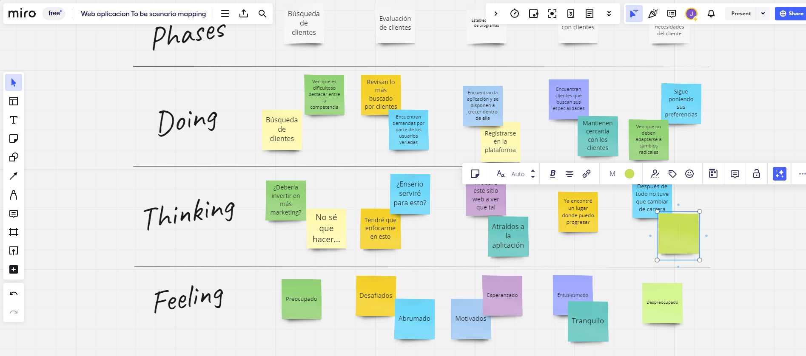
    * ### UXPressia:
      Es una herramienta en línea que simplifica el proceso de mapeo y comprensión de las necesidades del cliente en un proyecto determinado.  
      [Link De Registro o Inicio De Sesión](https://uxpressia.com)
      Imagen para mostrar evidencia de uso:
      
    * ### Structurizr:
      Se trata de una suite de herramientas que posibilita la creación colaborativa de modelos C4 para representar de forma gráfica nuestros productos.  
      [Link De Registro o Inicio De Sesión](https://structurizr.com)
- ###  Product UX/UI Design:
    * ### Figma:
      Una herramienta de colaboración que facilita el desarrollo conjunto de wireframes y mockups.  
      [Link De Registro, Inicio De Sesión y Descarga](https://www.figma.com/downloads/)
    * ### LucidChart:
      Una herramienta colaborativa que posibilita la creación conjunta de wireframes flow y mockups flow.  
      [Link De Registro o Inicio De Sesión ](https://www.lucidchart.com/pages/es)
      Imagen para mostrar evidencia de uso:
      
- ###  Software Development:
    * ### HTML5:
      Es un lenguaje de etiquetado utilizado para crear la estructura a páginas web. Lo utilizamos para incluir componentes como texto, imágenes, enlaces, botones y videos en nuestras páginas web.  
      [Información Relacionada](https://www.esic.edu/rethink/tecnologia/html5-que-es-caracteristicas-y-como-funciona-c#:~:text=El%20HTML5%20es%20un%20estándar,%2C%20estilo%20de%20letra%2C%20etc.)
      Imagen para mostrar evidencia de uso:
      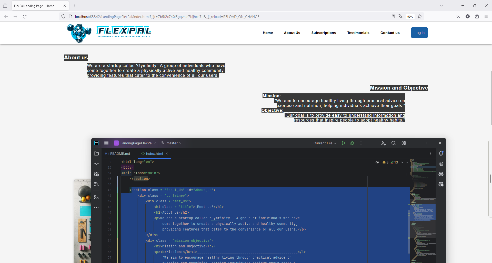
    * ### CSS:
      Un lenguaje de diseño gráfico utilizado para dar formato y estilo a la presentación de un documento escrito en HTML.  
      [Información Relacionada](https://developer.mozilla.org/es/docs/Web/CSS)
      Imagen para mostrar evidencia de uso:
      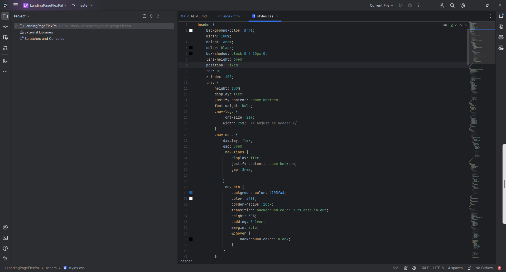
    * ### JavaScript:
      Un lenguaje de programación orientado a objetos dinámico que utilizamos para implementar funcionalidades en un documento HTML.  
      [Información Relacionada]( https://developer.mozilla.org/es/docs/Web/JavaScript )
      Imagen para mostrar evidencia de uso:
      
    * ### WebStorm:
      Un entorno de desarrollo integrado (IDE) que emplearemos para trabajar con JavaScript.  
      [Link De Descarga]( https://www.jetbrains.com/es-es/webstorm/)

- ###  Software Testing:
    * ### Lenguaje Gherkin:
      Se trata de un Lenguaje Específico de Dominio (DSL), diseñado específicamente para abordar un problema particular. Es un lenguaje comprensible para los desarrolladores, destinado a resolver necesidades concretas.  
- ###  Software Documentation:
    * ### Github:
      Se trata de una plataforma utilizada para el alojamiento de versiones del código fuente de un proyecto. Es una herramienta ampliamente popular en el trabajo colaborativo de programadores.  
      [Link De Descarga]( https://desktop.github.com)
      [Link De Registro o Inicio De Sesión](https://github.com/login)
- ###  Software Deployment:
    * ### GitHub Pages: 
      Una plataforma que posibilita la realización de despliegues simples directamente desde un repositorio de GitHub.  

### 5.1.2. Source Code Management.
Landing Page Repository: [Landing Page Repository](https://github.com/los-seniors-v2/LandingPageFlexPal.git)
- #### GitFlow Implementation:
Para implementar el flujo de trabajo Gitflow utilizando Git como nuestra herramienta de control de versiones, nos basamos en la entrada de blog "A successful Git branching model" de Vincent Driessen. Esta referencia nos permitió establecer las convenciones detalladas que serán aplicadas en nuestro proyecto 
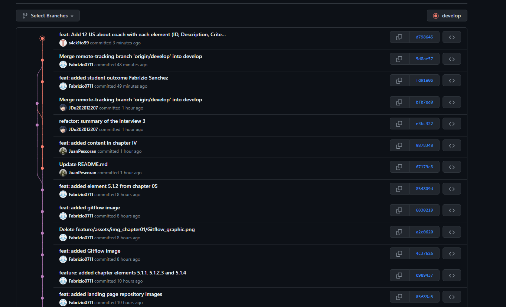

### **Master o Main branch**
La rama principal de desarrollo del proyecto es la Master branch. En esta rama reside el código que actualmente se encuentra en producción.
#### Notación: master o main

### **Develop branch**
La rama "Develop" albergará las más recientes actualizaciones y cambios agregados que serán incluidos en la próxima versión del proyecto. Esta rama sirve como un espacio para la integración y prueba continua de los cambios antes de ser fusionados con la rama principal "Master" para su despliegue en producción.
#### Notación: develop

### **Release branch**
La rama de lanzamiento (Release branch) facilitará la preparación de una nueva versión del producto. Esta rama permitirá la corrección de errores y permitirá que la rama Develop reciba más actualizaciones.
 Debe derivarse de la rama Develop.
 Debe fusionarse con la rama Develop y Master.
#### Notación: release

### **Feature branch**
Las ramas de características (Feature branches) serán empleadas para desarrollar nuevas funcionalidades o características del producto que se agregarán en la siguiente versión o en versiones futuras. Estas funcionalidades deberán fusionarse eventualmente con la rama Develop.
 Debe derivarse de la rama Develop.
 Debe fusionarse de vuelta a la rama Develop.
#### Notación: release

### **Hotfix branch**
La rama de corrección rápida (Hotfix branch) se empleará para resolver y actuar de manera inmediata ante posibles errores en la versión en producción del producto. La característica principal de esta rama es que permite preparar una solución rápida mientras el resto del equipo continúa trabajando en otras funcionalidades o mejoras.
 Debe derivarse de la rama Master
 Debe fusionarse con la rama Develop y Master
#### Notación: hotfix

### **Support branch**
### **Conventional Commits**
"Conventional Commits" es una convención para estructurar los mensajes de confirmación (commits) en un formato estándar y semántico. Este formato ayuda a comunicar claramente los cambios realizados en el código y facilita la generación de registros de cambios automáticos. Los "Conventional Commits" suelen seguir un formato que incluye un encabezado, un cuerpo opcional y un pie de página opcional, y se utilizan para describir de manera sucinta y clara los cambios realizados en el código, lo que facilita su seguimiento y comprensión por parte de los desarrolladores y otros miembros del equipo.
 
La estructura de un commit debe seguir las siguientes pautas:
~~~
git commit -m “<type>[optional scope]: <title>“ -m “<description”
~~~
**Tipos De Conventional Commits**
~~~
1. feat: Used to describe a new feature or functionality added to the code.
2. fix: Indicates a bug fix or solution to a problem.
3. docs: Employed for changes or improvements in code documentation.
4. style: Describes changes related to the code's formatting, such as whitespace, indentation, etc., that do not affect its functionality.
5. refactor: Used for modifications to the code that do not fix bugs or add new features, but rather improve its structure or readability.
6. test: Indicates the addition or modification of unit tests or functional tests.
7. chore: Used for changes in the build process or maintenance tasks that are not directly related to the code itself.
8. perf: Describes performance improvements in the code.
~~~

### 5.1.3. Source Code Style Guide & Conventions.
Como norma general, se espera que todo el código desarrollado por los miembros del equipo esté completamente redactado en inglés.
- ### HTML 
    - #### Use Lowercase Element Names:
        Es recomendable utilizar minúsculas o lowercase para los nombres de los elementos HTML.
        ~~~ 
      <body>
            
This is a paragraph

      <body>
       ~~~
    - #### Close All HTML Elements:
        Es recomendable cerrar todos los elementos HTML correctamente.
        ~~~ 
      <body>
            
This is a paragraph

            
This is another paragraph

      <body>
       ~~~
    - #### Use Lowercase Attribute Names:
        Es recomendable utilizar minúsculas para los nombres de los atributos HTML.
      ~~~ 
      <a href="https://www.w3schools.com/html/">Visit our HTMLtutorial</a>
       ~~~
    - #### Always Specify alt, width, and height for Images:
      Es recomendable seguir estas convenciones en caso de que la imagen no se pueda mostrar, lo que ayuda a mejorar la accesibilidad del contenido.
      ~~~ 
      
      ~~~ 
    - #### Spaces and Equal Signs:
      Se recomienda no utilizar espacios en blanco entre las entidades para mejorar la legibilidad.
      ~~~ 
      <link rel="stylesheet" href="styles.css">
      ~~~ 
- ### CSS
    - #### ID and Class Naming
      Es recomendable utilizar nombres de clases e id's significativos que expresen claramente el propósito del elemento.
      ~~~ 
      #gallery {}
      #login {}
      .video {}
       ~~~
    - #### ID and Class Name Style
      Se recomienda utilizar nombres cortos para nombrar ids o clases, pero lo suficientemente descriptivos para entender su propósito.
      ~~~ 
      #nav {}
      .author {}
      ~~~
    - #### Shorthand Properties
      Se recomienda utilizar propiedades CSS de forma abreviada siempre que sea posible para hacer el código más eficiente y comprensible.
       ~~~ 
       border-top: 0;
       font: 100%/1.6 palatino, georgia, serif;
       padding: 0 1em 2em;
       ~~~ 
    - #### 0 and Units
      Es recomendable evitar especificar la unidad después del valor 0 en propiedades que lo permitan, ya que esto ayuda a reducir el tamaño del código y mejora su legibilidad.
       ~~~ 
       margin: 0;
       padding: 0;
       ~~~
     - #### Declaration Order
       Se recomienda ordenar las declaraciones en orden alfabético para facilitar el mantenimiento y la recordación del código.
       ~~~ 
        background: fuchsia;
        border: 1px solid;
        border-radius: 4px;
        color: black;
        text-align: center;
        text-indent: 2em;
       ~~~  
- ### JAVASCRIPT
     - #### Use expanded syntax
       Cada línea de JavaScript debería estar en una nueva línea, con la llave de apertura en la misma línea de su declaración y la llave de cierre en una nueva línea al final.
       ~~~ 
       function myFunc() {
        console.log('Hello!');
       };
       ~~~
     - #### Variable naming
       Para el nombre de las variables, se recomienda utilizar lowerCamelCase. 
       ~~~ 
       let playerScore = 0;
       let speed = distance / time;
       ~~~  
     - #### Declaring variables
       Para la declaración de variables, es recomendable utilizar las palabras reservadas let y const en lugar de var.
       ~~~ 
       const myName = 'Chris';
       console.log(myName);
       let myAge = '40';
       myAge++;
       console.log('Happy birthday!');
       ~~~ 
     - #### Function naming
       Para el nombre de las funciones, se recomienda utilizar lowerCamelCase.
       ~~~ 
       function sayHello() {
       alert('Hello!');
       };
       ~~~ 
- ### C#
    - #### PascalCase
      Mayúscula al principio de cada palabra para nombres de clases y métodos.
      ~~~ 
      public class MyClass {
          public void ExampleMethod() {
              // Method code
          }
      }
      ~~~
    - #### camelCase
      Minúscula al principio con mayúsculas para cada palabra subsiguiente para variables y parámetros.
      ~~~ 
      public class MyClass {
          public void ExampleMethod(int exampleNumber) {
              string exampleName = "Example";
              // Method code     
          }
      }
      ~~~
      - #### Reasonable line length
        Mantener líneas de código con longitud adecuada para mejorar la legibilidad.
        ~~~ 
        public class MyClass {
            public void ExampleMethod() {
                string message = "This is an example message that spans multiple lines " +
                                 "to demonstrate how to maintain a reasonable length.";
                 Console.WriteLine(message);  
          }
        }
        ~~~ 
      - #### Clear comments:
          Utilizar comentarios para explicar el propósito del código de manera concisa.
          ~~~ 
          public class MyClass {
              // This method performs an addition operation and returns the result.
              public int Add(int a, int b) {
                return a + b;
               }
          }
          ~~~
    - #### Single responsibility:
      Cada clase o método debe tener una única función bien definida.
      ~~~ 
      // Class responsible for handling basic mathematical operations
      public class MathematicalOperations {
          // Method to add two numbers
          public int Add(int a, int b) {
              return a + b; 
          } 
       
          // Method to subtract two numbers
          public int Subtract(int a, int b) { 
              return a - b; 
          } 
      }
      ~~~
- ### LENGUAJE GHERKIN
    - #### Descriptive and concise titles for scenarios
      Utilizar títulos descriptivos y concisos para los escenarios.
      ~~~ 
      Feature: Login
        Scenario: Successful login
          Given a user is on the login page     
          When they enter valid credentials     
          Then they should be logged in successfully      
      ~~~
    - #### Follow the Given-When-Then structure consistently.
      Seguir la estructura de Given-When-Then de manera consistente.
      ~~~ 
      Scenario: Adding items to the shopping cart
        Given the user is on the shopping page
        When they add an item to the cart
        Then the item should appear in the cart 
      ~~~
    - #### Focus on business-readable language
      Centrarse en un lenguaje legible para el negocio, evitando detalles técnicos de implementación.
      ~~~ 
      Scenario: Changing user settingst
        Given the user is logged in
        When they navigate to the settings page
        Then they should be able to update their profile
      ~~~
    - ####  Utilize Scenario Outline for scenarios with multiple similar cases.
      Utilizar Scenario Outline para escenarios con múltiples casos similares.
      ~~~ 
      Scenario Outline: Searching for products
        Given the user is on the search page
        When they search for "<product>"
        Then they should see search results for "<product>"
      
      Examples:
        | product  |
        | Laptop   |
        | Smartphone |
      ~~~
    - #### Add comments to provide additional context
      Agregar comentarios para proporcionar contexto adicional o explicaciones cuando sea necesario.
      ~~~ 
      # This scenario checks the functionality of the logout feature
      Scenario: User logout
        Given the user is logged in
        When they click on the logout button
        Then they should be redirected to the login page      
      ~~~
      
### 5.1.4. Software Deployment Configuration.
- Creación Landing Page: 
1. Se crea un repositorio remoto en GitHub
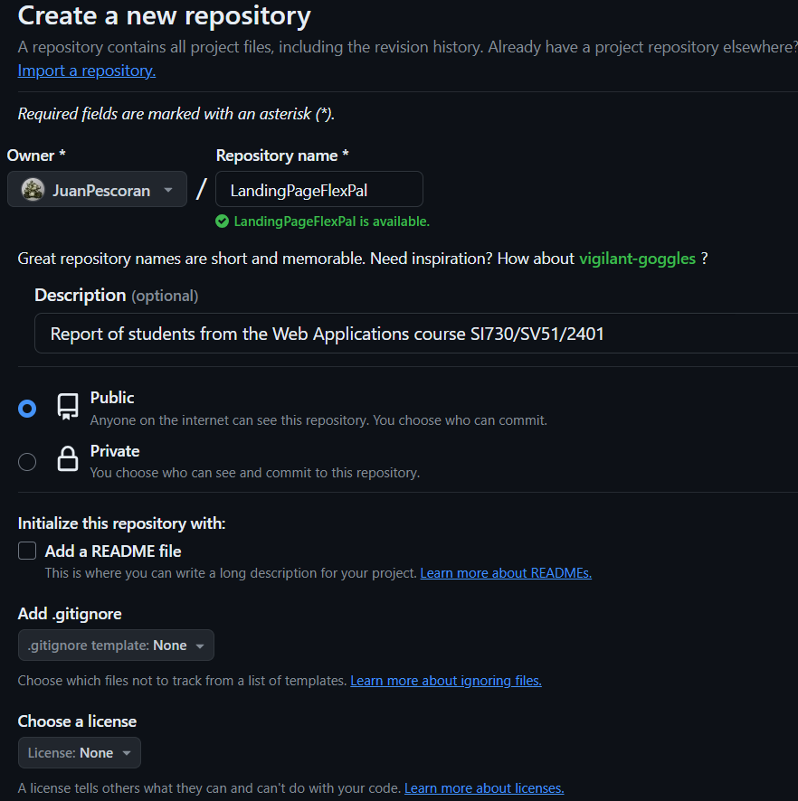
2. Agregar a participantes

3. Habilitamos GitHub Pages en branch "master" y ruta "/(root)"

- Creación Front End App: 
1. Creación de repositorio dentro de nuestra organización:

2. Agregar a participantes:

## 5.2. Landing Page, Services & Applications Implementation.
La implementación de la página de inicio, los servicios y las aplicaciones es un paso fundamental en nuestro proceso de desarrollo. Nos permite materializar el diseño y la funcionalidad planificados, transformando los conceptos en productos tangibles y listos para su uso. Esta fase nos permite traducir las especificaciones y requisitos en código, desarrollando la estructura de la página, los servicios y las aplicaciones de acuerdo con las necesidades identificadas.
### 5.2.1. Sprint 1
El primer sprint es un hito importante en nuestro proceso de desarrollo ágil. Durante este período, nos enfocamos en la implementación de las características y funcionalidades prioritarias identificadas en la planificación inicial. Esto implica traducir los requisitos y especificaciones en código funcional, desarrollando las bases de nuestro producto de manera iterativa.
#### 5.2.1.1. Sprint Planning 1.
El sprint planning es una reunión en la metodología ágil donde el equipo planifica las actividades del próximo sprint. Define qué trabajo se hará, cuánto tiempo tomará y quién será responsable. El objetivo es establecer un plan claro y alcanzable para el equipo, fomentando la colaboración y asegurando que todos estén alineados en cuanto a objetivos y prioridades.
<table  style="text-align: center;">
    <tbody>
        <tr>
			<td colspan="1">Sprint #</td>
            <td colspan="1"> Sprint 1  </td>
		</tr>
        <tr>
			<td colspan="2">Sprint Planning Background </td>
		</tr>
        <tr>
			<td colspan="1">Date</td>
            <td colspan="1"> 2024-04-10 </td>
		</tr>
        <tr>
			<td colspan="1">Time</td>
            <td colspan="1"> 11:00 PM </td>
		</tr>
        <tr>
			<td colspan="1">Location</td>
            <td colspan="1">Microsoft Teams (Reunion virtual)</td>
		</tr>
        <tr>
			<td colspan="1">Prepared By</td>
            <td colspan="1">Pescoran Angulo, Juan Fabritzzio</td>
		</tr>
        <tr>
			<td colspan="1"> Attendees (to planning meeting)</td>
            <td colspan="1">Carpio Cornejo, Miguel Angel Jesus / Cueto Dominguez, Juan Diego / Sanchez Zamora Fabrizio Alessandro / Paredes Zapata, Luiggi Gianfranco </td>
		</tr>
         <tr>
			<td colspan="1">Sprint 1 – 1 Review Summary </td>
            <td colspan="1">Se alcanzaron los objetivos del producto como la realización de todos los capítulos, el despliegue completo de la Landing Pague y la mayoría de información necesaria dentro del reporte, sin embargo, una de las tareas/objetivos más importantes que se debía alcanzar fue la presentación de un informa en formato pdf y word.</td>
		</tr>
         <tr>
			<td colspan="1">Sprint 1 – 1 Retrospective Summary </td>
            <td colspan="1">El sprint 1 fue ineficiente en términos de cooperación, se organizó mal el uso del tiempo y esto dio como resultado la entrega de un producto incompleto y para nada profesional. Juan Pescorán como Team Leader mencionó puntos de mejora, siendo estos: "Más dedicación por parte de todo el equipo, reuniones diarias para analizar el desarrollo de vida del proyecto de software, más comunicación entre los integrantes del equipo y maximizar el uso de herramientas de software para manejar las tareas pendientes de cada sprint."</td>
		</tr>
         <tr>
			<td colspan="2">Sprint Goal & User Stories </td>
		</tr>
         <tr>
			<td colspan="1">Sprint 1 Goal</td>
            <td colspan="1">Para este sprint se requiere el cumplimiento de los siguientes objetivos: Finalización de reporte y despliegue sin problemas de la Landing Page que se encuentran en nuestro repositorio. La métrica de cumplimiento se basará en el proceso de cómo nuestro "Board de Trello" luzca con el paso del tiempo, nuestro resultado final debe de mostrar todas las tareas en el lado derecho de la herramienta, ubicándolos en la columna "Terminado"</td>
		</tr>
        <tr>
			<td colspan="1">Sprint 1 Velocity </td>
            <td colspan="1">Para este sprint se han elegido 5 User Stories que tienen 5 Story points cada uno.</td>
		</tr>
        <tr>
			<td colspan="1">Sum of Story Points </td>
            <td colspan="1">25</td>
		</tr>
</tbody>
</table>

#### 5.2.1.2. Sprint Backlog 1.

En este primer sprint, nos enfocamos en la implementación de las funcionalidades básicas de la Landing Page, incluyendo la estructura general, el diseño visual y la navegación básica, también se ha creado un reporte que muestra el ciclo de vida de todo nuestro proyecto de software. Estas características son fundamentales para establecer las bases de nuestro producto y proporcionar una experiencia de usuario sólida y coherente.
A continuación el sprint backlog 1 y el Trello donde se repartieron los trabajos: 

[Link para ingresar al board del primer sprint](https://trello.com/invite/b/OVQC9ARc/ATTI0aff475a30a66269bb2b8469d3332a14873BB5C1/task-app-web)

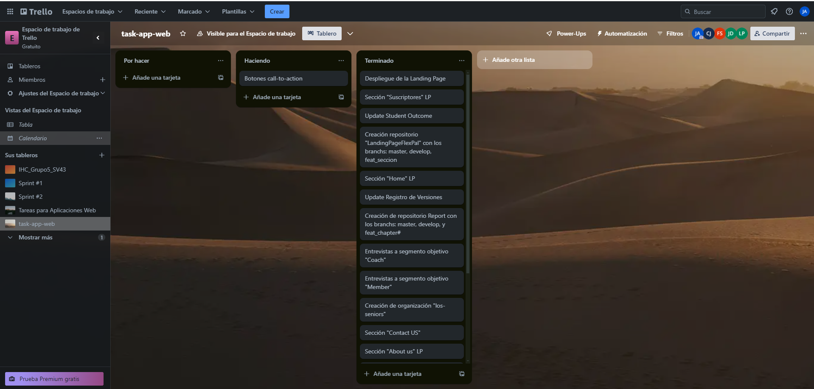

<table>
	<tbody>
		<tr>
			<td>Sprint #</td>
			<td colspan="7">Sprint 1</td>
		</tr>
		<tr>
			<td colspan="2">User Story</td>
			<td colspan="6">Work - Item / Task</td>
		</tr>
		<tr>
			<td>Id</td>
			<td>Title</td>
			<td>Id</td>
			<td>Title</td>
			<td>Description</td>
			<td>Estimation (Hours)</td>
			<td>Assigned To</td>
			<td>Status (To-do / In-Process / To-Review / Done)</td>
		</tr>
		<tr>
			<td></td>
			<td></td>
			<td>TSK001</td>
			<td>Remote environment creation for Report and Landing Page</td>
			<td>Organization, repositories and branch creation in GitHub</td>
			<td>0</td>
			<td>All team members</td>
			<td>Done</td>
		</tr>
		<tr>
			<td></td>
			<td></td>
			<td>TSK002</td>
			<td>Conclude Chapter01</td>
			<td>Finish all section and add the respective information in chapter01</td>
			<td>5</td>
			<td>Juan Pescoran</td>
			<td>Done</td>
		</tr>
		<tr>
			<td></td>
			<td></td>
			<td>TSK003</td>
			<td>Conclude Chapter02</td>
			<td>Finish all section and add the respective information in chapter02</td>
			<td>3</td>
			<td>All team members</td>
			<td>Done</td>
		</tr>
		<tr>
			<td></td>
			<td></td>
			<td>TSK004</td>
			<td>Conclude Chapter03</td>
			<td>Finish all section and add the respective information in chapter03</td>
			<td>5</td>
			<td>All team members</td>
			<td>Done</td>
		</tr>
		<tr>
			<td></td>
			<td></td>
			<td>TSK005</td>
			<td>Conclude Chapter04</td>
			<td>Finish all section and add the respective information in chapter04</td>
			<td>19</td>
			<td>All team members</td>
			<td>Done</td>
		</tr>
		<tr>
			<td></td>
			<td></td>
			<td>TSK006</td>
			<td>Conclude Chapter05</td>
			<td>Finish all section and add the respective information in chapter05</td>
			<td>3</td>
			<td>All team members</td>
			<td>Done</td>
		</tr>
    <tbody>
</table>

#### 5.2.1.3. Development Evidence for Sprint Review.
En esta sección se explica y presenta los avances en implementación con relación a los productos de la solución según el alcance del Sprint: Landing Page, Web Applications, Web Services.

Primero, se mostrarán los commits más importantes para el Reporte, los cuales muestran el ciclo de vida del proyecto, y toda la información que se usó, usa y usará para el desarrollo del proyecto:

| Repository          | Branch  | Commit ID                                | Commit Message                           | Commit Message Body                                                                                                                                 | Commited on (Date) |
|---------------------|---------|------------------------------------------|------------------------------------------|-----------------------------------------------------------------------------------------------------------------------------------------------------|--------------------|
| JuanPescoran/Report | develop | 98783487238973c5dd4a8097197adb2cf70af00a | feat: added content in chapter IV        | added content in all sections of chapter04                                                                                                          | 4/9/2024           |
| JuanPescoran/Report | master  | 889cdc0229a96aa9fca4641ebfccccd71f0d7a5a | feat(assets)                             | added img to master branch                                                                                                                          | 4/9/2024           |

A continuación se presentan los commits más importantes para la Landing Page, los cuales muestran todo el contenido visual y funcionalidades implementadas en el Sprint 2:

| Repository                      | Branch                | Commit ID                                | Commit Message                   | Commit Message Body                                                                                                                                 | Commited on (Date) |
|---------------------------------|-----------------------|------------------------------------------|----------------------------------|-----------------------------------------------------------------------------------------------------------------------------------------------------|--------------------|
| JDu202012207/LandingPageFlexPal | feat-bienvenida       | 563de4f7bde5ef4a20ce639bc4f6bd881d205856 | feat(welcome-container)          | implemented cta in section home, added slogan and banner.                                                                                           | 4/9/2024           |
| Fabrizio0711/LandingPageFlexPal | feature-testimonios   | d3d404bfa4c98d4bd3311d54d2edca3c2b7f6f51 | feat: added testimonials section | added testimonials section with user feedback                                                                                                       | 4/9/2024           |
| JDu202012207/LandingPageFlexPal | feature-header-footer | f8351fb08d1718af912437127ac10d350a6b0d2c | feat(header-footer)              | implemented logo in header and information in footer.                                                                                               | 4/9/2024           |
| JDu202012207/LandingPageFlexPal | feature-contacto      | c8d979e154ceec2e6b7e924b6aa16137199f743d | feat(contact-us)                 | implemented form, description and labels                                                                                                            | 4/9/2024           |
| JuanPescoran/LandingPageFlexPal | feature-contenido     | db8e4a108071eeed824a148623bf34e7785ea982 | feat(assets): added images       | feat(assets): added all information for hero content, about us, subscriptions and other sections Also, added images for banners and everything else | 4/9/2024           |

#### 5.2.1.4. Testing Suite Evidence for Sprint Review.
Se ha omitido la sección de la aplicación web debido a que solo se ha desarrollado la Landing Page. Se ofrecerá más información sobre la aplicación en una etapa posterior del desarrollo.
#### 5.2.1.5. Execution Evidence for Sprint Review.

En esta entrega, el equipo de desarrolladores de FlexPal ha completado con éxito la implementación y el lanzamiento de la página de la Landing Page. Esta página presenta diferentes secciones que brindan información detallada sobre nuestro producto.
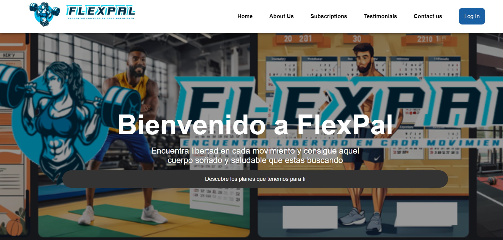

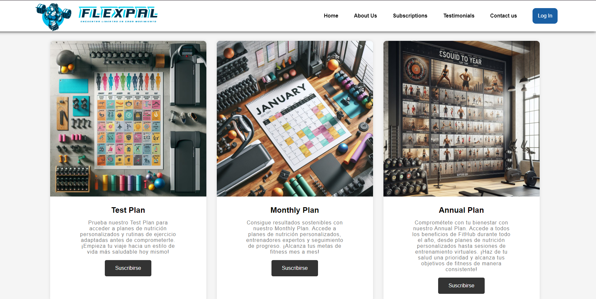
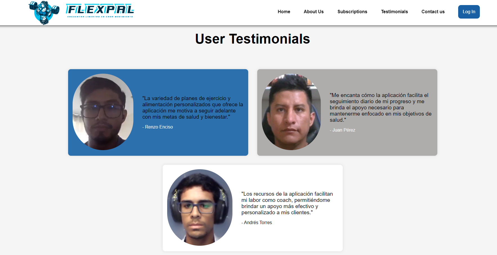
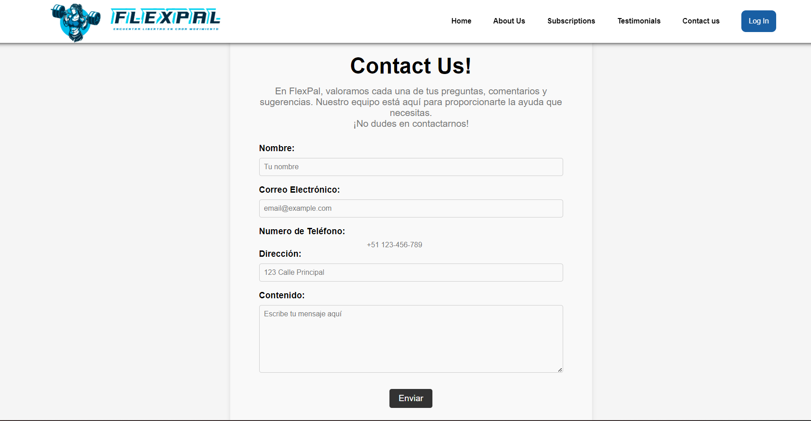

#### 5.2.1.6. Services Documentation Evidence for Sprint Review.
Se ha omitido la sección de la aplicación web debido a que solo se ha desarrollado la Landing Page. Se ofrecerá más información sobre la aplicación en una etapa posterior del desarrollo.
#### 5.2.1.7. Software Deployment Evidence for Sprint Review.
Se ha omitido la sección de la aplicación web debido a que solo se ha desarrollado la Landing Page. Se ofrecerá más información sobre la aplicación en una etapa posterior del desarrollo.
#### 5.2.1.8. Team Collaboration Insights during Sprint.
A continuación todos los analíticos que nos proporciona Github, en su apartado de Insights, sobre la colaboración del equipo durante el Sprint 1:

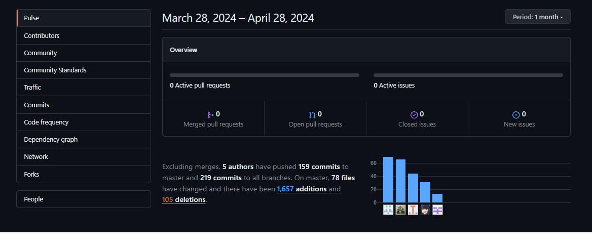

- - -

### 5.2.2. Sprint 2
En esta sección se registra y explica el avance en términos de producto y trabajo colaborativo para el Sprint 2. Incluye como secciones internas: Sprint Planning 2, Sprint Backlog 2, Development Evidence for Sprint Review, Execution Evidence for Sprint Review, Services Documentation Evidence for Sprint Review, junto con Team Collaboration Insights during Sprint
#### 5.2.2.1.Sprint Planning 2.

<table  style="text-align: center;">
    <tbody>
        <tr>
			<td colspan="1">Sprint #</td>
            <td colspan="1"> Sprint 2  </td>
		</tr>
        <tr>
			<td colspan="2">Sprint Planning Background </td>
		</tr>
        <tr>
			<td colspan="1">Date</td>
            <td colspan="1"> 2024-04-28 </td>
		</tr>
        <tr>
			<td colspan="1">Time</td>
            <td colspan="1"> 11:00 PM </td>
		</tr>
        <tr>
			<td colspan="1">Location</td>
            <td colspan="1">Microsoft Teams (Reunion virtual)</td>
		</tr>
        <tr>
			<td colspan="1">Prepared By</td>
            <td colspan="1">Pescoran Angulo, Juan Fabritzzio</td>
		</tr>
        <tr>
			<td colspan="1"> Attendees (to planning meeting)</td>
            <td colspan="1">Carpio Cornejo, Miguel Angel Jesus / Cueto Dominguez, Juan Diego / Sanchez Zamora Fabrizio Alessandro / Paredes Zapata, Luiggi Gianfranco </td>
		</tr>
         <tr>
			<td colspan="1">Sprint 2 – 1 Review Summary </td>
            <td colspan="1">Se alcanzaron los objetivos: el mejoramiento del reporte según las pautas del profesor, el arreglo del código en nuestra landing page y también el despliegue de la primera versión de nuestra Front End App que se planea seguir desarrollando en etapas posteriores.</td>
		</tr>
         <tr>
			<td colspan="1">Sprint 1 – 1 Retrospective Summary </td>
            <td colspan="1">El sprint 2 fue mucho mejor comparado al sprint 1, a pesar de tener menos tiempo para la presentación de una versión mejorada del producto presentado en la etapa anterior y también adicionar la creación de nuestra Web Application, el equipo ha podido mantener su resiliencia, mejorando el rendimiento de todos los integrantes, su cooperación y manejo de herramientas que mejoraron la presentación del trabajo. En palabras de Fabrizio Sánchez: "Nos fue mejor, pues supimos utilizar el tiempo que se nos dio para completar una tarea que fue completada con sencillez gracias al trabajo en equipo."</td>
		</tr>
         <tr>
			<td colspan="2">Sprint Goal & User Stories </td>
		</tr>
         <tr>
			<td colspan="1">Sprint 1 Goal</td>
            <td colspan="1">Para este sprint se requiere el cumplimiento de los siguientes objetivos: Mejoramiento de información dentro del reporte y adición de información que faltó agregar en el sprint anterior, arreglo de código fuente de nuestra landing page (mayormente convenciones y cambio de lenguaje en variables y valores) y por último despliegue de nuestra primera versión completa de la Front End App</td>
		</tr>
        <tr>
			<td colspan="1">Sprint 1 Velocity </td>
            <td colspan="1">Para este sprint se han elegido 11 User Stories que tienen 2,3 y 5 Story points cada uno: 2 User Stories con el valor de 2 Story Points, 7 USer Stories con el valor de 3 Story Points y 2 User Stories con el valor de 5 Story Points.</td>
		</tr>
        <tr>
			<td colspan="1">Sum of Story Points </td>
            <td colspan="1">35</td>
		</tr>
</tbody>
</table>

#### .2.2.2.Sprint Backlog 2.

En este segundo sprint el equipo se ha enfocado en el mejoramiento de la Landing Page, el reporte y la implementación de la Front End Application. A continuación, se presenta el backlog de tareas para el Sprint 2:
[Link para ingresar al board del segundo Sprint](https://trello.com/invite/b/gGX8tUs5/ATTI8c704f8583cb7e50fc94edb9fbc756d2DEBA4981/tareas-para-aplicaciones-web)

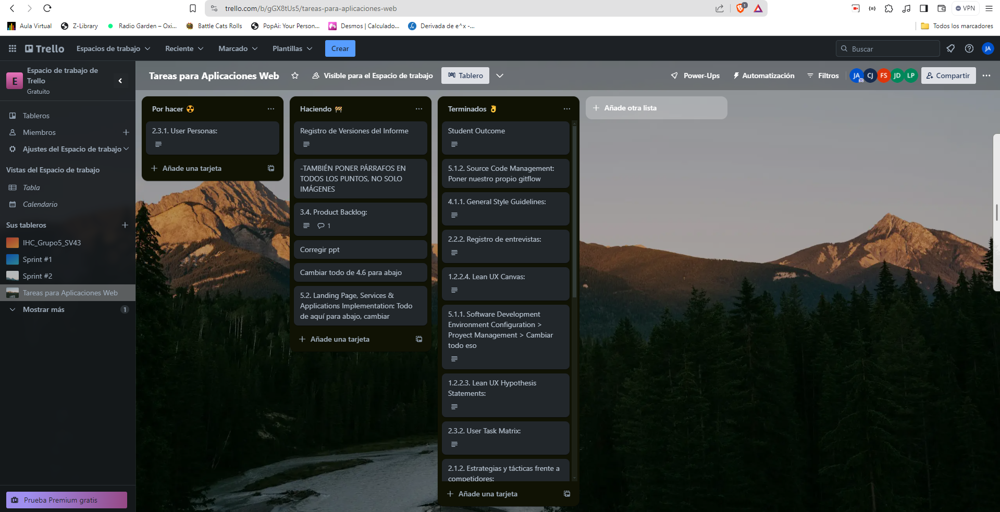

<table>
	<tbody>
		<tr>
			<td>Sprint #</td>
			<td colspan="7">Sprint 2</td>
		</tr>
		<tr>
			<td colspan="2">User Story</td>
			<td colspan="6">Work - Item / Task</td>
		</tr>
		<tr>
			<td>Id</td>
			<td>Title</td>
			<td>Id</td>
			<td>Title</td>
			<td>Description</td>
			<td>Estimation (Hours)</td>
			<td>Assigned To</td>
			<td>Status (To-do / In-Process / To-Review / Done)</td>
		</tr>
		<tr>
			<td></td>
			<td></td>
			<td>TSK008</td>
			<td>Remote environment creation for Front End App</td>
			<td>repositories and branch creations for Web Application in GitHub</td>
			<td>0</td>
			<td>Juan Pescoran</td>
			<td>Done</td>
		</tr>
		<tr>
			<td></td>
			<td></td>
			<td>TSK009</td>
			<td>Update Chapter01</td>
			<td>add the respective information resulting from the observations made in the review in chapter01</td>
			<td>5</td>
			<td>All team members</td>
			<td>Done</td>
		</tr>
		<tr>
			<td></td>
			<td></td>
			<td>TSK010</td>
			<td>Update Chapter02</td>
			<td>add the respective information resulting from the observations made in the review in chapter02</td>
			<td>1</td>
			<td>All team members</td>
			<td>Done</td>
		</tr>
		<tr>
			<td></td>
			<td></td>
			<td>TSK011</td>
			<td>Update Chapter03</td>
			<td>add the respective information resulting from the observations made in the review in chapter03</td>
			<td>2</td>
			<td>All team members</td>
			<td>Done</td>
		</tr>
		<tr>
			<td></td>
			<td></td>
			<td>TSK012</td>
			<td>Update Chapter04</td>
			<td>add the respective information resulting from the observations made in the review in chapter04</td>
			<td>6</td>
			<td>All team members</td>
			<td>Done</td>
		</tr>
		<tr>
			<td></td>
			<td></td>
			<td>TSK013</td>
			<td>Update Chapter05</td>
			<td>add the respective information resulting from the observations made in the review in chapter02</td>
			<td>4</td>
			<td>All team members</td>
			<td>Done</td>
		</tr>
    <tbody>
</table>

#### 5.2.2.3.Development Evidence for Sprint Review.

En la primera tabla
En la segunda tabla se ve el commit que realizó el cambio de lenguaje en la Landing Page.

Primero, se mostrarán los commits más importantes para el arreglo según las observaciones hechas al reporte:

Ahora, se mostrarán los commits más importantes para el arreglo según las observaciones hechas a la Landing Page:

| Repository                   | Branch | Commit ID                                | Commit Message | Commit Message Body                    | Commited on (Date) |
|------------------------------|--------|------------------------------------------|----------------|----------------------------------------|--------------------|
| s4ck1to99/LandingPageFlexPal | master | 51d1e22858cd8356c12bc86d530eda3935e6b3e5 | refactor       | Language spanish to english index.html | 25/9/2024          |

#### 5.2.2.4.Testing Suite Evidence for Sprint Review.
Se ha omitido la sección de la aplicación web debido a que solo se ha desarrollado la Landing Page y la Front End Application. Se ofrecerá más información sobre la aplicación en una etapa posterior del desarrollo.
#### 5.2.2.5.Execution Evidence for Sprint Review.
En esta entrega, el equipo de desarrolladores de FlexPal ha completado con éxito la implementación y el lanzamiento de la página de la Landing Page. Esta página presenta diferentes secciones que brindan información detallada sobre nuestro producto.

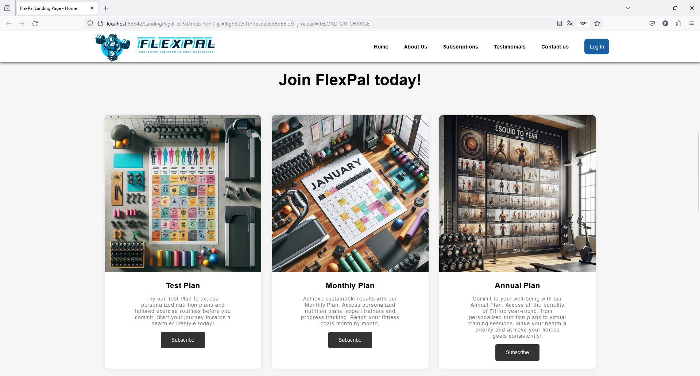

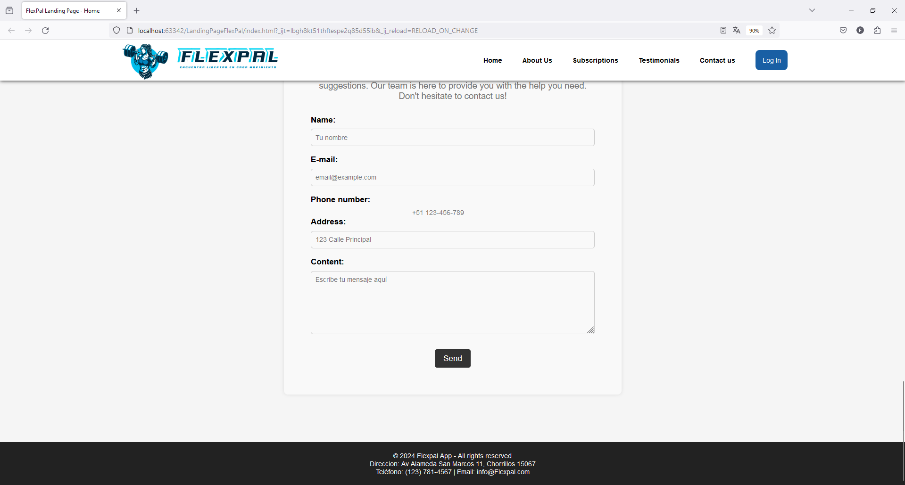

También se ha completado la implementación de la Front End Application, que presenta una interfaz de usuario interactiva y funcionalidades básicas para los usuarios. A continuación, se presentan algunas capturas de pantalla de la aplicación en funcionamiento:

#### 5.2.2.6.Services Documentation Evidence for Sprint Review.
Se ha omitido la sección de la aplicación web debido a que solo se ha desarrollado la Landing Page y la Front End Application. Se ofrecerá más información sobre la aplicación en una etapa posterior del desarrollo.
#### 5.2.2.7.Software Deployment Evidence for Sprint Review.
Se ha omitido la sección de la aplicación web debido a que solo se ha desarrollado la Landing Page y la Front End Application. Se ofrecerá más información sobre la aplicación en una etapa posterior del desarrollo.
#### 5.2.2.8.Team Collaboration Insights during Sprint.
A continuación todos los analíticos que nos proporciona Github, en su apartado de Insights, sobre la colaboración del equipo durante el Sprint 2:

## Avance de Conclusiones, Bibliografía y Anexos.
### Conclusiones
- Durante el desarrollo de la Landing Page, el equipo de FlexPal ha logrado implementar con éxito las funcionalidades y características planificadas, proporcionando una experiencia de usuario sólida y coherente.
- La implementación de la Landing Page ha permitido al equipo demostrar su capacidad para traducir los requisitos y especificaciones en código funcional, desarrollando una estructura sólida y un diseño visual atractivo.
- La colaboración y el trabajo en equipo han sido fundamentales para el éxito del proyecto, permitiendo a los miembros del equipo compartir conocimientos, habilidades y recursos para lograr los objetivos establecidos.
- La implementación de la Landing Page ha sentado las bases para el desarrollo de la Web Application, que se espera completar en etapas posteriores del proyecto.
- El uso de herramientas de gestión de proyectos como Trello y GitHub ha facilitado la planificación, el seguimiento y la colaboración en el desarrollo del proyecto, permitiendo al equipo mantenerse organizado y enfocado en los objetivos.
- El proceso de desarrollo ágil ha demostrado ser efectivo para la implementación de la Landing Page, permitiendo al equipo adaptarse a los cambios y desafíos de manera eficiente y eficaz.

### Anexos
- Anexo 1: [Landing Page Repository](https://github.com/los-seniors-v2)
- Anexo 2: [Mockups - Wireframe](https://www.figma.com/file/91Ez19KOQpxgpmPEZ9NtIm/FlexPal?type=design&node-id=0%3A1&mode=design&t=vgM82K5YOfavEdYS-1)
- Anexo 3: [User-Flow - WireFlow Diagram](https://lucid.app/lucidspark/2c642c76-fe1b-41c2-a0e3-613a0b64f8f0/edit?viewport_loc=-1797%2C-1394%2C8704%2C4350%2C0_0&invitationId=inv_0f96f168-1b85-4920-a9fb-ce76f2b42015)
### Bibliografía
- Ipsos. (16 de octubre de 2019). Alimentación y vida saludable en Lima. Ipsos. https://www.ipsos.com/es-pe/alimentacion-y-vida-saludable-en-lima
- Aproximadamente 15 millones de peruanos sufren de obesidad. (4 de marzo de 2024). Noticias - Ministerio De Salud - Plataforma Del Estado Peruano. https://www.gob.pe/institucion/minsa/noticias/915217-aproximadamente-15-millones-de-peruanos-sufren-de-obesidad
- Mena, F. G. (10 de junio de 2019). La realidad de los gimnasios: “80% de peruanos abandona su membresía en los primeros 3 meses.” Gestión. https://gestion.pe/tendencias/realidad-gimnasios-80-peruanos-abandona-membresia-primeros-3-meses-269519-noticia/
