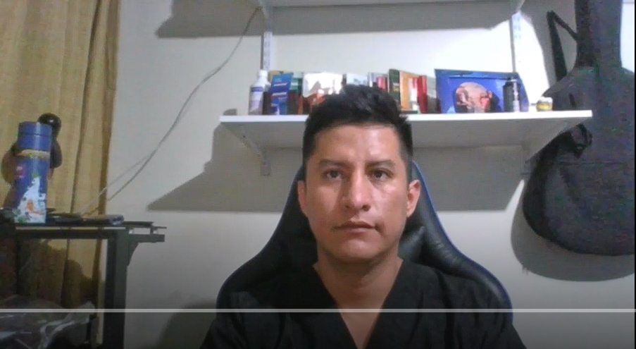
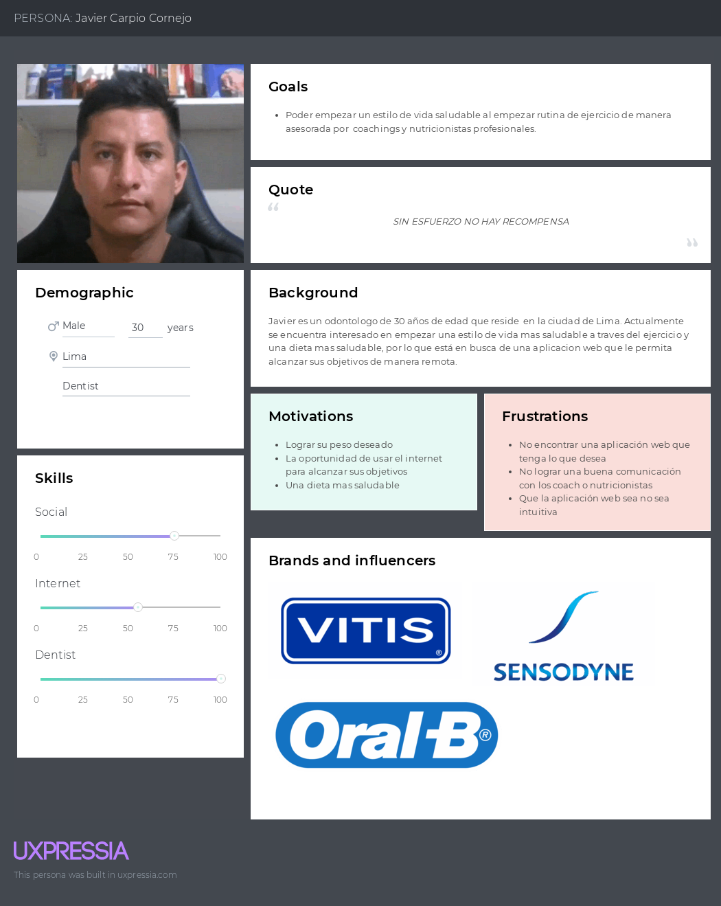
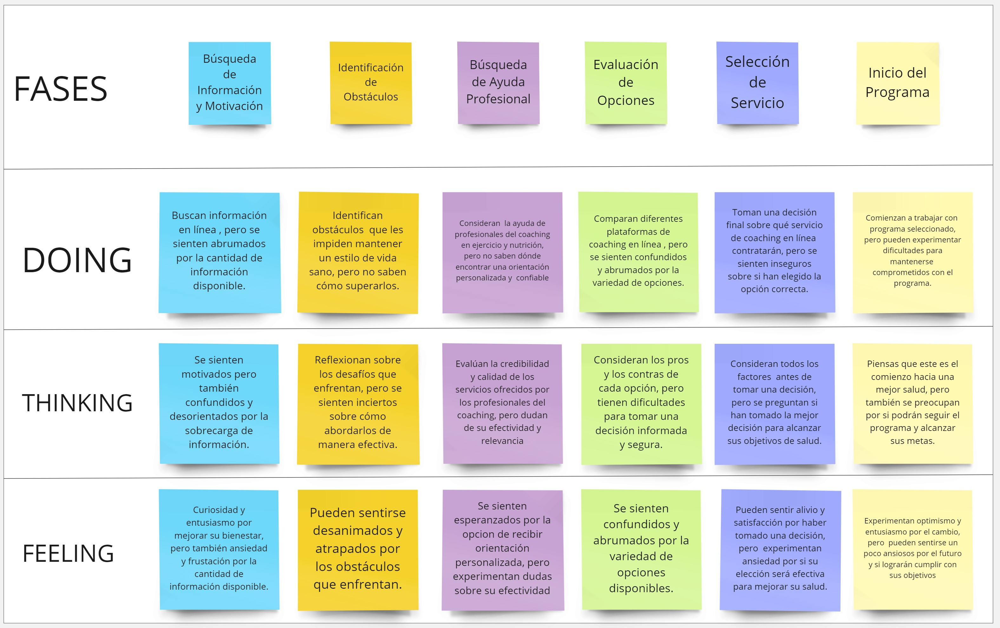
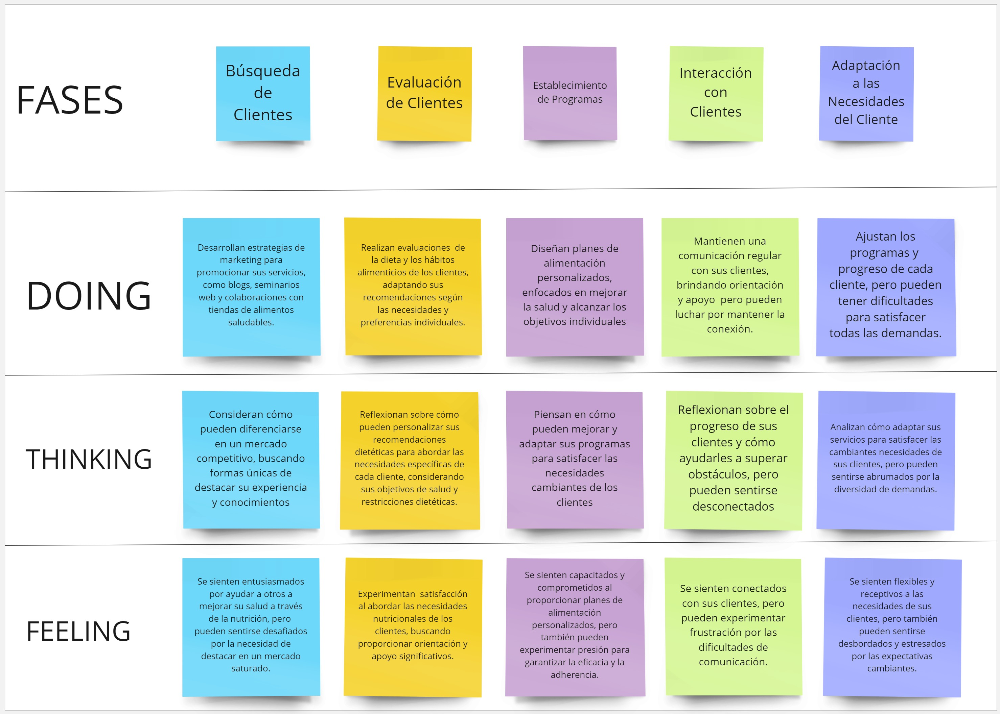

# **Capítulo II:  Requirements Elicitation & Analysis**
## 2.1. Competidores.
* Competidor 1: Description
* Competidor 2: Description
* Competidor 3: Description
### 2.1.1. Análisis competitivo.
<table border="1" style="text-align: center;">
	<tbody>
		<tr>
			<td colspan="6">Competitive Analysis Landscape</td>
		</tr>
		<tr>
			<td colspan="2">¿Por que llevar a cabo este análisis?</td>
			<td colspan="4">Llevar a cabo este análisis nos brindará información crítica que nos permitirá tomar decisiones más informadas y estratégicas para el desarrollo, comercialización y crecimiento de nuestra aplicación</td>
		</tr>
		<tr>
			<td colspan="2"></td>
			<td>Nuestro nombre</td>
			<td>MyFitnessPal</td>
			<td>Noom</td>
			<td>Nike Training Club</td>
		</tr>
		<tr>
			<td rowspan="2">Perfil</td>
			<td>Overview</td>
			<td>Una aplicación móvil y web que ofrece coaching personalizado, seguimiento de progreso y planes de ejercicio y alimentación adaptados a las necesidades individuales de los usuarios.</td>
			<td>Una aplicación líder en seguimiento de alimentos y ejercicio, con una amplia base de usuarios y herramientas para ayudar a mejorar la salud y el estado físico.</td>
			<td>Una aplicación de coaching en salud y bienestar que combina seguimiento de alimentos, planificación de comidas, apoyo de coaching y educación sobre hábitos saludables.</td>
			<td>Una aplicación de entrenamiento de Nike que ofrece una amplia variedad de programas de ejercicio, entrenamientos guiados por expertos y seguimiento del progreso.</td>
		</tr>
		<tr>
			<td>Ventaja competitiva ¿Que valor ofrece a los clientes?</td>
			<td>Ofrece coaching personalizado y seguimiento de progreso integral para una experiencia de usuario altamente adaptada.</td>
			<td>Amplia base de usuarios, base de datos extensa de alimentos, integración con dispositivos de fitness y una comunidad activa.</td>
			<td>Enfoque holístico en la salud y el bienestar, coaching personalizado, educación sobre hábitos saludables y seguimiento del progreso.</td>
			<td>Variedad de entrenamientos y programas, consejos y guía de entrenadores expertos, seguimiento del progreso detallado y amplia integración con dispositivos Nike. </td>
		</tr>
		<tr>
			<td rowspan="2">Perfil de Marketing</td>
			<td>Mercado objetivo</td>
			<td>Individuos interesados en mejorar su salud y condición física, así como profesionales del coaching en áreas como el ejercicio y la nutrición.</td>
			<td>Personas que buscan mejorar su dieta y actividad física, así como profesionales de la salud y el fitness.</td>
			<td>Usuarios interesados en una experiencia de coaching en línea centrada en la salud y el bienestar, con un enfoque en la educación y el apoyo personalizado.</td>
			<td>Individuos que buscan variedad en sus entrenamientos, guía de expertos y seguimiento del progreso para mejorar su estado físico.</td>
		</tr>
		<tr>
			<td>Estrategias de marketing</td>
			<td>Marketing digital dirigido a individuos interesados en la salud y el bienestar, así como colaboraciones con profesionales del sector.</td>
			<td>Marketing de contenido, integración con dispositivos de fitness y una sólida presencia en línea.</td>
			<td>Enfoque en la educación sobre hábitos saludables, coaching personalizado y testimonios de éxito.</td>
			<td>Promoción de la marca Nike, colaboraciones con atletas y celebridades, y marketing digital dirigido a entusiastas del fitness.</td>
		</tr>
		<tr>
			<td rowspan="3">Perfil de Producto</td>
			<td>Productos &amp; Servicios</td>
			<td>Aplicación móvil y web con coaching personalizado, seguimiento de progreso y planes de ejercicio y alimentación adaptados.</td>
			<td>Aplicación móvil y web con seguimiento de alimentos, registro de ejercicio, objetivos personalizables y comunidad en línea.</td>
			<td>Aplicación móvil y web que combina seguimiento de alimentos, planificación de comidas, apoyo de coaching y educación sobre hábitos saludables.</td>
			<td>Aplicación móvil con una amplia variedad de programas de ejercicio, entrenamientos guiados por expertos y seguimiento del progreso.</td>
		</tr>
		<tr>
			<td>Precios &amp; Costos</td>
			<td>Modelo de suscripción mensual para acceder a los servicios de coaching y planes alimentarios personalizados.</td>
			<td>Modelo gratuito con opciones premium de suscripción mensual o anual.</td>
			<td>Modelo de suscripción con opciones de pago mensual o anual.</td>
			<td>Modelo gratuito con opciones de suscripción premium disponibles.</td>
		</tr>
		<tr>
			<td>Canales de distribución (Web y/o Móvil)</td>
			<td>Disponible en línea a través de la aplicación móvil y la plataforma web.</td>
			<td>Disponible en línea a través de la aplicación móvil y la plataforma web.</td>
			<td>Disponible en línea a través de la aplicación móvil y la plataforma web.</td>
			<td>Disponible en línea a través de la aplicación móvil y la plataforma web.</td>
		</tr>
		<tr>
			<td rowspan="4">Análisis SWOT</td>
			<td>Fortalezas</td>
			<td>
                <ul>
                    <li>Coaching personalizado</li>
                    <li>Seguimiento de progreso integral</li>
                    <li>Planes de ejercicio y alimentación adaptados</li>
                </ul>
            </td>
			<td>
                <ul>
                    <li>Amplia base de usuarios</li>
                    <li>Base de datos extensa de alimentos</li>
                    <li>Comunidad activa</li>
                </ul>
            </td>
			<td>
                <ul>
                    <li>Enfoque holístico en la salud y el bienestar</li>
                    <li>Coaching personalizado</li>
                    <li>Educación sobre hábitos saludables</li>
                </ul>
            </td>
			<td>
                <ul>
                    <li>Variedad de entrenamientos y programas</li>
                    <li>Consejos y guía de entrenadores expertos</li>
                    <li>Seguimiento del progreso detallado</li>
                </ul>
            </td>
		</tr>
		<tr>
			<td>Debilidades</td>
			<td>
                <ul>
                    <li>Novedad en el mercado</li>
                    <li>Confianza en las empresas educativas</li>
                </ul>
            </td>
			<td>
                <ul>
                    <li>Precio prohibitivo (facturado anualmente)</li>
                    <li>Solo disponible en inglés</li>
                </ul>
            </td>
			<td>
                <ul>
                    <li>Precio variable (en función de la inscripción de niños)</li>
                    <li>Material muy general</li>
                </ul>
            </td>
			<td>
                <ul>
                    <li>Precio alto (facturado anualmente)</li>
                    <li>Enfoque en niños de entre 3 a 10 años</li>
                </ul>
            </td>
		</tr>
		<tr>
			<td>Oportunidades</td>
			<td>
                <ul>
                    <li>Expansión a nivel internacional</li>
                    <li>Establecer asociaciones con empresas educativas</li>
                </ul>
            </td>
			<td>
                <ul>
                    <li>Precios basados en el nivel socioeconómico</li>
                    <li>Posibilidad de cambio de idioma</li>
                </ul>
            </td>
			<td>
                <ul>
                    <li>Precios fijos basados en usuario</li>
                    <li>Actualización continua del material</li>
                </ul>
            </td>
			<td>
                <ul>
                    <li>Precios basados en el nivel socioeconómico</li>
                    <li>Optimización del rendimiento de la aplicación web</li>
                </ul>
            </td>
		</tr>
		<tr>
			<td>Amenazas</td>
			<td>
                <ul>
                    <li>Competidores establecidos</li>
                    <li>Aceptación por parte de empresas educativas</li>
                </ul>
            </td>
			<td>
                <ul>
                    <li>Competencia de aplicaciones similares</li>
                    <li>Precio alto (facturado anualmente)</li>
                </ul>
            </td>
			<td>
                <ul>
                    <li>Competencia de aplicaciones similares</li>
                    <li>Precio variable</li>
                </ul>
            </td>
			<td>
                <ul>
                    <li>Competencia de aplicaciones similares</li>
                    <li>Precio alto (facturado anualmente)</li>
                </ul>
            </td>
		</tr>
	</tbody>
</table>

### 2.1.2. Estrategias y tácticas frente a competidores.

## 2.2. Entrevistas.
El propósito de las entrevistas es adquirir una comprensión profunda de las experiencias, perspectivas y opiniones de los segmentos de mercado seleccionados. Nuestro objetivo es obtener información valiosa que nos ayude a entender mejor a nuestro público objetivo y así mejorar nuestro conocimiento sobre los usuarios. Estas conversaciones nos permitirán obtener una visión más clara de las necesidades y deseos de nuestros usuarios, lo que nos ayudará a adaptar nuestros productos o servicios de manera más efectiva a sus requerimientos.
### 2.2.1. Diseño de entrevistas.
* **Individuos interesados en mejorar su salud y condición física:**
1. ¿Qué te ha motivado a buscar maneras de mejorar tu salud y condición física en este momento?
2. ¿Cuál ha sido tu experiencia previa al intentar adoptar un estilo de vida más saludable? ¿Qué obstáculos has enfrentado?
3. ¿Qué tipo de apoyo o orientación te resultaría más útil para alcanzar tus objetivos de salud y condición física?
4. ¿Cómo crees que una Aplicación web de coaching en línea podría ayudarte a mantenerte motivado y comprometido con tus metas de bienestar?
5. ¿Qué características considerarías más importantes al elegir un servicio de coaching en línea para ayudarte a alcanzar tus objetivos de salud y condición física?
6. ¿Qué esperas obtener de un coach profesional en términos de apoyo y seguimiento en tu viaje hacia un estilo de vida más saludable?

* **Especialistas en Nutrición:**
1. ¿Qué te llevó a especializarte en el campo de la nutrición y la dietética?
2. ¿Cuáles son los mayores desafíos que enfrentas al trabajar con clientes para mejorar sus hábitos alimenticios y su salud en general?
3. ¿Qué herramientas o recursos encuentras más útiles al proporcionar orientación nutricional a tus clientes?
4. ¿Qué ventajas crees que ofrecería la posibilidad de brindar asesoramiento nutricional a través de una aplicación de coaching en línea?
5. ¿Cuáles son tus principales preocupaciones o consideraciones al seleccionar una plataforma o herramienta en línea para proporcionar asesoramiento nutricional a tus clientes?
6. ¿Cómo crees que una aplicación web de coaching en línea podría mejorar la eficacia de tu trabajo como especialista en nutrición y la experiencia de tus clientes?

* **Profesionales del coaching en ejercicio y alimentación:**
1. ¿Qué te llevó a convertirte en un profesional del coaching en ejercicio o alimentación?
2. ¿Cuáles son los mayores desafíos que enfrentas al trabajar con clientes de manera presencial?
3. ¿Qué beneficios ves en la posibilidad de ofrecer servicios de coaching en línea?
4. ¿Qué herramientas o características crees que serían más útiles para ti al proporcionar servicios de coaching en línea a tus clientes?
5. ¿Qué aspectos considerarías críticos al seleccionar una plataforma de coaching en línea para ofrecer tus servicios profesionales?
6. ¿Cómo crees que una aplicación web de coaching  podría mejorar la eficacia de tu trabajo como coach y la experiencia de tus clientes?
### 2.2.2. Registro de entrevistas.
- **Individuos interesados en mejorar su salud y condición física:**  

**Entrevista #1**  
Nombre y apellidos: Javier Carpio Cornejo  
Edad: 30 años  
  

**Transcripción:**  

**¿Qué te ha motivado a buscar maneras de mejorar tu salud y condición física en este momento?**  
Mejorar mi rendimiento físico y mental para cumplir satisfactoriamente todas las actividades que me planteo en el día.

**¿Cuál ha sido tu experiencia previa al intentar adoptar un estilo de vida más saludable? ¿Qué obstáculos has enfrentado?**  
Experiencia desfavorable y los obstáculos fueron no poder variar las actividades saludables durante un periodo largo, haciendo esto repetitivo y cansado.

**¿Qué tipo de apoyo o orientación te resultaría más útil para alcanzar tus objetivos de salud y condición física?**  
Definitivamente un guia para entrenar y un nutricionista que mejore mi alimentación

**¿Cómo crees que una Aplicación web de coaching en línea podría ayudarte a mantenerte motivado y comprometido con tus metas de bienestar?**  
Creo que un coaching en linea podría ayudarme en incluir correctamente la rutina dentro de mis actividaes diarias. Además un seguimiento por parte de él evitaría caer en la rutina y desmotivación.

**¿Qué características considerarías más importantes al elegir un servicio de coaching en línea para ayudarte a alcanzar tus objetivos de salud y condición física?**  
Considero que debe tener una atención rápida, un plan de actividades semanales y profesionales con capacitaciones constantes.

**¿Qué esperas obtener de un coach profesional en términos de apoyo y seguimiento en tu viaje hacia un estilo de vida más saludable?**  
Espero obtener profesionalismo, motivación, responsabilidad y compromiso.  

[URL de entrevista](https://upcedupe-my.sharepoint.com/:v:/g/personal/u20221c360_upc_edu_pe/EdSdE2ZeVzlKhhKpaprpreoBPGQf2imEYcScLVT3qf_xog?e=uICrNB)

### 2.2.3. Análisis de entrevistas.
## 2.3. Needfinding.
### 2.3.1. User Personas.
En esta sección, presentaremos el perfil de nuestros User Persona, que surge de un análisis de las entrevistas realizadas anteriormente y de una evaluación de la competencia en el mercado. Los artefactos que vamos a presentar están estrechamente relacionados con las principales características identificadas durante este proceso de análisis. Desde las entrevistas, hemos extraído valiosa información sobre las necesidades, deseos y frustraciones de nuestros potenciales usuarios, lo que nos ha permitido perfilar a nuestro User Persona de manera precisa y realista.
- **User Persona Primer Segmento Objetivo(Usuarios interesados en mejorar su salud y condición física)**
  
### 2.3.2. User Task Matrix.
### 2.3.3. User Journey Mapping
### 2.3.4. Empathy Mapping.
### 2.3.5. As-is Scenario Mapping.
- As-Is De Usuarios interesados en mejorar su salud y condición física:

- As-Is De Profesionales del coaching en ejercicio:

- As-Is De Nutricionista:

## 2.4. Ubiquitous Language