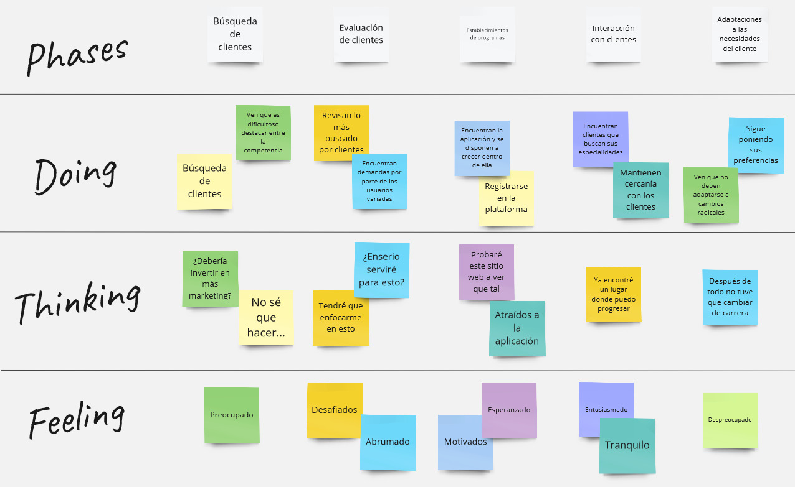

# **Capítulo III: Requirements Specification**

## 3.1. To-Be Scenario Mapping.
- To-Be del segmento objetivo usuario:

- To-Be del segmento objetivo coach:

## 3.2. User Stories.
Para elaborar user stories que pertenecen a un epic. A continuación, las epics que consideramos como equipo:

| **Código** | **Título**                                      | **Epic**                                                                                                          |
|------------|-------------------------------------------------|-------------------------------------------------------------------------------------------------------------------|
| EP001      | Gestión de cuentas                              | **Como** usuario de la plataforma, **Quiero** poder gestionar mi cuenta, **Para** poder actualizar mi información personal, cambiar mi contraseña y gestionar mis preferencias de privacidad.  |
| EP002      | Visualización de User Interface                | **Como** usuario de la plataforma, **Quiero** poder ver la interfaz de usuario del landing page y la plataforma, **Para** explorar todas las funcionalidades disponibles y entender cómo interactuar con la plataforma.  |
| EP003      | Interacción con la plataforma                  | **Como** usuario de la plataforma, **Quiero** poder interactuar con las diferentes características de la plataforma, **Para** poder realizar acciones como crear, editar y eliminar contenido, así como recibir retroalimentación y comunicarme con otros usuarios.  |
| EP004      | Programación y Seguimiento de Sesiones de Entrenamiento | **Como** usuario de la plataforma, **Quiero** poder programar sesiones de entrenamiento con mi coach, **Para** poder establecer metas, seguir mi progreso y recibir recomendaciones personalizadas para mejorar mi rendimiento físico.  |
| EP005      | Análisis de Datos y Planificación de Objetivos | **Como** usuario de la plataforma, **Quiero** tener acceso a herramientas de análisis de datos, **Para** poder revisar mi progreso, establecer metas alcanzables y planificar mi entrenamiento de manera efectiva.  |
| EP006      | Seguridad y Privacidad de Datos                | **Como** usuario de la plataforma, **Quiero** tener la seguridad de que mis datos personales están protegidos, **Para** poder utilizar la plataforma con confianza y tranquilidad, sabiendo que mi privacidad está garantizada.  |
| EP007      | Soporte y Atención al Cliente                  | **Como** usuario de la plataforma, **Quiero** tener acceso a un servicio de soporte y atención al cliente, **Para** poder resolver dudas, reportar problemas y recibir asistencia personalizada en caso de necesitar ayuda.  |

A continuacion, la realizacion de los user stories con sus criterios de aceptacion con escenarios e ID de Épica:

| ID de Historia de Usuario | Título de User Story              | Descripción                                                                                                       | Criterios de Aceptación con Escenarios                                                                                                                                                                                                                                                                                                                                                                                                                                                                                                                                                                                                                                                                                                                                                              | ID de Épica |
|---------------------------|----------------------------------|---------------------------------------------------------------------------------------------------------------------|-----------------------------------------------------------------------------------------------------------------------------------------------------------------------------------------------------------------------------------------------------------------------------------------------------------------------------------------------------------------------------------------------------------------------------------------------------------------------------------------------------------------------------------------------------------------------------------------------------------------------------------------------------------------------------------------------------------------------------------------------------------------------------------------------------|-------------|
| US001                     | Iniciar Sesión                   | Como usuario registrado, Quiero poder iniciar sesión en la plataforma, Para acceder a mi cuenta y utilizar las funciones disponibles. | **Dado** que el usuario tiene credenciales válidas.  **Cuando** el usuario ingresa sus credenciales y presiona "Iniciar sesión".   **Entonces** el sistema lo redirige a la página principal de la plataforma.   **Dado** que el usuario tiene credenciales inválidas.   **Cuando** el usuario ingresa credenciales incorrectas y presiona "Iniciar sesión".   **Entonces** el sistema muestra un mensaje de error.  **Dado** que el usuario no tiene una cuenta.   **Cuando** el usuario intenta iniciar sesión sin estar registrado.   **Entonces** el sistema muestra un enlace para registrarse.                                                                                                                                                                        | EP001       |
| US002                     | Recuperar Contraseña             | Como usuario de la plataforma, Quiero poder recuperar mi contraseña olvidada, Para poder acceder nuevamente a mi cuenta. | **Dado** que el usuario ha olvidado su contraseña.   **Cuando** el usuario solicita restablecer la contraseña.   **Entonces** el sistema envía un correo electrónico con un enlace de restablecimiento.  **Dado** que el usuario no ha olvidado su contraseña.   **Cuando** el usuario intenta restablecerla sin haber olvidado la contraseña.   **Entonces** el sistema muestra un mensaje indicando que la contraseña es incorrecta.  **Dado** que el usuario no tiene una cuenta.   **Cuando** el usuario intenta restablecer la contraseña sin estar registrado.   **Entonces** el sistema muestra un mensaje indicando que la cuenta no existe.                                                                                                                        | EP001       |
| US003                     | Actualizar Información Personal | Como usuario registrado, Quiero poder actualizar mi información personal en mi perfil, Para mantenerla actualizada y precisa. | **Dado** que el usuario desea cambiar su información personal.   **Cuando** el usuario realiza cambios en su perfil y guarda.   **Entonces** el sistema actualiza la información en la base de datos.   **Dado** que el usuario intenta guardar información inválida.    **Cuando** el usuario intenta guardar cambios con campos obligatorios vacíos.   **Entonces** el sistema muestra un mensaje indicando los campos obligatorios.      **Dado** que el usuario desea eliminar su foto de perfil.   **Cuando** el usuario elimina la foto y guarda los cambios.   **Entonces** el sistema elimina la foto de perfil y actualiza la información en la base de datos.                                                                                                     | EP001       |
| US004                     | Cambiar Idioma de la Plataforma | Como usuario, Quiero poder cambiar el idioma de la plataforma, Para utilizar la plataforma en mi idioma preferido. | **Dado** que el usuario desea cambiar el idioma de la plataforma.   **Cuando** el usuario selecciona un nuevo idioma en la configuración.   **Entonces** la plataforma muestra el contenido en el nuevo idioma. **Dado** que el usuario selecciona el mismo idioma actual.    **Cuando** el usuario intenta cambiar el idioma a uno que ya está seleccionado.   **Entonces** la plataforma no realiza cambios y muestra un mensaje informativo.   **Dado** que el usuario selecciona un idioma no admitido.   **Cuando** el usuario intenta cambiar el idioma a uno no admitido por la plataforma.   **Entonces** la plataforma no realiza cambios y muestra un mensaje de error.                                                                                           | EP002       |
| US005                     | Personalizar Tema de Interfaz   | Como usuario de la plataforma, Quiero poder personalizar el tema de la interfaz, Para adaptarla a mis preferencias visuales. | **Dado** que el usuario desea cambiar el tema de la interfaz.   **Cuando** el usuario elige un tema de interfaz en la configuración.   **Entonces** la plataforma cambia la apariencia según el tema seleccionado.  **Dado** que el usuario selecciona el mismo tema actual.   **Cuando** el usuario intenta cambiar el tema a uno que ya está seleccionado.   **Entonces** la plataforma no realiza cambios y muestra un mensaje informativo.   **Dado** que el usuario selecciona un tema no admitido.   **Cuando** el usuario intenta cambiar el tema a uno no admitido por la plataforma.   **Entonces** la plataforma no realiza cambios y muestra un mensaje de error.                                                                                                | EP002       |
| US006                     | Filtrar Contenido por Categoría | Como usuario, Quiero poder filtrar el contenido por categoría, Para encontrar información relevante más fácilmente.  | **Dado** que el usuario desea ver contenido específico.   **Cuando** el usuario selecciona una categoría de filtrado.   **Entonces** la plataforma muestra solo el contenido de esa categoría.  **Dado** que el usuario intenta filtrar contenido con una categoría no existente.   **Cuando** el usuario selecciona una categoría inexistente.   **Entonces** la plataforma no muestra ningún contenido y muestra un mensaje informativo.  **Dado** que el usuario intenta filtrar contenido sin seleccionar ninguna categoría.   **Cuando** el usuario intenta aplicar un filtro sin seleccionar una categoría.   **Entonces** la plataforma no realiza cambios y muestra un mensaje informativo.                                                                         | EP002       |
| US007                     | Publicar Comentarios             | Como usuario, Quiero poder publicar comentarios en las publicaciones de otros usuarios, Para interactuar con la comunidad de la plataforma. | **Dado** que el usuario encuentra una publicación interesante.   **Cuando** el usuario escribe un comentario y lo publica.   **Entonces** el comentario se muestra debajo de la publicación.  **Dado** que el usuario intenta publicar un comentario vacío.   **Cuando** el usuario intenta publicar un comentario sin contenido.   **Entonces** el sistema muestra un mensaje indicando que el comentario no puede estar vacío.  **Dado** que el usuario intenta publicar un comentario muy largo.   **Cuando** el usuario intenta publicar un comentario que excede el límite de caracteres.   **Entonces** el sistema muestra un mensaje indicando que el comentario es demasiado largo.                                                                                 | EP003       |
| US008                     | Dar "Me Gusta" a Publicaciones | Como usuario de la plataforma, Quiero poder dar "Me Gusta" a las publicaciones de otros usuarios, Para mostrar aprecio por el contenido.    | **Dado** que el usuario ve una publicación que le gusta.   **Cuando** el usuario hace clic en el botón "Me Gusta".   **Entonces** el sistema incrementa el contador de "Me Gusta" en la publicación.  **Dado** que el usuario intenta dar "Me Gusta" a una publicación ya gustada.   **Cuando** el usuario intenta dar "Me Gusta" a una publicación que ya ha sido gustada por él.   **Entonces** el sistema no realiza cambios en el contador de "Me Gusta".  **Dado** que el usuario intenta dar "Me Gusta" a una publicación sin estar autenticado.   **Cuando** el usuario intenta dar "Me Gusta" a una publicación sin haber iniciado sesión.   **Entonces** el sistema redirige al usuario a la página de inicio de sesión.                                           | EP003       |
| US009                     | Compartir Publicaciones        | Como usuario, Quiero poder compartir publicaciones en mis redes sociales, Para compartir contenido interesante con otros.                    | **Dado** que el usuario desea compartir una publicación.   **Cuando** el usuario hace clic en el botón de compartir y selecciona una red social.   **Entonces** el sistema abre la página de la red social seleccionada.  **Dado** que el usuario intenta compartir una publicación sin seleccionar una red social.   **Cuando** el usuario intenta compartir una publicación sin seleccionar una red social.   **Entonces** el sistema muestra un mensaje indicando que se debe seleccionar una red social.  **Dado** que el usuario intenta compartir una publicación sin estar autenticado.   **Cuando** el usuario intenta compartir una publicación sin haber iniciado sesión.   **Entonces** el sistema redirige al usuario a la página de inicio de sesión.          | EP003       |
| US010                     | Programar Sesiones de Entrenamiento | Como usuario, Quiero programar una sesión de entrenamiento con un coach, Para recibir orientación personalizada.                            | **Dado** que el usuario desea programar una sesión de entrenamiento.   **Cuando** el usuario selecciona un horario disponible y confirma.   **Entonces** el sistema registra la sesión en el calendario del usuario y notifica al coach.   **Dado** que el usuario intenta programar una sesión en un horario no disponible.   **Cuando** el usuario selecciona un horario que ya está ocupado.   **Entonces** el sistema muestra un mensaje indicando que el horario no está disponible.   **Dado** que el usuario intenta programar una sesión sin haber iniciado sesión.   **Cuando** el usuario intenta programar una sesión sin haber iniciado sesión.   **Entonces** el sistema redirige al usuario a la página de inicio de sesión.                                  | EP004       |
| US011                     | Seguir Rutinas de Ejercicio          | Como usuario, Quiero poder seguir rutinas de ejercicio recomendadas por mi coach, Para mejorar mi rendimiento físico.                    | **Dado** que el usuario desea seguir una rutina de ejercicio recomendada por su coach.   **Cuando** el usuario selecciona una rutina y la inicia.   **Entonces** el sistema muestra los ejercicios de la rutina paso a paso.  **Dado** que el usuario intenta seguir una rutina sin estar autenticado.   **Cuando** el usuario intenta seguir una rutina sin haber iniciado sesión.   **Entonces** el sistema redirige al usuario a la página de inicio de sesión.   **Dado** que el usuario intenta seguir una rutina que no está asignada por su coach.   **Cuando** el usuario intenta seguir una rutina que no ha sido asignada por su coach.   **Entonces** el sistema muestra un mensaje indicando que la rutina no está disponible.                                  | EP004       |
| US012                     | Registrar Progreso                   | Como usuario, Quiero registrar mi progreso de entrenamiento, Para hacer un seguimiento de mi rendimiento y mejoras.                       | **Dado** que el usuario desea registrar su progreso.   **Cuando** el usuario ingresa sus datos de progreso y los guarda.   **Entonces** el sistema registra los datos en su perfil y los muestra en forma de gráficos y estadísticas.  **Dado** que el usuario intenta registrar un progreso sin estar autenticado.   **Cuando** el usuario intenta registrar un progreso sin haber iniciado sesión.   **Entonces** el sistema redirige al usuario a la página de inicio de sesión.  **Dado** que el usuario intenta registrar un progreso con datos inválidos.   **Cuando** el usuario intenta guardar datos de progreso con formatos incorrectos o valores no válidos.   **Entonces** el sistema muestra un mensaje indicando el error.                                   | EP005       |
| US013                     | Visualizar Estadísticas de Progreso | Como usuario, Quiero visualizar estadísticas de mi progreso de entrenamiento, Para analizar mi rendimiento a lo largo del tiempo.          | **Dado** que el usuario desea ver estadísticas de su progreso.   **Cuando** el usuario navega a la sección de estadísticas en su perfil.   **Entonces** el sistema muestra gráficos y métricas de su progreso.  **Dado** que el usuario intenta visualizar estadísticas sin estar autenticado.   **Cuando** el usuario intenta ver estadísticas sin haber iniciado sesión.   **Entonces** el sistema redirige al usuario a la página de inicio de sesión.  **Dado** que el usuario intenta visualizar estadísticas sin tener datos registrados.   **Cuando** el usuario navega a la sección de estadísticas sin haber registrado datos de progreso.   **Entonces** el sistema muestra un mensaje indicando que no hay datos disponibles.                                    | EP005       |
| US014                     | Establecer Objetivos de Entrenamiento | Como usuario, Quiero establecer objetivos de entrenamiento, Para tener metas claras y medibles.                                         | **Dado** que el usuario desea establecer un objetivo de entrenamiento.   **Cuando** el usuario define un objetivo específico y lo guarda.   **Entonces** el sistema registra el objetivo en su perfil y lo muestra como parte de su plan de entrenamiento.  **Dado** que el usuario intenta establecer un objetivo sin estar autenticado.   **Cuando** el usuario intenta definir un objetivo sin haber iniciado sesión.   **Entonces** el sistema redirige al usuario a la página de inicio de sesión.  **Dado** que el usuario intenta establecer un objetivo con datos inválidos.   **Cuando** el usuario intenta guardar un objetivo con valores no válidos o formatos incorrectos.   **Entonces** el sistema muestra un mensaje indicando el error.                    | EP005       |
| US015                     | Visualizar Planes de Nutrición     | Como usuario, Quiero visualizar los planes de nutrición personalizados, Para tener una guía alimentaria adaptada a mis necesidades.       | **Dado** que el usuario desea ver los planes de nutrición.   **Cuando** el usuario accede a la sección de nutrición en la plataforma.   **Entonces** el sistema muestra una lista de planes de nutrición personalizados disponibles. **Dado** que el usuario intenta visualizar planes de nutrición sin estar autenticado.   **Cuando** el usuario intenta ver los planes de nutrición sin haber iniciado sesión.   **Entonces** el sistema redirige al usuario a la página de inicio de sesión.  **Dado** que el usuario intenta visualizar planes de nutrición sin tener ningún plan disponible.   **Cuando** el usuario accede a la sección de nutrición sin tener planes asignados.   **Entonces** el sistema muestra un mensaje indicando que no hay planes disponibles. | EP003       |
| US016                     | Acceder a Recetas Nutricionales    | Como usuario, Quiero acceder a recetas nutricionales saludables, Para mejorar mi alimentación y mantener un estilo de vida saludable.       | **Dado** que el usuario desea acceder a recetas nutricionales.   **Cuando** el usuario navega a la sección de recetas en la plataforma.   **Entonces** el sistema muestra una lista de recetas saludables disponibles.  **Dado** que el usuario intenta acceder a recetas sin estar autenticado.   **Cuando** el usuario intenta ver las recetas sin haber iniciado sesión.   **Entonces** el sistema redirige al usuario a la página de inicio de sesión.  **Dado** que el usuario intenta acceder a recetas sin tener ninguna receta disponible.   **Cuando** el usuario accede a la sección de recetas sin tener recetas asignadas.   **Entonces** el sistema muestra un mensaje indicando que no hay recetas disponibles.                                               | EP003       |
| US017                     | Seguir Planes de Nutrición        | Como usuario, Quiero poder seguir planes de nutrición personalizados, Para mejorar mis hábitos alimenticios.                               | **Dado** que el usuario desea seguir un plan de nutrición.   **Cuando** el usuario selecciona un plan de nutrición y lo inicia.   **Entonces** el sistema muestra las pautas y recomendaciones del plan de nutrición.  **Dado** que el usuario intenta seguir un plan de nutrición sin estar autenticado.   **Cuando** el usuario intenta iniciar un plan de nutrición sin haber iniciado sesión.   **Entonces** el sistema redirige al usuario a la página de inicio de sesión.  **Dado** que el usuario intenta seguir un plan de nutrición sin tener ningún plan disponible.   **Cuando** el usuario intenta iniciar un plan de nutrición sin tener planes asignados.   **Entonces** el sistema muestra un mensaje indicando que no hay planes disponibles.              | EP003       |
| US018                     | Compartir Recetas Nutricionales   | Como usuario, Quiero poder compartir recetas nutricionales con otros usuarios, Para ayudarles a mejorar su alimentación.                     | **Dado** que el usuario desea compartir una receta nutricional.   **Cuando** el usuario hace clic en el botón de compartir y selecciona una opción.   **Entonces** el sistema abre la opción seleccionada para compartir la receta.  **Dado** que el usuario intenta compartir una receta sin estar autenticado.   **Cuando** el usuario intenta compartir una receta sin haber iniciado sesión.   **Entonces** el sistema redirige al usuario a la página de inicio de sesión.  **Dado** que el usuario intenta compartir una receta que no está disponible.   **Cuando** el usuario intenta compartir una receta que no existe en la plataforma.   **Entonces** el sistema muestra un mensaje indicando que la receta no está disponible.                                 | EP003       |

## 3.3. Impact Mapping.

## 3.4. Product Backlog.
