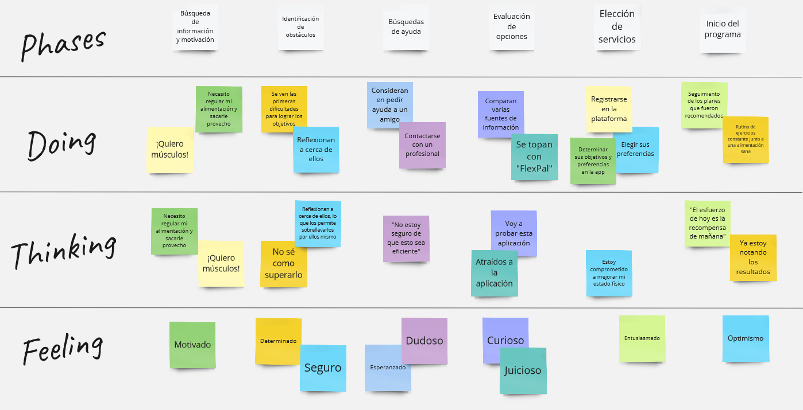

# **Capítulo III: Requirements Specification**

## 3.1. To-Be Scenario Mapping.
- To-Be del segmento objetivo usuario:

- To-Be del segmento objetivo coach:

## 3.2. User Stories.
Para elaborar user stories que pertenecen a un epic. A continuación, las epics que consideramos como equipo:

<table border="1" style="text-align: left;">
    <tbody>
        <tr>
            <td colspan="1"><strong>Código</strong></td>
            <td colspan="1"><strong>Título</strong></td>
            <td colspan="1"><strong>Epic</strong></td>
        </tr>
        <tr>
            <td colspan="1">...</td>
            <td colspan="1">...</td>
            <td colspan="1">...</td>
        </tr>
        <tr>
            <td colspan="1">...</td>
            <td colspan="1">...</td>
            <td colspan="1">...</td>
        </tr>
        <tr>
            <td colspan="1">...</td>
            <td colspan="1">...</td>
            <td colspan="1">...</td>
        </tr>
        <tr>
            <td colspan="1">...</td>
            <td colspan="1">...</td>
            <td colspan="1">...</td>
        </tr>
        <tr>
            <td colspan="1">...</td>
            <td colspan="1">...</td>
            <td colspan="1">...</td>
        </tr>
        <tr>
            <td colspan="1">...</td>
            <td colspan="1">...</td>
            <td colspan="1">...</td>
        </tr>
    </tbody>
</table>
A continuacion, la realizacion de los user stories con sus criterios de aceptacion con escenarios e ID de Épica:

<table border="1" style="text-align: left;">
    <tbody>
        <tr>
            <td colspan="1"><strong>ID de Historia de Usuario</strong></td>
            <td colspan="1"><strong>Título</strong></td>
            <td colspan="1"><strong>Descripción</strong></td>
            <td colspan="1"><strong>Criterios de Aceptación con Escenarios</strong></td>
            <td colspan="1"><strong>ID de Épica</strong></td>
        </tr>
        <tr>
            <td colspan="1">...</td>
            <td colspan="1">...</td>
            <td colspan="1">...</td>
            <td colspan="1">...</td>
            <td colspan="1">...</td>
        </tr>
        <tr>
            <td colspan="1">...</td>
            <td colspan="1">...</td>
            <td colspan="1">...</td>
            <td colspan="1">...</td>
            <td colspan="1">...</td>
        </tr>
        <tr>
            <td colspan="1">...</td>
            <td colspan="1">...</td>
            <td colspan="1">...</td>
            <td colspan="1">...</td>
            <td colspan="1">...</td>
        </tr>
        <tr>
            <td colspan="1">...</td>
            <td colspan="1">...</td>
            <td colspan="1">...</td>
            <td colspan="1">...</td>
            <td colspan="1">...</td>
        </tr>
        <tr>
            <td colspan="1">...</td>
            <td colspan="1">...</td>
            <td colspan="1">...</td>
            <td colspan="1">...</td>
            <td colspan="1">...</td>
        </tr>
        <tr>
            <td colspan="1">...</td>
            <td colspan="1">...</td>
            <td colspan="1">...</td>
            <td colspan="1">...</td>
            <td colspan="1">...</td>
        </tr>
        <tr>
            <td colspan="1">...</td>
            <td colspan="1">...</td>
            <td colspan="1">...</td>
            <td colspan="1">...</td>
            <td colspan="1">...</td>
        </tr>
        <tr>
            <td colspan="1">...</td>
            <td colspan="1">...</td>
            <td colspan="1">...</td>
            <td colspan="1">...</td>
            <td colspan="1">...</td>
        </tr>
        <tr>
            <td colspan="1">...</td>
            <td colspan="1">...</td>
            <td colspan="1">...</td>
            <td colspan="1">...</td>
            <td colspan="1">...</td>
        </tr>
        <tr>
            <td colspan="1">...</td>
            <td colspan="1">...</td>
            <td colspan="1">...</td>
            <td colspan="1">...</td>
            <td colspan="1">...</td>
        </tr>
        <tr>
            <td colspan="1">...</td>
            <td colspan="1">...</td>
            <td colspan="1">...</td>
            <td colspan="1">...</td>
            <td colspan="1">...</td>
        </tr>
    </tbody>
</table>

## 3.3. Impact Mapping.

## 3.4. Product Backlog.
