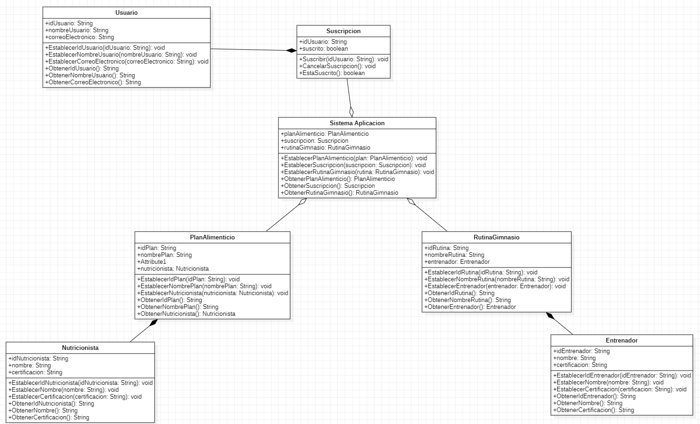

# **Capítulo IV: Product Design**
## 4.1. Style Guidelines.
### 4.1.1. General Style Guidelines.
### 4.1.2. Web Style Guidelines.
## 4.2. Information Architecture.
### 4.2.1. Organization Systems.
### 4.2.2. Labeling Systems.
### 4.2.3. SEO Tags and Meta Tags
### 4.2.4. Searching Systems.
### 4.2.5. Navigation Systems.
## 4.3. Landing Page UI Design.
### 4.3.1. Landing Page Wireframe.
### 4.3.2. Landing Page Mock-up.
## 4.4. Web Applications UX/UI Design.
### 4.4.1. Web Applications Wireframes.
### 4.4.2. Web Applications Wireflow Diagrams.
### 4.4.3. Web Applications Mock-ups.
### 4.4.4. Web Applications User Flow Diagrams.
## 4.5. Web Applications Prototyping.
## 4.6. Domain-Driven Software Architecture.
### 4.6.1. Software Architecture Context Diagram.
### 4.6.2. Software Architecture Container Diagrams.
### 4.6.3. Software Architecture Components Diagrams.
## 4.7. Software Object-Oriented Design.
### 4.7.1. Class Diagrams.

### 4.7.2. Class Dictionary.
- Suscripcion: Representa la suscripción de un usuario al servicio. Tiene los atributos idUsuario para el identificador del usuario y suscrito para indicar si está suscrito o no. Sus métodos incluyen Suscribir para suscribir al usuario, CancelarSuscripcion para cancelar la suscripción y EstaSuscrito para verificar el estado de suscripción.
- Usuario: Representa un usuario del sistema. Tiene los atributos idUsuario, nombreUsuario y correoElectronico. Sus métodos permiten establecer y obtener estos atributos.
- RutinaGimnasio: Representa una rutina de ejercicio en el gimnasio. Tiene los atributos idRutina, nombreRutina y entrenador. Sus métodos permiten establecer y obtener estos atributos.
- PlanAlimenticio: Representa un plan alimenticio personalizado para un usuario. Tiene los atributos idPlan, nombrePlan y nutricionista. Sus métodos permiten establecer y obtener estos atributos.
- SistemaAplicacion: Esta clase conecta las funcionalidades del sistema. Tiene atributos para gestionar instancias de PlanAlimenticio, Suscripcion y RutinaGimnasio. Sus métodos permiten establecer y obtener estas instancias.
## 4.8. Database Design.
### 4.8.1. Database Diagram.
